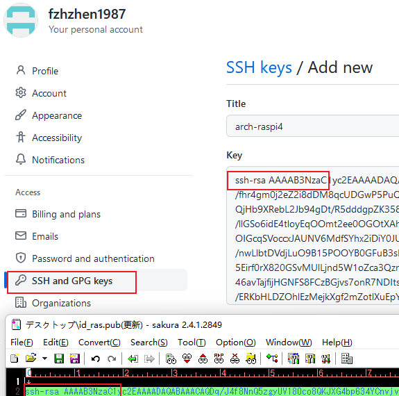

[TOC]
# 个人笔记专用  

[个人主页](https://github.com/fzhzhen1987/)  

- [archlinux安装_manjaro安装(x1和raspi4)](archlinux-install/archlinux-install.md)  

- [archlinux必会软件](archlinux-tools/archlinux-tools.md)  

- ## [嵌入式开发](embedded_all/main.md)  

- ## [C language](c_language/main.md)  

- ## [windows 相关配置](windows/main.md)  

- ## [docker 相关学习](docker/main.md)  

---
## 前提:<font color=red>使用ssh-key方式登陆github(push权限)</font>  

[1.本地生成公钥]  

<div style="color: blue;">
ssh-keygen -t rsa -b 4096 -C "fzhzhen1987@yahoo.co.jp"
</div>

[2.在.ssh生成<font color=red>id_rsa.pub</font>]  

[3.登陆到github个人主页,按照图片将<font color=red>id_rsa.pub</font>内容粘贴到相应位置]  

  

  

  

[4.更换remote]  
```shell
git remote -v
git remote remove origin
git remote add origin git@github.com:
```

