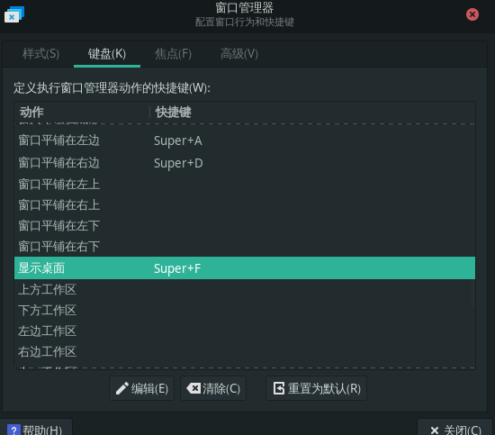

# Manjaro安装

- [一.制作镜像工具:balenaEtcher](#1)
- [二.下载raspi4镜像](#2)
- [三.安装Manjaro系统](#3)
- [四.安装Manjaro系统](#4)

---
<h4 id="1">[一.制作镜像工具:balenaEtcher]</h>

[balenaEtcher](https://www.balena.io/etcher/)  

<h4 id="2">[二.下载raspi4镜像]</h>

[Manjaro-raspi4镜像](https://manjaro.org/download/#raspberry-pi-4)  

<h4 id="3">[三.安装Manjaro系统]</h>

- **连接网络,ssh账号密码oem**  
- 1.通过vnc安装manjaro  
	```shell
	sudo pacman -S tigervnc
	vncpasswd
	
	配置文件
	/etc/tigervnc/vncserver.users 中添加
	:0=root
	:1=oem
	
	~/.vnc/config 中添加
	session=xfce
	geometry=1920x1080
	
	sudo systemctl start vncserver@:1
	sudo systemctl enable vncserver@:1
	```
- 2.修改组号,方便添加oem用户和组  
`groupmod -g 1347 oem`
- 3.更换源  
`sudo pacman-mirrors -i -c China -m rank`
- 4.安装必要的软件工具  
`sudo pacman -S terminator xorg-xinput fcitx5-im fcitx5-chinese-addons fcitx5-pinyin-zhwiki`
- 5.参照其他markdown文档继续安装(完)  
- 6.设置/etc/NetworkManager/system-connections/416-5g.nmconnection  
	```shell
	[connection]
	id=416-5g
	uuid=910cf443-0807-42d5-b139-acde7356f39d
	type=wifi
	interface-name=wlan0
	permissions=
	
	[wifi]
	mac-address-blacklist=
	mode=infrastructure
	ssid=416-5g
	
	[wifi-security]
	auth-alg=open
	key-mgmt=wpa-psk
	psk=28267598
	
	[ipv4]
	address1=192.168.11.254/24,192.168.11.1
	dns-search=
	method=manual
	
	[ipv6]
	addr-gen-mode=stable-privacy
	dns-search=
	method=auto
	
	[proxy]
	```
- 7.窗口控制快捷键设定  





<h4 id="4">[四.安装Manjaro系统]</h>

- 更新系统  
	```shell
	sudo pacman -Sy archlinux-keyring
	sudo pacman -Syy
	sudo pacman -Syu
	```

