# Manjaro安装

- [一.制作镜像工具:Ventoy](#1)
- [二.安装Manjaro系统](#2)

---
<h4 id="1">[一.制作镜像工具:Ventoy]</h>

[Ventoy github](https://github.com/ventoy/Ventoy)  
[Linux 系统图形界面使用方法](https://www.ventoy.net/cn/doc_linux_gui.html)  

- 格式化U盘  
	```shell
	./VentoyGUI.x86_64 --qt5
	
	配置选项:选择GTP
	```
- 将镜像拷贝到格式化好的U盘,调整好Bios就可以开始安装  

<h4 id="2">[二.安装Manjaro系统]</h>

- **分区的注意事项:选择 <kbd>手动分区</kbd>**  
	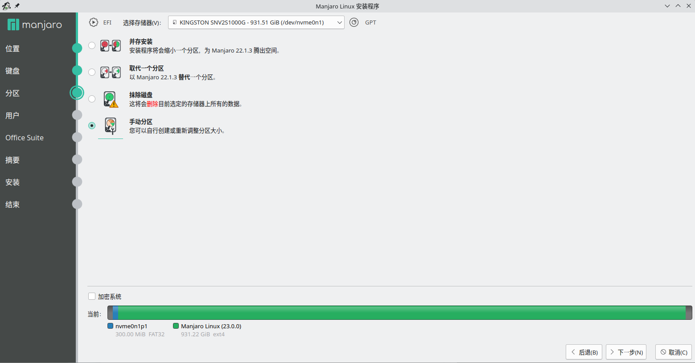  
	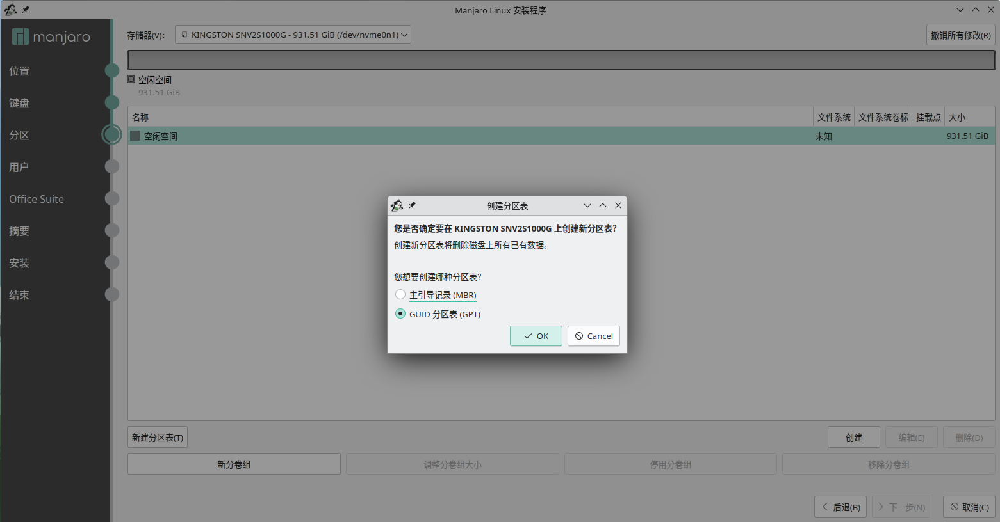  
	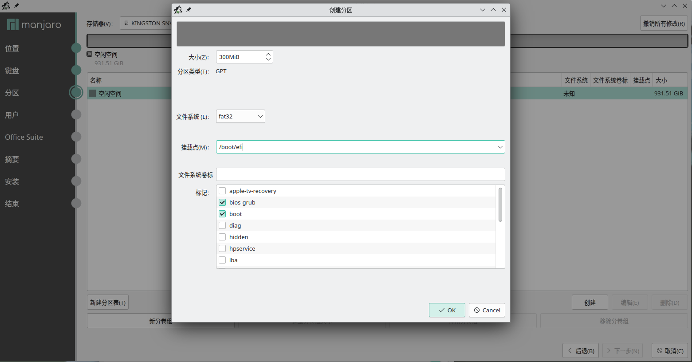  
	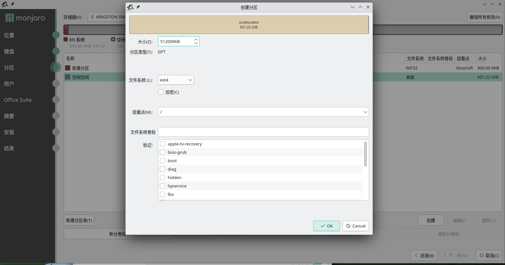  
	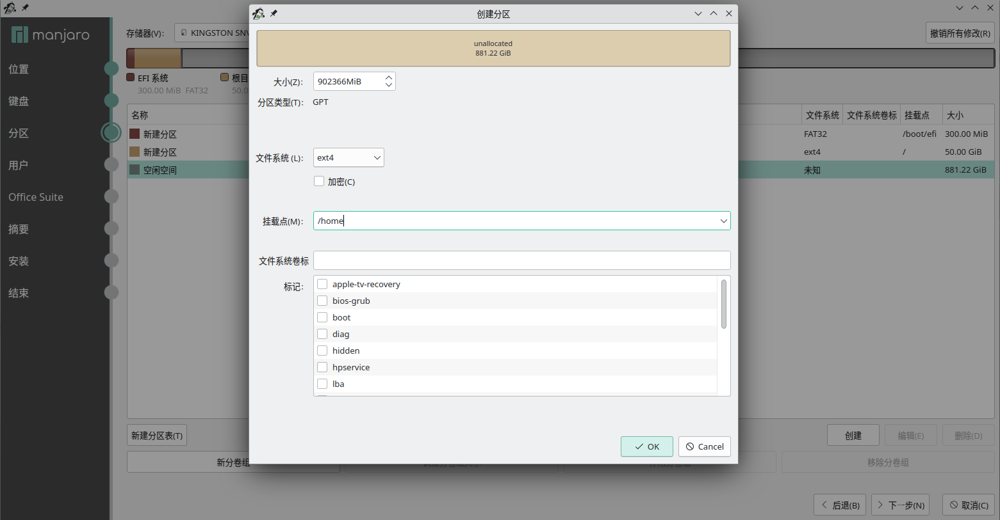  
	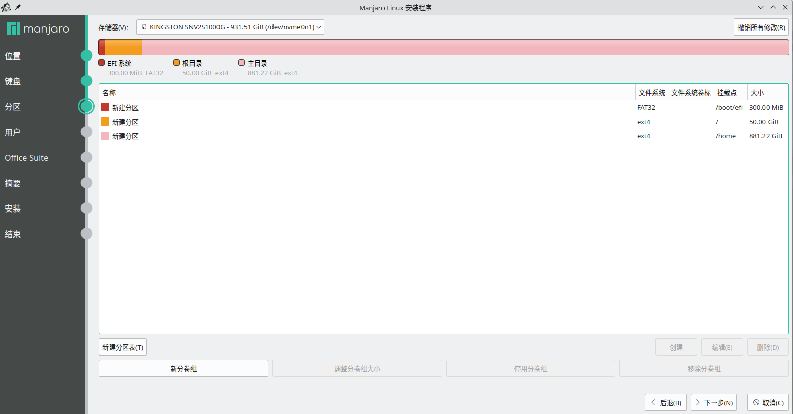  

- 1.更换源  
	```shell
	# 自动选择最快的源
	sudo pacman-mirrors -g
	# 手动选择最快的源
	sudo pacman-mirrors -i -c China -m rank
	```

- 2.开启sshd  
	```shell
	sudo systemctl enable sshd
	sudo systemctl start sshd
	```

- 3.用户和组相关操作  
	```shell
	# 添加组
	sudo groupadd -g 4927 feng
	# 添加用户
	sudo useradd -u 4927 -m -g feng -s /bin/zsh feng -c "Feng"
	# 设置密码
	sudo passwd feng
	# 添加sudo权限(两种方法,效果相同)
	sudo gpasswd -a feng wheel
	sudo usermod -aG wheel feng

	# 修改uid
	sudo usermod -u 4927 feng
	# 修改gid,同时更新文件夹的gid
	sudo usermod -g 4927 feng
	sudo find / -group 1001 -exec chgrp -h feng {} \;

	# 删除用户(不删除fzh目录)
	sudo userdel fzh
	# 删除用户(删除fzh目录)
	sudo userdel -r fzh
	# 删除组
	sudo groupdel fzh
	```

- 4.设置语言  
	```shell
	# 目的:设置用户界面为中文,终端为英文
	# 前提:在安装系统时,选择了英文
	# 修改/etc/locale.gen,添加中文
	nano /etc/locale.gen
		zh_CN.UTF-8 UTF-8
		en_US.UTF-8 UTF-8
		ja_JP.UTF-8 UTF-8
	locale-gen
	# "语言和区域设置" 中选择 "中文" 作为系统语言,并且重启系统.
	```

- 5.安装软件聚集  
	```shell
	sudo pacman -S base-devel uboot-tools lf bat flameshot tmux tig lazygit ripgrep bear fd ccls fzf \
	               python-pynvim global ctags htop the_silver_searcher colordiff python-pip git-delta \
	               terminator fcitx5-im fcitx5-chinese-addons fcitx5-pinyin-zhwiki fcitx5-mozc neovim \
	               xorg-xinput xorg-xev \
	```

- 6.配置环境  
	```shell
	cd feng_LG/memo
	./install.sh
	cd ..
	cp .zshrc ~/
	cp .tmux.conf ~/
	cp .p10k.zsh ~/
	cp .tigrc ~/
	cp .xinitrc ~/
	cp .xprofile ~/
	cp .xbindkeysrc ~/
	cp .gitconfig ~/
	cp keysetting.sh ~/
	cp -r .config/zsh ~/.config
	cp -r .config/lf ~/.config
	cp -r .config/lazygit ~/.config
	cp -r .config/tmux ~/.config
	cp -r .config/terminator ~/.config
	cp -r .config/autostart/keyboard.desktop ~/.config/autostart
	git clone https://github.com/zsh-users/zsh-syntax-highlighting.git ${ZSH_CUSTOM:-~/.oh-my-zsh/custom}/plugins/zsh-syntax-highlighting
	git clone https://github.com/zsh-users/zsh-autosuggestions.git ${ZSH_CUSTOM:-~/.oh-my-zsh/custom}/plugins/zsh-autosuggestions
	git clone --depth=1 https://github.com/romkatv/powerlevel10k.git ${ZSH_CUSTOM:-~/.oh-my-zsh/custom}/themes/powerlevel10k
	```

- 7.nvim配置  
	```shell
	python3 -m pip install --upgrade pip
	pip3 install --user --upgrade pynvim
	pip3 install --user --upgrade neovim
	pip3 install --user --upgrade pygments
	cp /usr/share/gtags/gtags.conf ~/.gtags.conf
	```

- 8.nvim gtags搜索配置  
	```shell
	~/.config/nvim/plugged/vim-gutentags/autoload/gutentags/gtags_cscope.vim 删除以下内容
		 -if !has('cscope')
		 -    throw "Can't enable the gtags-cscope module for Gutentags, "
		 -                \"this Vim has no support for cscope files."
		 -endif
		

		 -    execute 'set cscopeprg=' . fnameescape(g:gutentags_gtags_cscope_executable)
	```

- 9.更改键位  
	```shell
	# 查看键值
	xev
	# 查看mod
	xmodmap -pm
	# 保存映射到文件
	xmodmap -pke > ~/.Xmodmap
	# 应用新键位表
	xmodmap ~/.Xmodmap
	```

	- 9.1.开机自动运行  
		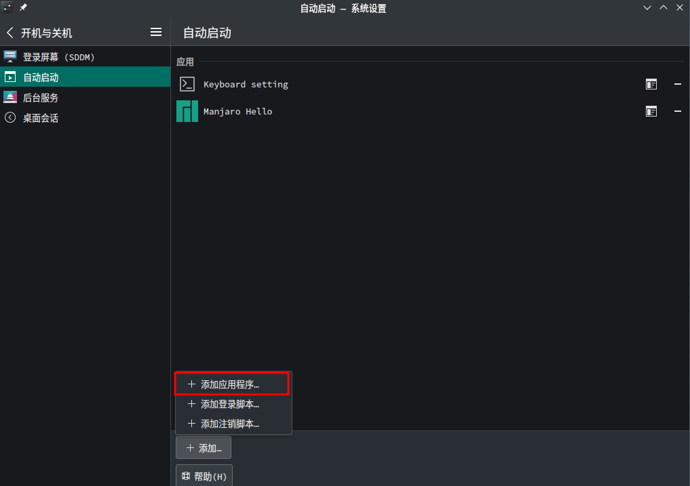  
		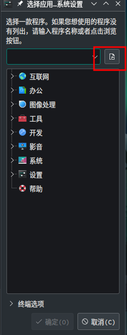  
		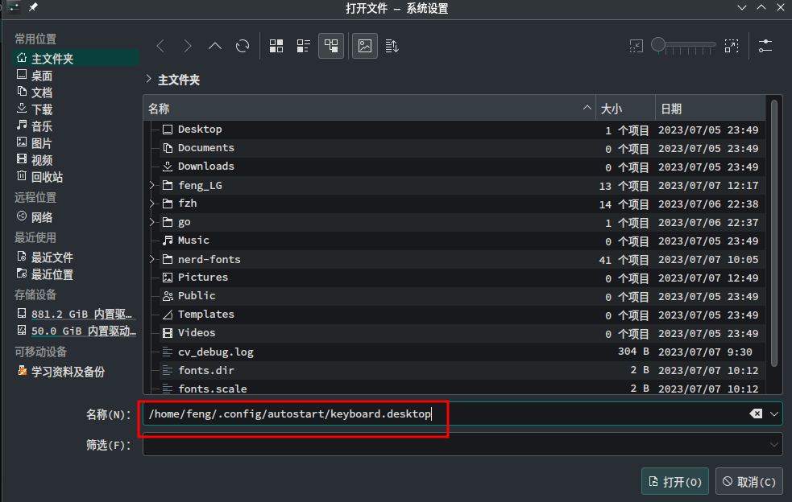  

- 10.安装字体  
	```shell
	sudo pacman -S xorg-mkfontscale
	git clone --depth 1 https://github.com/ryanoasis/nerd-fonts.git
	cd nerd-fonts
	./install.sh SourceCodePro
	sudo mkfontscale
	sudo mkfontdir
	sudo fc-cache -fv
	```

- 11.安装edge  
	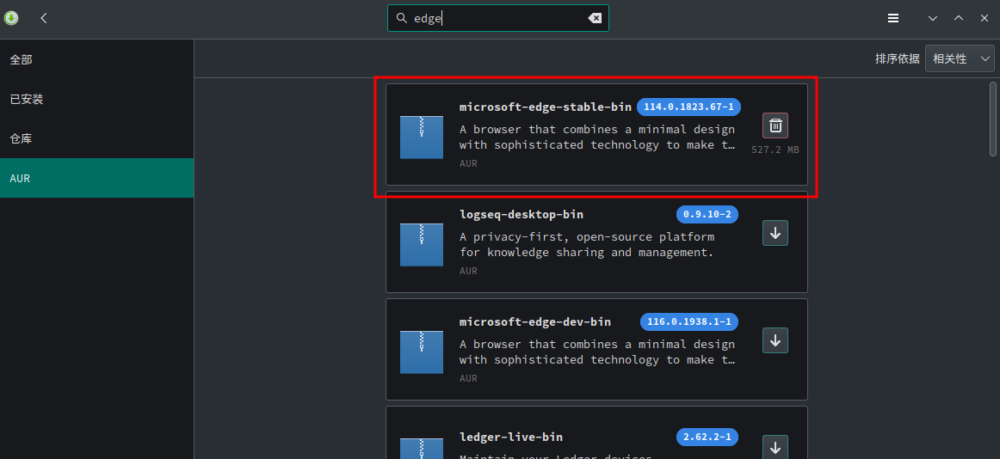  

- 12.截图快捷键  
	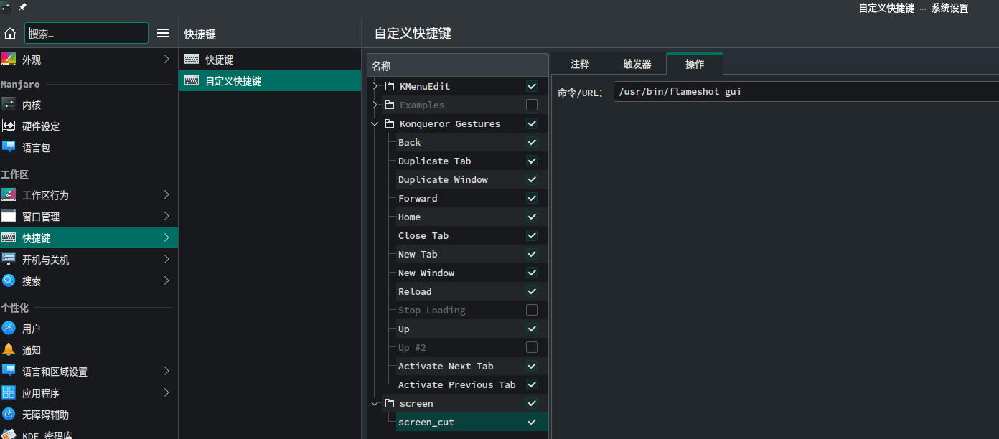  

- 13.将右ALT映射为鼠标中键  
	```shell
	# 安装xdotool和xbindkeys
	sudo pacman -S xdotool xbindkeys
	# 初始化配置文件
	xbindkeys --defaults > ~/.xbindkeysrc
	# 映射右ALT为鼠标中键,修改文件~/.xbindkeysrc
	"xdotool click 2"
	  XF86WebCam
	```

- 14.截图键启动terminator  
	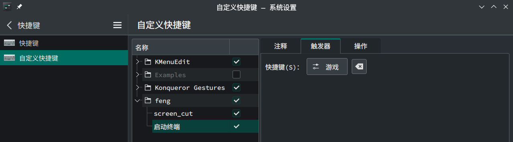  
	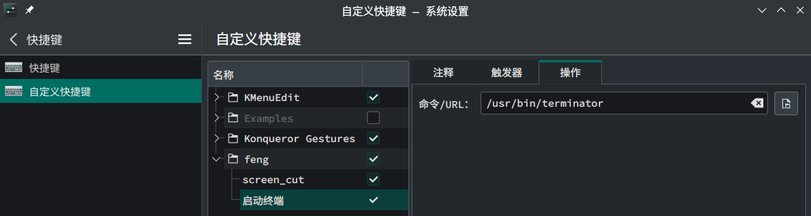  

- 15.安装colipot
	```shell
	sudo pacman -S nodejs npm
	# 打开nvim,执行以下命令
	:Copilot setup
	```

