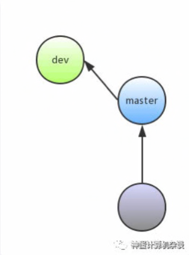

<table>
<colgroup>
<col style="text-align:center;"/>
<col style="text-align:center;"/>
<col style="text-align:left;"/>
</colgroup>

<thead>
<tr>
	<th style="text-align:center;" colspan="3">一. 基础操作</th>
</tr>
<tr>
	<th style="text-align:center;">Key</th>
	<th style="text-align:center;">Sub-Key</th>
	<th style="text-align:left;">Function</th>
</tr>
</thead>

<tbody>
<tr>
	<td style="text-align:center;">tab</td>
	<td style="text-align:center;"></td>
	<td style="text-align:left;">当处在预览窗格时,在staged和unstaged窗格间跳转 </td>
</tr>
<tr>
	<td style="text-align:center;">C-p</td>
	<td style="text-align:center;"></td>
	<td style="text-align:left;">窗格之间移动.※在预览窗格功能为翻页 </td>
</tr>
<tr>
	<td style="text-align:center;">C-n</td>
	<td style="text-align:center;"></td>
	<td style="text-align:left;">窗格之间移动.※在预览窗格功能为翻页 </td>
</tr>
<tr>
	<td style="text-align:center;">j</td>
	<td style="text-align:center;"></td>
	<td style="text-align:left;">窗格中每个条目间移动 </td>
</tr>
<tr>
	<td style="text-align:center;">k</td>
	<td style="text-align:center;"></td>
	<td style="text-align:left;">窗格中每个条目间移动 </td>
</tr>
<tr>
	<td style="text-align:center;">,</td>
	<td style="text-align:center;"></td>
	<td style="text-align:left;">窗格中翻页 </td>
</tr>
<tr>
	<td style="text-align:center;">.</td>
	<td style="text-align:center;"></td>
	<td style="text-align:left;">窗格中翻页 </td>
</tr>
<tr>
	<td style="text-align:center;">e</td>
	<td style="text-align:center;"></td>
	<td style="text-align:left;">在任何窗格的文件名上,进入文件编辑模式 </td>
</tr>
<tr>
	<td style="text-align:center;">o</td>
	<td style="text-align:center;"></td>
	<td style="text-align:left;">在任何窗格的文件名上,打开文件 </td>
</tr>
<tr>
	<td style="text-align:center;"><</td>
	<td style="text-align:center;"></td>
	<td style="text-align:left;">窗格条目首尾跳转 </td>
</tr>
<tr>
	<td style="text-align:center;">></td>
	<td style="text-align:center;"></td>
	<td style="text-align:left;">窗格条目首尾跳转 </td>
</tr>
<tr>
	<td style="text-align:center;">x</td>
	<td style="text-align:center;"></td>
	<td style="text-align:left;">当前窗格最大化 </td>
</tr>
<tr>
	<td style="text-align:center;">C-f</td>
	<td style="text-align:center;"></td>
	<td style="text-align:left;">同一窗格,不同tab间跳转 </td>
</tr>
<tr>
	<td style="text-align:center;">C-b</td>
	<td style="text-align:center;"></td>
	<td style="text-align:left;">同一窗格,不同tab间跳转 </td>
</tr>
<tr>
	<td style="text-align:center;">/</td>
	<td style="text-align:center;"></td>
	<td style="text-align:left;">查询 </td>
</tr>
<tr>
	<td style="text-align:center;"></td>
	<td style="text-align:center;">n</td>
	<td style="text-align:left;">下一个查询结果 </td>
</tr>
<tr>
	<td style="text-align:center;"></td>
	<td style="text-align:center;">N</td>
	<td style="text-align:left;">上一个查询结果 </td>
</tr>
<tr>
	<td style="text-align:center;">?</td>
	<td style="text-align:center;"></td>
	<td style="text-align:left;">列出当前面板可用快捷键 </td>
</tr>
<tr>
	<td style="text-align:center;">C-q</td>
	<td style="text-align:center;"></td>
	<td style="text-align:left;">退出菜单 </td>
</tr>
<tr>
	<td style="text-align:center;">q</td>
	<td style="text-align:center;"></td>
	<td style="text-align:left;">退出lazygit</td>
</tr>
<tr>
	<td style="text-align:center;">S-j</td>
	<td style="text-align:center;"></td>
	<td style="text-align:left;">预览窗格翻页</td>
</tr>
<tr>
	<td style="text-align:center;">S-k</td>
	<td style="text-align:center;"></td>
	<td style="text-align:left;">预览窗格翻页</td>
</tr>

</tbody>
</table>

<table>
<colgroup>
<col style="text-align:center;"/>
<col style="text-align:center;"/>
<col style="text-align:left;"/>
</colgroup>

<thead>
<tr>
	<th style="text-align:center;" colspan="3">二. Files-Submodules 窗格</th>
</tr>
<tr>
	<th style="text-align:center;">Key</th>
	<th style="text-align:center;">Sub-Key</th>
	<th style="text-align:left;">Function</th>
</tr>
</thead>

<tbody>
<tr>
	<td style="text-align:center;">C-a</td>
	<td style="text-align:center;"></td>
	<td style="text-align:left;">修改过全部的文件staged/unstaged</td>
</tr>
<tr>
	<td style="text-align:center;">space</td>
	<td style="text-align:center;"></td>
	<td style="text-align:left;">※在文件名上可以进行单文件/多文件的staged/unstaged操作</td>
</tr>
<tr>
	<td style="text-align:center;">Enter</td>
	<td style="text-align:center;"></td>
	<td style="text-align:left;">光标在文件上时,从file窗格进入预览窗格 </td>
</tr>
<tr>
	<td style="text-align:center;"></td>
	<td style="text-align:center;">space</td>
	<td style="text-align:left;">在预览窗格可逐行staged/unstaged</td>
</tr>
<tr>
	<td style="text-align:center;">a</td>
	<td style="text-align:center;"></td>
	<td style="text-align:left;">amend,与最后一次commit融合</td>
</tr>
<tr>
	<td style="text-align:center;">c</td>
	<td style="text-align:center;"></td>
	<td style="text-align:left;">commit,短描述</td>
</tr>
<tr>
	<td style="text-align:center;">C</td>
	<td style="text-align:center;"></td>
	<td style="text-align:left;">commit,长描述</td>
</tr>
<tr>
	<td style="text-align:center;">d</td>
	<td style="text-align:center;"></td>
	<td style="text-align:left;">discard all changes※千万慎用,将unstaged/staged删除 </td>
</tr>
<tr>
	<td style="text-align:center;">D</td>
	<td style="text-align:center;"></td>
	<td style="text-align:left;">更多删除选项※建议使用此选项 </td>
</tr>
<tr>
	<td style="text-align:center;"></td>
	<td style="text-align:center;">nuke working tree</td>
	<td style="text-align:left;">核弹摧毁 </td>
</tr>
<tr>
	<td style="text-align:center;"></td>
	<td style="text-align:center;">discard unstaged changes</td>
	<td style="text-align:left;">相当于使用git checkout -- .</td>
</tr>
<tr>
	<td style="text-align:center;">f</td>
	<td style="text-align:center;"></td>
	<td style="text-align:left;">fetch </td>
</tr>
<tr>
	<td style="text-align:center;">s</td>
	<td style="text-align:center;"></td>
	<td style="text-align:left;">将修改的文件暂存到stash缓冲区 </td>
</tr>
<tr>
	<td style="text-align:center;"></td>
	<td style="text-align:center;">stash changes</td>
	<td style="text-align:left;">将所有的修改暂存到stash缓冲区 </td>
</tr>
<tr>
	<td style="text-align:center;"></td>
	<td style="text-align:center;">stash staged changes</td>
	<td style="text-align:left;">仅将staged的文件暂存到stash缓冲区 </td>
</tr>

</tbody>
</table>

<table>
<colgroup>
<col style="text-align:center;"/>
<col style="text-align:center;"/>
<col style="text-align:left;"/>
</colgroup>

<thead>
<tr>
	<th style="text-align:center;" colspan="3">三. Local Branches-Remotes-Tags 窗格</th>
</tr>
<tr>
	<th style="text-align:center;">Key</th>
	<th style="text-align:center;">Sub-Key</th>
	<th style="text-align:left;">Function</th>
</tr>
</thead>

<tbody>
<tr>
	<td style="text-align:center;">space</td>
	<td style="text-align:center;"></td>
	<td style="text-align:left;">※在分支上,checkout分支.在commit上,checkout历史提交.在文件上,添加文件到patch </td>
</tr>
<tr>
	<td style="text-align:center;">n</td>
	<td style="text-align:center;"></td>
	<td style="text-align:left;">在选定的分支或commit上新建分支,选定的分支前有*号 </td>
</tr>
<tr>
	<td style="text-align:center;">f</td>
	<td style="text-align:center;"></td>
	<td style="text-align:left;">在选中的branch上fetch内容并更新当前branch到最近commit</td>
</tr>
<tr>
	<td style="text-align:center;">P</td>
	<td style="text-align:center;"></td>
	<td style="text-align:left;">PUSH</td>
</tr>
<tr>
	<td style="text-align:center;">p</td>
	<td style="text-align:center;"></td>
	<td style="text-align:left;">pull</td>
</tr>
<tr>
	<td style="text-align:center;">R</td>
	<td style="text-align:center;"></td>
	<td style="text-align:left;">branch重命名</td>
</tr>
<tr>
	<td style="text-align:center;">C-s</td>
	<td style="text-align:center;"></td>
	<td style="text-align:left;">单文件过滤:

光标移动到commit中某个想要过滤的文件.选择"filter by xxx":只看xxx修改的commit</td>
</tr>
<tr>
	<td style="text-align:center;"></td>
	<td style="text-align:center;">C-e</td>
	<td style="text-align:left;">diff模式:(过滤文件后,单文件下模式)

摁下快捷键相当于固定比对基本点.再上下移动光标到不同的commit,就可以在预览窗格查看与基本点的diff.</td>
</tr>
<tr>
	<td style="text-align:center;">C-e</td>
	<td style="text-align:center;"></td>
	<td style="text-align:left;">diff模式:(commit对比模式)

移动到想要对比的commit基本点,摁下快捷键相当于固定比对基本点.再上下移动光标到不同的commit,就可以在预览窗格查看与基本点的diff.</td>
</tr>

</tbody>
</table>

<table>
<colgroup>
<col style="text-align:center;"/>
<col style="text-align:center;"/>
<col style="text-align:left;"/>
</colgroup>

<thead>
<tr>
	<th style="text-align:center;" colspan="3">四. Commits-Reflog 窗格</th>
</tr>
<tr>
	<th style="text-align:center;">Key</th>
	<th style="text-align:center;">Sub-Key</th>
	<th style="text-align:left;">Function</th>
</tr>
</thead>

<tbody>
<tr>
	<td style="text-align:center;">z</td>
	<td style="text-align:center;"></td>
	<td style="text-align:left;">undo </td>
</tr>
<tr>
	<td style="text-align:center;">C-z</td>
	<td style="text-align:center;"></td>
	<td style="text-align:left;">redo </td>
</tr>
<tr>
	<td style="text-align:center;">C-y</td>
	<td style="text-align:center;"></td>
	<td style="text-align:left;">复制commit信息</td>
</tr>
<tr>
	<td style="text-align:center;">r</td>
	<td style="text-align:center;"></td>
	<td style="text-align:left;">修改光标所在处commit提交的commit信息</td>
</tr>
<tr>
	<td style="text-align:center;">R</td>
	<td style="text-align:center;"></td>
	<td style="text-align:left;">修改光标所在处commit提交的commit信息.※长commit信息</td>
</tr>
<tr>
	<td style="text-align:center;">d</td>
	<td style="text-align:center;"></td>
	<td style="text-align:left;">删除某次提交</td>
</tr>
<tr>
	<td style="text-align:center;">G</td>
	<td style="text-align:center;"></td>
	<td style="text-align:left;">reset到某个版本</td>
</tr>
<tr>
	<td style="text-align:center;"></td>
	<td style="text-align:center;">soft reset</td>
	<td style="text-align:left;">当前提交以后的commit消失,并且出现在staged缓冲区</td>
</tr>
<tr>
	<td style="text-align:center;"></td>
	<td style="text-align:center;">hard reset</td>
	<td style="text-align:left;">当前提交以后的commit消失</td>
</tr>
<tr>
	<td style="text-align:center;">e</td>
	<td style="text-align:center;"></td>
	<td style="text-align:left;">git rebase,修改历史commit</td>
</tr>
<tr>
	<td style="text-align:center;"></td>
	<td style="text-align:center;">pick</td>
	<td style="text-align:left;"></td>
</tr>
<tr>
	<td style="text-align:center;"></td>
	<td style="text-align:center;">edit</td>
	<td style="text-align:left;">可以编辑文件,e从编辑器打开</td>
</tr>
<tr>
	<td style="text-align:center;"></td>
	<td style="text-align:center;">drop</td>
	<td style="text-align:left;"></td>
</tr>
<tr>
	<td style="text-align:center;"></td>
	<td style="text-align:center;">fixup</td>
	<td style="text-align:left;">合并</td>
</tr>
<tr>
	<td style="text-align:center;"></td>
	<td style="text-align:center;">squash</td>
	<td style="text-align:left;">合并</td>
</tr>
<tr>
	<td style="text-align:center;"></td>
	<td style="text-align:center;">up</td>
	<td style="text-align:left;">光标所在处的commit向上移动</td>
</tr>
<tr>
	<td style="text-align:center;"></td>
	<td style="text-align:center;">down</td>
	<td style="text-align:left;">光标所在处的commit向下移动</td>
</tr>
<tr>
	<td style="text-align:center;"></td>
	<td style="text-align:center;">m</td>
	<td style="text-align:left;">终止/执行rebase</td>
</tr>
<tr>
	<td style="text-align:center;">C-s</td>
	<td style="text-align:center;"></td>
	<td style="text-align:left;">单文件过滤:

光标移动到commit中某个想要过滤的文件.选择"filter by xxx":只看xxx修改的commit</td>
</tr>
<tr>
	<td style="text-align:center;"></td>
	<td style="text-align:center;">C-e</td>
	<td style="text-align:left;">diff模式:(过滤文件后,单文件下模式)

摁下快捷键相当于固定比对基本点.再上下移动光标到不同的commit,就可以在预览窗格查看与基本点的diff.</td>
</tr>
<tr>
	<td style="text-align:center;">C-e</td>
	<td style="text-align:center;"></td>
	<td style="text-align:left;">diff模式:(commit对比模式)

移动到想要对比的commit基本点,摁下快捷键相当于固定比对基本点.再上下移动光标到不同的commit,就可以在预览窗格查看与基本点的diff.</td>
</tr>
<tr>
	<td style="text-align:center;">T</td>
	<td style="text-align:center;"></td>
	<td style="text-align:left;">为commit添加tag</td>
</tr>
<tr>
	<td style="text-align:center;"></td>
	<td style="text-align:center;">lightweight tag</td>
	<td style="text-align:left;">不用添加tag message</td>
</tr>
<tr>
	<td style="text-align:center;"></td>
	<td style="text-align:center;">annotated tag</td>
	<td style="text-align:left;">需要添加tag message</td>
</tr>
<tr>
	<td style="text-align:center;">P</td>
	<td style="text-align:center;"></td>
	<td style="text-align:left;">PUSH</td>
</tr>
<tr>
	<td style="text-align:center;">space</td>
	<td style="text-align:center;"></td>
	<td style="text-align:left;">光标在commit上,checkout</td>
</tr>
<tr>
	<td style="text-align:center;"></td>
	<td style="text-align:center;"></td>
	<td style="text-align:left;">可选操作1.移动到branches窗格,n新建分支</td>
</tr>
<tr>
	<td style="text-align:center;"></td>
	<td style="text-align:center;"></td>
	<td style="text-align:left;">可选操作2.移动到branches窗格,选定原来分支中的最新提交,space切换回来</td>
</tr>
<tr>
	<td style="text-align:center;">enter</td>
	<td style="text-align:center;"></td>
	<td style="text-align:left;">查看commit中具体修改的文件内容</td>
</tr>
<tr>
	<td style="text-align:center;"></td>
	<td style="text-align:center;"></td>
	<td style="text-align:left;">可选操作1.光标移动到文件,d 删除对此文件的修改</td>
</tr>
<tr>
	<td style="text-align:center;"></td>
	<td style="text-align:center;"></td>
	<td style="text-align:left;">可选操作2.光标移动到文件,c checkout此文件</td>
</tr>

</tbody>
</table>

<table>
<colgroup>
<col style="text-align:center;"/>
<col style="text-align:center;"/>
<col style="text-align:left;"/>
</colgroup>

<thead>
<tr>
	<th style="text-align:center;" colspan="3">五. Stash 窗格</th>
</tr>
<tr>
	<th style="text-align:center;">Key</th>
	<th style="text-align:center;">Sub-Key</th>
	<th style="text-align:left;">Function</th>
</tr>
</thead>

<tbody>
<tr>
	<td style="text-align:center;">g</td>
	<td style="text-align:center;"></td>
	<td style="text-align:left;">pop,内容到unstage区,stash区内容消失 </td>
</tr>
<tr>
	<td style="text-align:center;">space</td>
	<td style="text-align:center;"></td>
	<td style="text-align:left;">apply,内容到unstage区,stash区内容保留 </td>
</tr>
<tr>
	<td style="text-align:center;">d</td>
	<td style="text-align:center;"></td>
	<td style="text-align:left;">drop stash区内容.可以全部drop,也可以单个文件drop</td>
</tr>
<tr>
	<td style="text-align:center;">C-e</td>
	<td style="text-align:center;"></td>
	<td style="text-align:left;">diff对比模式</td>
</tr>
<tr>
	<td style="text-align:center;"></td>
	<td style="text-align:center;">diff stash@{0}</td>
	<td style="text-align:left;">以stash内容为基准并变为紫色,光标移动去和其他commit内容做比较(灵活方便)</td>
</tr>
<tr>
	<td style="text-align:center;"></td>
	<td style="text-align:center;">enter ref to diff</td>
	<td style="text-align:left;">以stash内容为基准,自己输入commit号去比较(不推荐,要比较branch最后的提交时好用)</td>
</tr>

</tbody>
</table>

<table>
<colgroup>
<col style="text-align:center;"/>
<col style="text-align:center;"/>
<col style="text-align:left;"/>
</colgroup>

<thead>
<tr>
	<th style="text-align:center;" colspan="3">六. 预览窗格(包括 Unstaged Changes-Patch)</th>
</tr>
<tr>
	<th style="text-align:center;">Key</th>
	<th style="text-align:center;">Sub-Key</th>
	<th style="text-align:left;">Function</th>
</tr>
</thead>

<tbody>
<tr>
	<td style="text-align:center;">a</td>
	<td style="text-align:center;"></td>
	<td style="text-align:left;">框住全部内容 </td>
</tr>
<tr>
	<td style="text-align:center;">space</td>
	<td style="text-align:center;"></td>
	<td style="text-align:left;">单行选定已修改过的内容</td>
</tr>
<tr>
	<td style="text-align:center;">j</td>
	<td style="text-align:center;"></td>
	<td style="text-align:left;">单行移动 </td>
</tr>
<tr>
	<td style="text-align:center;">k</td>
	<td style="text-align:center;"></td>
	<td style="text-align:left;">单行移动 </td>
</tr>
<tr>
	<td style="text-align:center;">S-j</td>
	<td style="text-align:center;"></td>
	<td style="text-align:left;">翻页模式浏览</td>
</tr>
<tr>
	<td style="text-align:center;">S-k</td>
	<td style="text-align:center;"></td>
	<td style="text-align:left;">翻页模式浏览</td>
</tr>

<tr>
	<td style="text-align:center;">C-n</td>
	<td style="text-align:center;"></td>
	<td style="text-align:left;">已修改的代码块之间跳转</td>
</tr>
<tr>
	<td style="text-align:center;">C-p</td>
	<td style="text-align:center;"></td>
	<td style="text-align:left;">已修改的代码块之间跳转</td>
</tr>
<tr>
	<td style="text-align:center;">v</td>
	<td style="text-align:center;"></td>
	<td style="text-align:left;">进入可视模式选择要已修改过的部分</td>
</tr>
<tr>
	<td style="text-align:center;"></td>
	<td style="text-align:center;">j</td>
	<td style="text-align:left;">行为单位框选</td>
</tr>
<tr>
	<td style="text-align:center;"></td>
	<td style="text-align:center;">k</td>
	<td style="text-align:left;">行为单位框选</td>
</tr>
<tr>
	<td style="text-align:center;"></td>
	<td style="text-align:center;">C-n</td>
	<td style="text-align:left;"></td>
</tr>
<tr>
	<td style="text-align:center;"></td>
	<td style="text-align:center;">C-p</td>
	<td style="text-align:left;"></td>
</tr>

</tbody>
</table>

## 七. 实用技巧
### 1. 将推进的分支A.master合并到分支B.dev

**1. 有连个分支:master和dev**

关系如图

**2. master分支向前推进一步**

关系如图

**3. 要做到如图该如何操作**

**答:在Local Branches窗格的dev分支空格切换到此分支,将光标移动到master分支输入r**

### 2. 将分支A.master合并到分支B.dev

**答:在Local Branches窗格的dev分支空格切换到此分支,将光标移动到master分支输入M**

### 3. 将分支A.master的commit拷贝到分支B.dev

**答:在Local Branches窗格的dev分支空格切换到此分支,可以在Branch窗格或Commits窗格c复制master分支的commit.将光标移动到Commits窗格输入v在dev分支末尾粘贴master分支的commit**

### 4. 在Commits窗格将commit中的内容抽取一部分,转移到另一个commit中.

**注意起始操作在Commits窗格中**

**答:在某个commit进入到文件内容浏览模式,使用space选定想要的内容**

<table>
<colgroup>
<col style="text-align:center;"/>
<col style="text-align:left;"/>
</colgroup>

<thead>
<tr>
	<th style="text-align:center;" colspan="3">操作1:直接C-o调出Patch Options菜单</th>
</tr>
<tr>
	<th style="text-align:center;">Key</th>
	<th style="text-align:left;">Function</th>
</tr>
</thead>

<tbody>
<tr>
	<td style="text-align:center;">remove patch from original commit</td>
	<td style="text-align:left;">从commit删除此内容</td>
</tr>
<tr>
	<td style="text-align:center;">pull patch out into index</td>
	<td style="text-align:left;">提取commit内容,放入工作目录</td>
</tr>
<tr>
	<td style="text-align:center;">pull patch into new commit</td>
	<td style="text-align:left;">提取commit内容,做成新的提交</td>
</tr>

</tbody>
</table>

<table>
<colgroup>
<col style="text-align:center;"/>
<col style="text-align:left;"/>
</colgroup>

<thead>
<tr>
	<th style="text-align:center;" colspan="3">操作2:退回到Commits窗格光标移动到其他的commit上C-o</th>
</tr>
<tr>
	<th style="text-align:center;">Key</th>
	<th style="text-align:left;">Function</th>
</tr>
</thead>

<tbody>
<tr>
	<td style="text-align:center;">move patch to selected commit</td>
	<td style="text-align:left;">将提取的内容放入到当前选定的commit中</td>
</tr>

</tbody>
</table>
