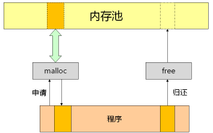

# 38.动态内存分配

- ### **C语言中的一切操作都是基于内存**
- ### **变量和数组都是内存的别名**
	- 对于变量和数组的内存分配是由 **编译器在编译的时候就决定了**
	- 特别对于数组定义 **必须指定数组的长度**.因为只有指定数组长度 **编译器** 才能确定给数组分配多大内存.
- ### 当应用程序被编译完成时,在运行时所需要多少内存空间就已经被决定了.
- ### **动态内存分配**:  
	**对于程序而言在运行过程中会需要一些额外的内存空间来完成任务.**
--------
### 动态内存分配函数: malloc 和 free
- malloc 和 free 用于执行动态内存分配和释放  
  
**内存泄漏** :当不停malloc内存,从不free内存会导致内存池没有内存可用,应用会崩溃,系统会变慢.
- malloc

	- 分配一段连续的内存
	- malloc不带任何类型信息,以字节为单位.
- free

	- 归还动态内存
```c
size_t *p;
p = void* malloc(size_t size);

void free(void* pointer);
free(p);
```

--------
### 需要注意的几点

- malloc 和 free 是 **库函数** ,不是系统调用,并不是系统提供的函数
- malloc 实际分配的内存可能会比请求的多(不同操作系统对内存池的管理方法不同)
- 当请求的动态内存无法满足, malloc 返回 NULL空
- 当free的参数为 NULL空,函数直接返回,不做任何操作

### malloc(0)的结果
```c
#include <stdio.h>
#include <malloc.h>

int main()
{
    int* p = (int*)malloc(0);

    printf("p = %p\n", p);

    free(p);
    return 0;
}

>gcc test.c -o test
❯ ./test
p = 0xaaaae88f32a0
说明malloc(0)是正当操作:动态分配得到的地址分为2部分
首地址和长度.此例中申请测动态内存长度为0.

问题2:一直malloc(0),会导致内存泄露吗?
答案:会,因为malloc(0)但是返回的实际动态内存也许会比0大
```
### 内存泄漏检测模块test_1.c
```c
test_1.c
#include <stdio.h>
#include "mleak.h"

void f()
{
    MALLOC(100);    //没有free,导致泄漏
}

int main()
{
    int* p = (int*)MALLOC(3 * sizeof(int));

    f();

    p[0] = 1;
    p[1] = 2;
    p[2] = 3;

    FREE(p);

    PRINT_LEAK_INFO();

    return 0;
}

mleak.h
#ifndef _MLEAK_H_
#define _MLEAK_H_

#include <malloc.h>

#define MALLOC(n) mallocEx(n, __FILE__, __LINE__)
#define FREE(p) freeEx(p)

void* mallocEx(size_t n, const char* file, int line);
void freeEx(void* p);
void PRINT_LEAK_INFO();

#endif


mleak.c
#include "mleak.h"

#define SIZE 256

/* 动态内存申请参数结构体 */
typedef struct
{
    void* pointer;	//申请后返回的内存地址
    int size;		//申请的内存空间的大小
    const char* file;	//在哪个文件执行了申请操作
    int line;		//在哪一行执行了申请操作
} MItem;

static MItem g_record[SIZE]; /* 定义全局数组,记录动态内存申请的操作 */

void* mallocEx(size_t n, const char* file, int line)
{
    void* ret = malloc(n); /* 动态内存申请 */

    if( ret != NULL )
    {
        int i = 0;

        /* 遍历全局数组,记录此次操作,记录成功后,break跳出大循环 */
        for(i=0; i<SIZE; i++)
        {
            /* 查找位置 */
            if( g_record[i].pointer == NULL )
            {
                g_record[i].pointer = ret;
                g_record[i].size = n;
                g_record[i].file = file;
                g_record[i].line = line;
                break;
            }
        }
    }

    return ret;
}

void freeEx(void* p)
{
    if( p != NULL )
    {
        int i = 0;

        /* 遍历全局数组，释放内存空间，并清除操作记录 */
        for(i=0; i<SIZE; i++)
        {
            if( g_record[i].pointer == p )
            {
                g_record[i].pointer = NULL;
                g_record[i].size = 0;
                g_record[i].file = NULL;
                g_record[i].line = 0;

                free(p);

                break;
            }
        }
    }
}

void PRINT_LEAK_INFO()
{
    int i = 0;

    printf("Potential Memory Leak Info:\n");

    /* 遍历全局数组，打印未释放的空间记录 */
    for(i=0; i<SIZE; i++)
    {
        if( g_record[i].pointer != NULL )
        {
            printf("Address: %p, size:%d, Location: %s:%d\n", g_record[i].pointer, g_record[i].size, g_record[i].file, g_record[i].line);
        }
    }
}

> gcc test_1.c mleak.c -o test_1
> ./test
Potential Memory Leak Info:
Address: 0xaaab01bea2c0, size:100, Location: test_1.c:6

代码缺陷:因为有全局数组,所以需要添加互斥操作.
```
--------
### calloc 和 realloc
- **malloc 的同胞兄弟**
	```c
	void* calloc(size_t num,size_t size);    //size为类型信息
	申请动态内存(带有类型信息size),并将每个元素初始化为0
	calloc 会将返回的内存初始化为 0
	
	void* realloc(void* pointer, size_t new_size);
	重置动态内存空间大小:新申请一片内存空间,将老的元素值复制到新的内存空间,再返回新的地址
	当第一个参数为 NULL空,等价 malloc
	```
### 实例分析 calloc 和 realloc 的使用
```c
test_2.c
#include <stdio.h>
#include <malloc.h>

#define SIZE 5

int main()
{
    int i = 0;
    int* pI = (int*)malloc(SIZE * sizeof(int));
    short* pS = (short*)calloc(SIZE, sizeof(short));

    for(i=0; i<SIZE; i++)
    {
        printf("pI[%d] = %d, pS[%d] = %d\n", i, pI[i], i, pS[i]);
    }

    printf("Before: pI = %p\n", pI);

    pI = (int*)realloc(pI, 2 * SIZE * sizeof(int));

    printf("After: pI = %p\n", pI);

    for(i=0; i<10; i++)
    {
        printf("pI[%d] = %d\n", i, pI[i]);
    }

    free(pI);
    free(pS);

    return 0;
}


> gcc test_2.c -o test_2
> ./test_2
pI[0] = 0, pS[0] = 0
pI[1] = 0, pS[1] = 0
pI[2] = 0, pS[2] = 0
pI[3] = 0, pS[3] = 0
pI[4] = 0, pS[4] = 0
Before: pI = 0xaaaab1ccb2a0    pI地址改变了
After: pI = 0xaaaab1ccb6f0
pI[0] = 0
pI[1] = 0
pI[2] = 0
pI[3] = 0
pI[4] = 0
pI[5] = 0
pI[6] = 0
pI[7] = 0
pI[8] = 0
pI[9] = 0
```
