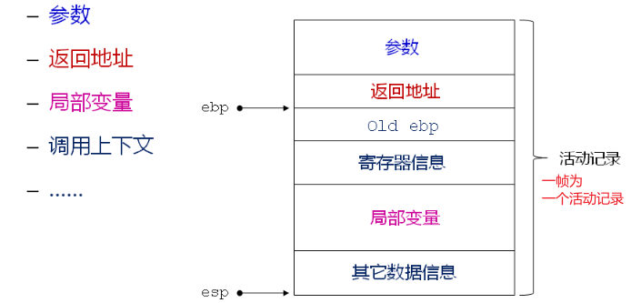
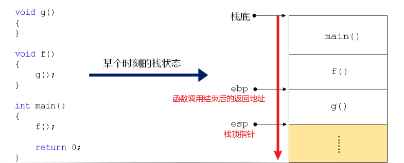
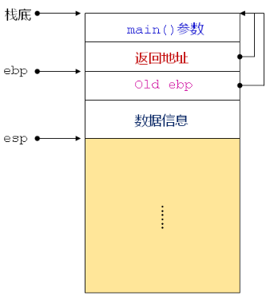
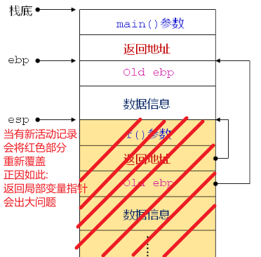
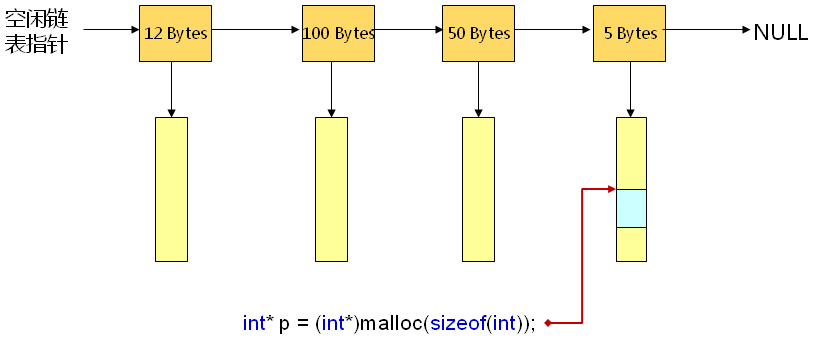

# 39.程序中的堆_栈_静态存储区
## 1. 程序中的栈

- ### **用来维护 *函数调用的上下文***
	在程序运行的过程中,必须肯定要使用的是栈存储区.(函数调用发生时)
	- 函数调用时所需要使用的参数信息和局部变量的信息
	- 返回地址,寄存器信息  

	换句话:没有栈,程序无法运行
- ### 栈:后进先出
	- 栈底被固定.
	- esp:栈顶指针.
	- ebp:保存函数调用结束后的返回地址即(指向栈顶帧的上一帧的esp)
	
- ### 栈帧  
	每个栈帧都保存了一个函数调用所需的维护信息,如下:  
	- **函数调用** 的参数信息
	- **函数调用** 返回地址
	- 寄存器信息
	- 局部变量 :**大坑 绝对不要返回局部变量的地址**
	- 其他数据信息:临时变量
	- esp:栈顶指针 ebp:上一帧的esp  
	

- ### 函数调用过程
	- 每次函数调用都会产生一个活动记录,生成一个新栈帧
	- **调用函数** 的活动记录位于 -**栈的中部**
	- **被调用函数** 的活动记录位于 **栈的顶部**
	

- ### 函数调用栈的变化
	- 从main()开始运行,建立活动记录  
	  
	- 当 main() 函数调用 f() 函数  
	  
	新老活动记录通过ebp指针来关联:  
	ebp向前4字节 = **返回地址** 是 esp 所要返回的地址  
	ebp向后4字节 = **old ebp** 是上一栈帧的ebp地址
	- 当从 f()函数 调用中返回 main()  
	  
	函数调用时,对应的栈空间在函数返回前是专用的  
	函数调用结束后,栈空间将被释放,**局部变量数据不再有效**
		### 不要返回局部数组和局部变量地址
- ### 通过test_1.c来证明:野指针的产生
```c
#include <stdio.h>

int* g()
{
    int a[10] = {0};

    return a;
}

void f()
{
    int i =0;
    int b[10] = {0, 1, 2, 3, 4, 5, 6, 7, 8, 9};
    int* pointer = g();

    for(i=0; i<10; i++)
    {
        b[i] = pointer[i];
    }

    for(i=0; i<10; i++)
    {
        printf("%d\n", b[i]);
    }
}

int main()
{
    f();

    return 0;
}

>gcc test_1.c -o test_1
test_1.c: In function ‘g’:
test_1.c:7:12: warning: function returns address of local variable [-Wreturn-local-addr]
    7 |     return a;
      |            ^
```
--------

## 2. 程序中的堆
- ### **堆是 *程序中一块预留的内存空间* 可以由程序自由使用**
- ### **堆中被 *程序申请使用的内存在主动释放前将一直有效***
- ### C语言中*通过库函数的调用获得堆空间*
	- 头文件:malloc.h
	- **malloc** 以字节的方式 **动态申请堆空间**
	- **free** 将堆空间归还给系统
- ### 系统对堆空间的管理方式
	空闲链表法,位图法,对象池等等  
	- **空闲链表管理:为了高效将 *堆空间* 被组织成链表.每个节点上的数字代表节点下每个单元的大小**  
		- **当使用 malloc,就会遍历空闲链表,判断 *申请的内存大小* 与哪个节点最接近**
		- **本例中申请 *4字节* 与5字节的节点最接近,就会在5字节节点下找到一个单位返回p指针给用户**  

		**空闲链表意图如下**


--------
## 3.程序中的静态存储区
### **静态存储区的特点**
- 随着程序的运行而分配空间
- **生命周期** 直到程序的运行结束:***程序执行的那一时刻就已经被系统分配好***
- **静态存储区的大小** 在程序的编译阶段就已经确定,运行时仅仅时分配空间而已.(***空间大小不能被改变***)
- **静态存储区** 存放 ***全局变量和静态局部变量***
- **静态存储区的信息** 最终会保存在可执行程序里(.out 或者 .exe)
### **test_2.c 静态存储区的验证**
```c
#include <stdio.h>

int g_v = 1;    //全局变量

static int g_vs  = 2;    //被static 修饰只能在本文件使用

void f()
{
    static int g_vl = 3;    //静态局部变量

    printf("%p\n", &g_vl);
}

int main()
{
    printf("%p\n", &g_v);

    printf("%p\n", &g_vs);

    f();

    return 0;
}

> gcc test_2.c -o test_2
> ./test_2
0xaaaacd081030
0xaaaacd081034
0xaaaacd081038

结果发现这三个变量的存储地址是连续的.
全局变量和静态局部变量都存放在静态存储区,且静态存储区大小和位置在编译时就已经确定
```

