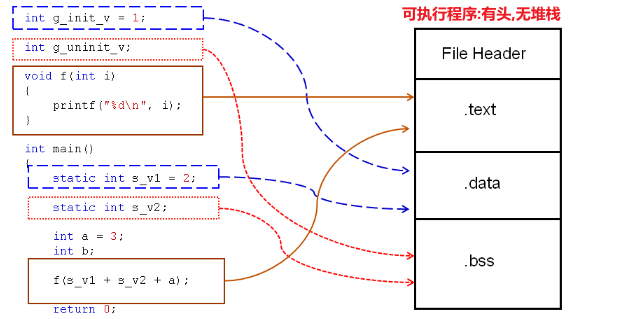
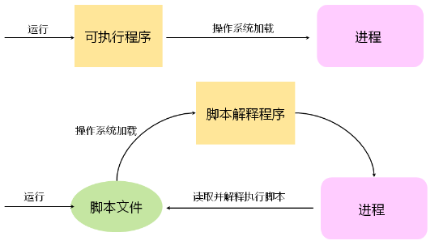

# 40.程序的内存分布
## 1. 程序文件的一般布局

- ### **不同代码在 *可执行程序* 中的对应关系**  
	.text(只读)  
	- 函数体代码  

	.data  
	- 全局变量(初始化)
	- 局部静态变量(初始化)  

	.bss  
	- 全局变量(未初始化)
	- 局部静态变量(未初始化)  

--------
## 2.程序和进程

- ### 程序和进程的不同处
	- 程序是静态概念,表现为一个可执行文件
	- 进程是动态概念,操作系统加载程序后得到进程
	- 一个程序可以对应多个进程
	- 一个进程只能对应一个程序

- ### 脚本
	- **脚本对应 *脚本解释程序***  
		当运行脚本文件,操作系统会查看是否关联到某个脚本解释程序  
		如果有关联,系统将加载运行此脚本解释程序.  
		加载了脚本解释程序后会变为进程,并读取脚本文件内容,解释执行
	
--------

## 3.程序文件的布局
***可执行程序的文件布局* 到加载到内存 *执行之后的内存布局***  

- ### 各个段的作用
	- 堆栈 :在程序运行后才正式存在,是程序运行的基础
	- .bss :全局变量和静态变量 (***未初始化***)
	- .text :程序的可执行代码
	- .data :全局变量和静态变量 (***已初始化***)
	- .rodate :常量 (只读存储区,如字符串常量)
- ### 程序术语的对应关系
	- 静态存储区 :.bss 和 .data
	- 只读存储区 :.rodata
	- 局部变量 :栈空间
	- 空间动态 :堆空间
	- 可执行代码 :.text(只读)
- ### 问题:对于全局变量和静态变量,初始化和未初始化保存的位置为何不同?

