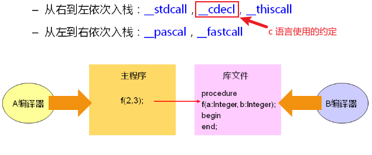

# 45.函数参数的秘密二(可变参数)
## 1. 参数入栈的顺序
- ### 调用约定
	- 描述参数如何传递到栈,以及栈的维护方式  
	参数的传递顺序
	- 栈的维护方式(栈清理)  
	
		函数调用肯定会发生参数传递,也有可能产生返回值.  
		返回值后,被调函数在栈上的信息需要被销毁:***被调函数*** 还是 ***调用函数*** 来做需要约定.
	- ***用于规范调用者以及被调函数之间的行为***
	- **调用约定不依赖于 *编译器***  

		不同的编译器都有预定义的调用约定  

	- 调用约定的应用场景  
		使用库函数函数:主程序必须遵守库函数的调用约定


--------
## 2. 可变参数
- ### 可变参数函数的实现依赖于 stdarg.h 
	- va_list :函数的参数集合
	- va_arg :取参数值
	- va_start :标识参数的访问开始时间
	- va_end :标识参数的访问结束时间

### 通过test_2.c 学习可变参数函数
```c
#include <stdio.h>
#include <stdarg.h>

float average(int n, ...)
{
    va_list args;    //通过 va_list 得到 ... 代表的参数多个
    int i = 0;
    float sum = 0;

    va_start(args, n);    //通过va_start 获得n个 ... 参数内容,并保存到args中

    for(i=0; i<n; i++)
    {
        sum += va_arg(args, int);    //从va_list args中取一个int出来,一共取n次
    }

    va_end(args);    //... 参数值取完

    return sum / n;   //求得平均值
}

int main()
{
    printf("%f\n", average(5, 1, 2, 3, 4, 5));
    printf("%f\n", average(4, 1, 2, 3, 4));

    return 0;
}
```
- ### 可变参数的限制
	- 可变参数从头到尾按照顺序逐个访问
	- 参数列表中 ***至少存在一个确定的命名参数***
	- 可变参数函数无法确定实际存在的参数的数量
	- 可变参数函数无法确定参数的实际类型  
		所以在例子中,指定类型为 int
		```
		va_arg(args, int)
		```
