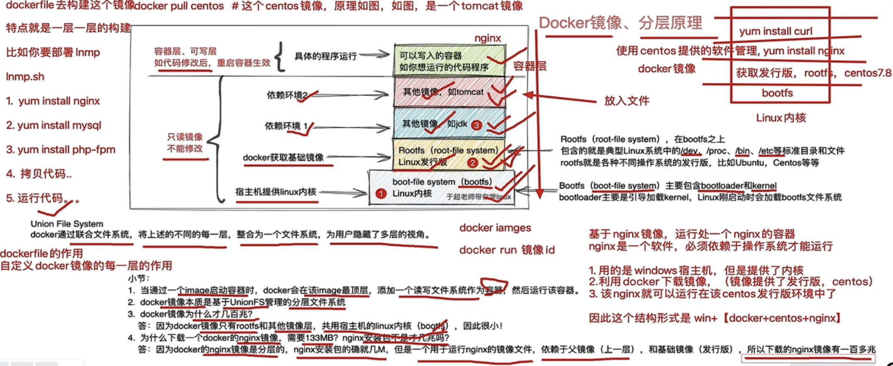
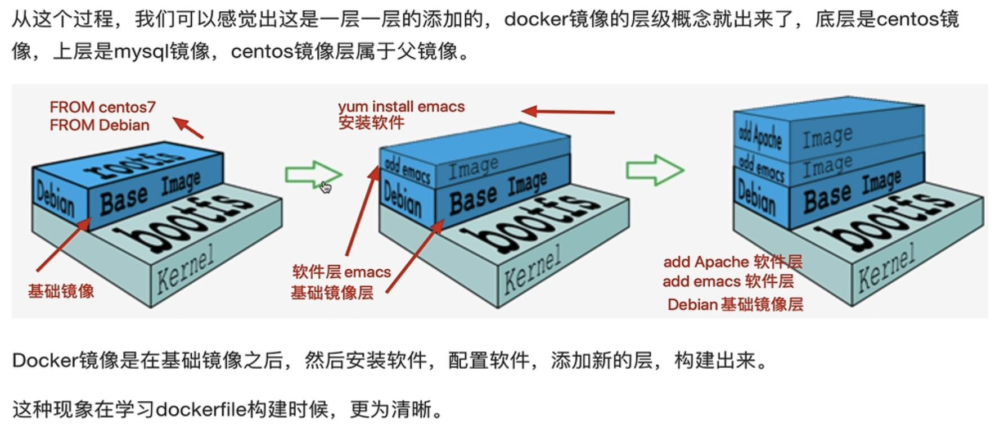
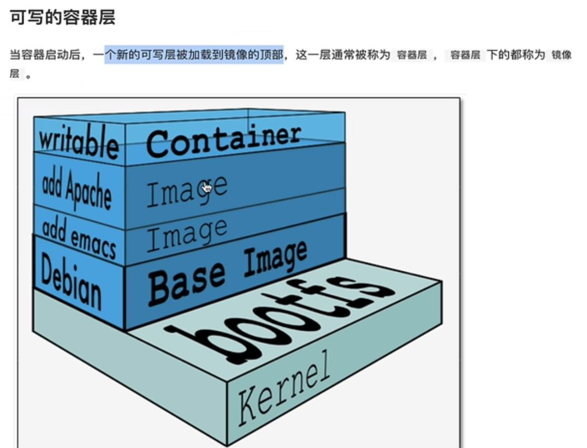

# docker 镜像原理
## 原理一.docker 镜像构成
	通过下图理解 docker 镜像构成

### docker pull nginx 得到的镜像是由 可修改的容器层 和 只读镜像层 组成
- 只读镜像(不能修改)
	1. boot-file system(bootfs): 包含 [bootloader] 和 [linux kernel] (宿主机提供).
	2. Rootfs:Linux 发行版(docker 获取的基础镜像)
	3. 依赖环境层1
	4. 依赖环境层2
- 可修改的容器(container)层

### dockerfile
	用此文件去构建镜像.特点为一层一层的构建.

### Union File System
	docker通过联合文件系统,将上述的每一层,整合为一个文件系统,为用户隐藏了只读层.

### 小结
	1. 当通过一个image启动容器时,docker会在该image最顶层,添加一个读写文件系统作为容器,然后运行该容器  
	2. docker镜像本质: 基于UnionFS管理的分层文件系统
	3. docker镜像包括: Rootfs和其他镜像层.公用宿主机linux kernel(bootfs)
--------
## 原理二.docker 镜像定义
	通过下图理解 docker 分层镜像

### 分层镜像的好处
	1. 资源的共享: 多个镜像都来自于同一个base镜像,则 docker host 只需存储一份base镜像.
	2. 写时复制: 多个容器共享同一个base镜像,某个容器修改了base镜像(/etc)内容,其他容器也不会被修改.
	3. 文件删除操作: docker会从上到下依次在各镜像中查找文件,找到后会在容器层记录下此删除操作.(只记录)

