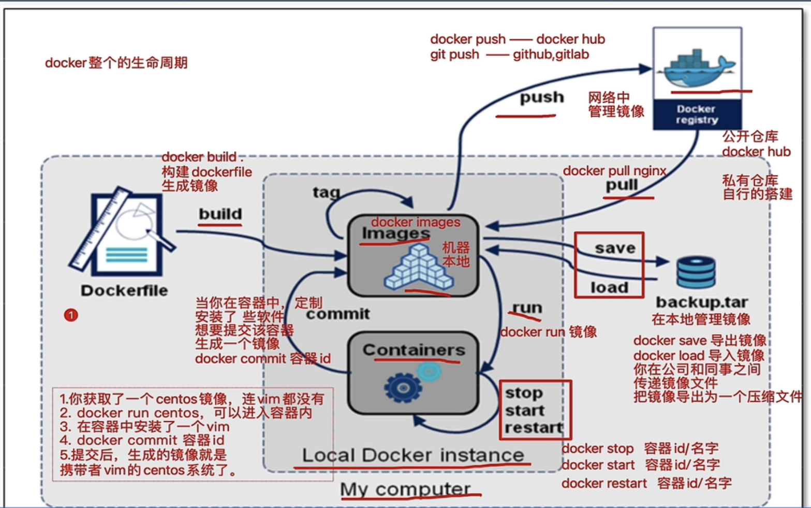

# docker 相关笔记

- [docker安装](docker_install.md)  
- [docker镜像相关操作](docker_image.md)  
- [docker容器相关操作](docker_container.md)  
- [dockerfile写法](docker_dockerfile.md)  
- [docker生命周期](docker_life.md)  
- [docker运行ubuntu](docker_ubuntu.md)  
- [docker 镜像原理](docker_base.md)  

docker 生命周期核心图  
  
