# x1 qemu安装
## 一. 常用工具链
```shell
qemu libncurses5-dev gcc-arm-linux-gnueabi build-essential gdb-arm-none-eabi gcc-aarch64-linux-gnu
eclipse-cdt
```

## 二. 下载内核代码
```shell
git clone https://github.com/figozhang/runninglinuxkernel_4.0.git

优化选项变更:o2变o0
```
## 三. 编译内核
```shell
cd runninglinuxkernel_4.0
export ARCH=arm             ARCH=arm64
export CROSS_COMPILE=arm-linux-gnueabi-
make vexpress_defconfig

生成设备节点
mkdir _install_arm32/dev
cd _install_arm32/dev
sudo mknod console c 5 1

make bzImage –j4
make dtbs
```

## 四. 运行QEMU
```shell
qemu-system-arm -nographic -M vexpress-a9 -smp 4 -m 1024M -kernel arch/arm/boot/zImage -append "rdinit=/linuxrc console=ttyAMA0 loglevel=8" -dtb arch/arm/boot/dts/vexpress-v2p-ca9.dtb -S -s

-nographic:f不要图形
-M:x选择机器类型
-m:n分配内存
-kernel:镜像文件所在位置
-append:将要传输给linux内核的参数
-dtb:dtb文件
-S -s:qemu debug功能
```

#### 查看系统相关信息
```shell
cat /proc/cpuinfo
cat /proc/meminfo
```

## 五. qemu+gdb debug
```shell
新开终端
arm-none-easbi-gdb --tui vmlinux
(gdb) target remote localhost:1234
(gdb) b do_fork        设置断点
(gdb) c                执行并停到do_fork函数
(gdb) s                单步调试
```

## 六. eclipse+qemu+gdb debug  
#### 1. 设定workspace 默认就可以
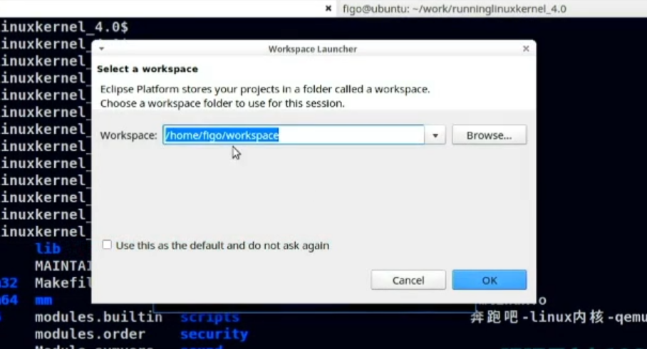  

#### 2. 启动eclipse后,设定debug C/C++  
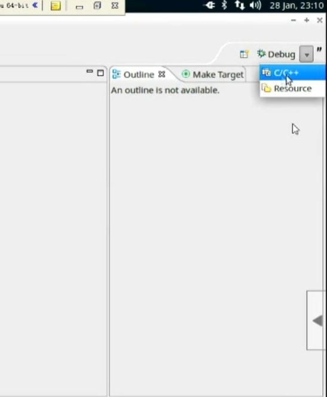  

#### 3. 创建工程
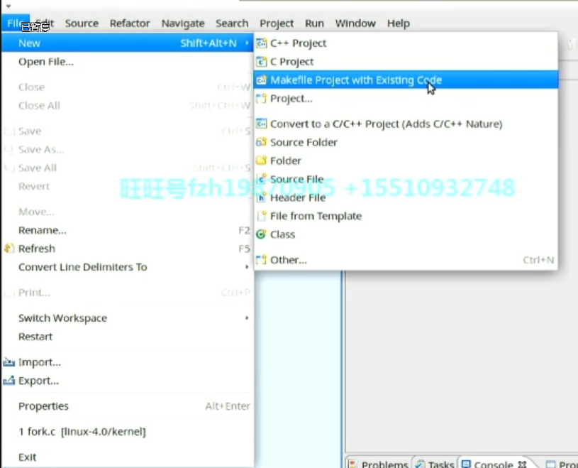  

**工程名字为: linux-4.0. 内核编译路径选择**  
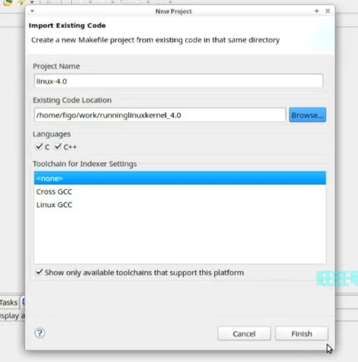  

#### 4. 配置debug选项
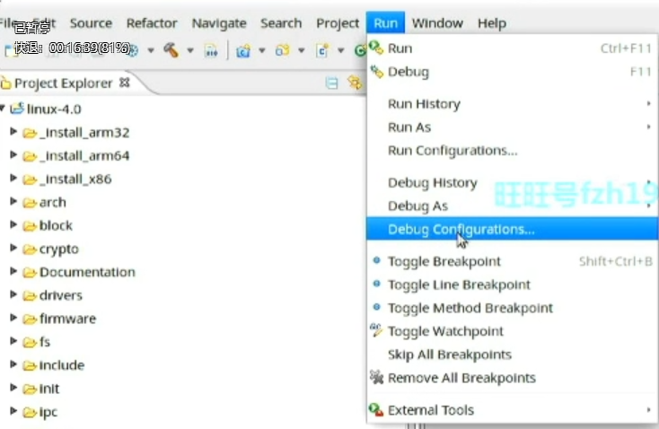  

**设置debug工程名为linux. 选择C/C++ Attach to App. 配置main标签**  
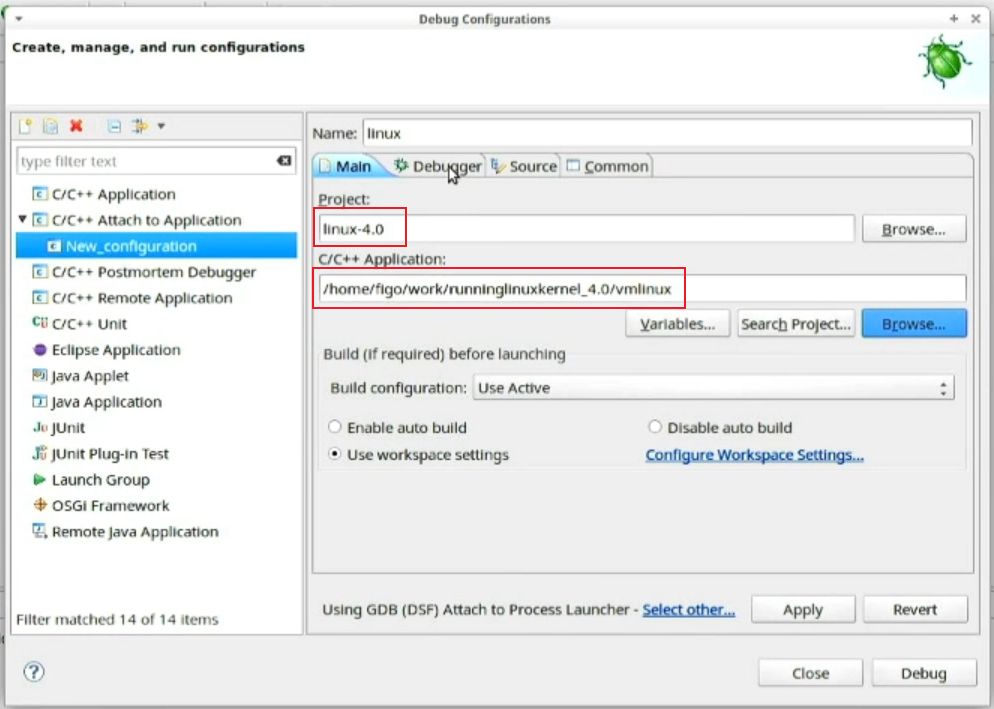  

**配置Debugger标签**  
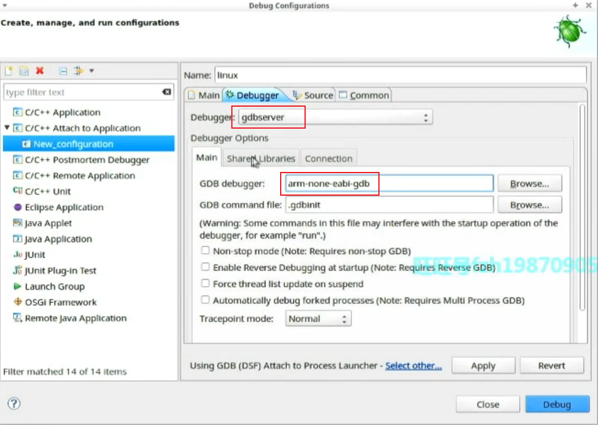  

**配置Connection子标签,完成debug选项配置**  
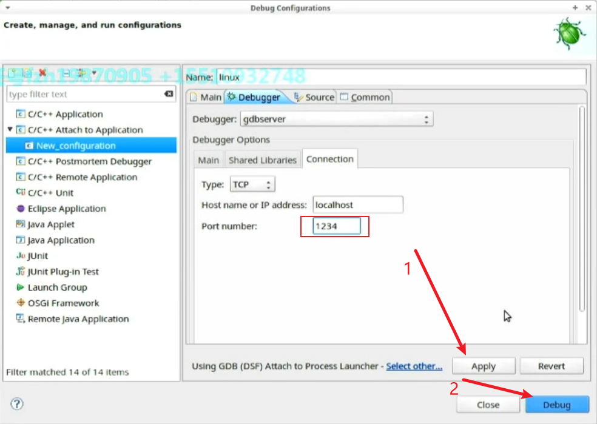  

#### 5. 启动QEMU,建立tcp连接  
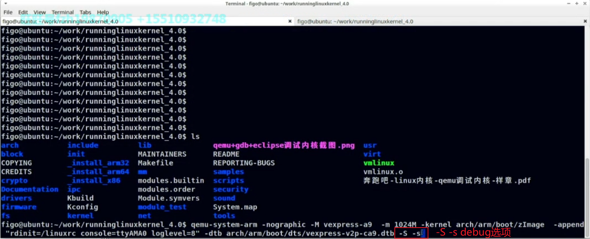  

#### 6. 回到eclipse,选择建立的linux debug项目
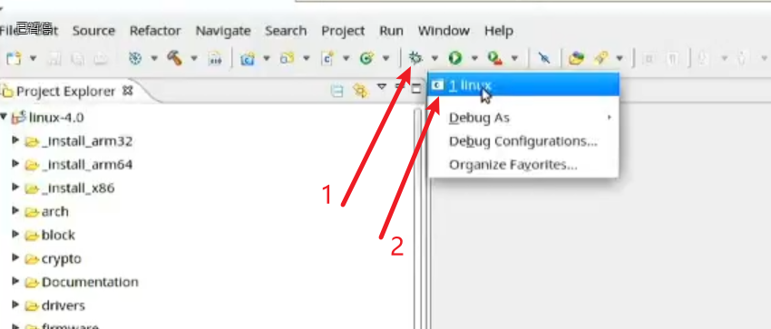  
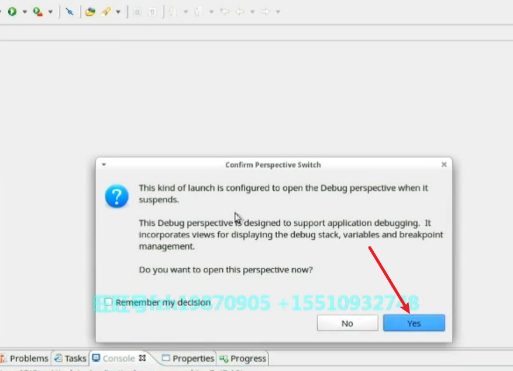  

#### 7. 加载vmlinux,添加断点开始调试
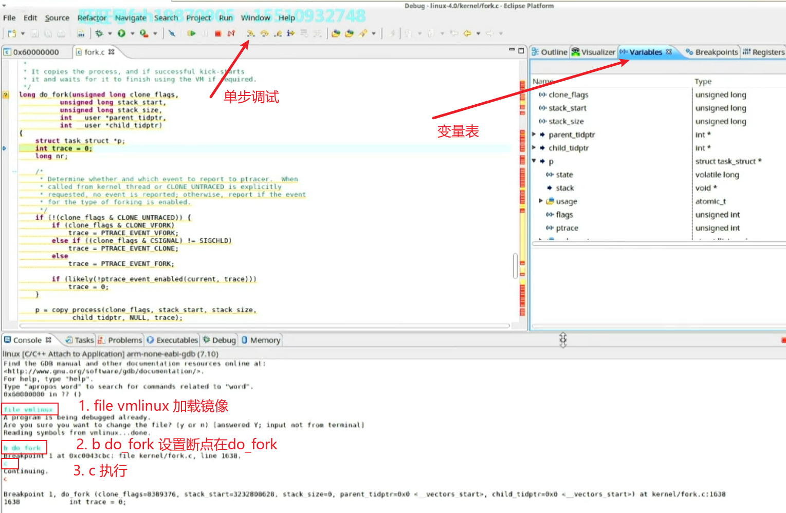  

