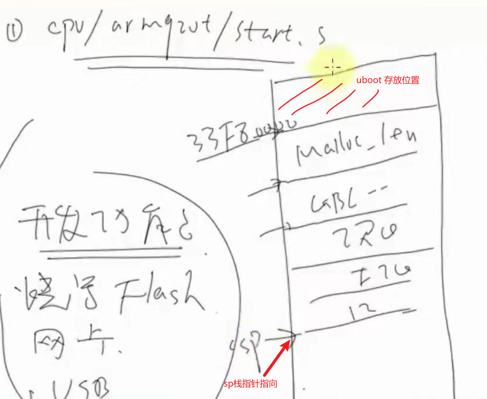

# 3.uboot分析之 源码第1阶段
## 概述第1阶段:硬件相关初始化 cpu/arm920t/start.S
- [1.设置CPU为 ***管理模式***](#1)
- [2.关闭看门狗](#2)
- [3.屏蔽所有的中断](#3)
- [4.CPU初始化(cpu_init_crit) 主要SDRAM 的初始化](#4)
- [5.设置栈SP](#5)
- [6.时钟初始化(clock_init)](#6)
- [7.代码重定位: 将nand存储的代码读到 ***SDRAM*** 的链接地址](#7)
- [8.清理 ***bss段*** ](#8)
- [9.调用C函数 ***start_armboot***](#9)


<h4 id="1">1.设置CPU为管理模式</h>  

[代码位置: start.S#L55](source/start.S#L55)
```armasm
_start:	b       reset    /* 跳转到reset */


/* #L135 */
reset:
	/*
	 * set the cpu to SVC32 mode
	 */
	mrs	r0,cpsr
	bic	r0,r0,#0x1f
	orr	r0,r0,#0xd3
	msr	cpsr,r0
/* 将cpu设置为 SVC32 管理模式 */
```

<h4 id="2">2.关闭看门狗</h>  

[代码位置: start.S#L157](source/start.S#L157)
```armasm
#if defined(CONFIG_S3C2400) || defined(CONFIG_S3C2410)
	ldr     r0, =pWTCON
	mov     r1, #0x0
	str     r1, [r0]
```

<h4 id="3">3.屏蔽所有的中断</h>··

[代码位置: start.S#L165](source/start.S#L165)
```armasm
	mov	r1, #0xffffffff
	ldr	r0, =INTMSK
	str	r1, [r0]
# if defined(CONFIG_S3C2410)
	ldr	r1, =0x3ff
	ldr	r0, =INTSUBMSK
	str	r1, [r0]
# endif
```

<h4 id="4">4.CPU初始化(cpu_init_crit) 主要SDRAM 的初始化</h>  

[代码位置: start.S#L250](source/start.S#L250)
```armasm
#ifndef CONFIG_SKIP_LOWLEVEL_INIT
	adr	r0, _start		/* r0 <- current position of code   */
	ldr	r1, _TEXT_BASE		/* test if we run from flash or RAM */
	cmp     r0, r1                  /* don't reloc during debug         */
	blne	cpu_init_crit
#endif
/* cpu初始化条件的判定
 adr	r0, _start     //addr: 读取地址指令. 目的: 确定当前 _start 代码位于哪个位置.
假设1. 正常上电启动 nand 会自动拷贝 _start 到片内 4K内存,此时 r0 = 0
假设2. 通过仿真器/调试器直接下载到SDRAM,则 r0= 0x33F80000 链接地址

 ldr	r1, _TEXT_BASE    //r1 = _TEXT_BASE 0x33F80000
 cmp     r0, r1    
 //如果 r0 和 r1 不相等,说明SDRAM还没有初始化. r0 = 0,证明SDRAM未初始化.
跳转到
cpu_init_crit:
*/

/* #L372 */
cpu_init_crit:
	/*
	 * flush v4 I/D caches
	 */
	mov	r0, #0
	mcr	p15, 0, r0, c7, c7, 0	/* flush v3/v4 cache */
	mcr	p15, 0, r0, c8, c7, 0	/* flush v4 TLB */
/* 关闭 flash 清理 cache */

	/*
	 * disable MMU stuff and caches
	 */
	mrc	p15, 0, r0, c1, c0, 0
	bic	r0, r0, #0x00002300	@ clear bits 13, 9:8 (--V- --RS)
	bic	r0, r0, #0x00000087	@ clear bits 7, 2:0 (B--- -CAM)
	orr	r0, r0, #0x00000002	@ set bit 2 (A) Align
	orr	r0, r0, #0x00001000	@ set bit 12 (I) I-Cache
	mcr	p15, 0, r0, c1, c0, 0
/* 关闭MMU */

	/*
	 * before relocating, we have to setup RAM timing
	 * because memory timing is board-dependend, you will
	 * find a lowlevel_init.S in your board directory.
	 */
	mov	ip, lr
	bl	lowlevel_init    /* 跳转到lowlevel_init,初始化存储控制器 */
	mov	lr, ip
	mov	pc, lr
#endif /* CONFIG_SKIP_LOWLEVEL_INIT */
```
- bl lowlevel_init  
[初始化存储控制器 代码位置](source/lowlevel_init.S#L96)
```armasm
/* cpu/arm920t/at91rm9200/lowlevel_init.S */
	ldr	r0, =SMRDATA    /* 初始化内存控制器 */
	ldr	r1, _MTEXT_BASE
	sub	r0, r0, r1
	add	r2, r0, #80

/* #L136 */
SMRDATA:
	.word MC_PUIA
	.word MC_PUIA_VAL
	.word MC_PUP
	.word MC_PUP_VAL
	.word MC_PUER
	.word MC_PUER_VAL
	.word MC_ASR
	.word MC_ASR_VAL
	.word MC_AASR
	.word MC_AASR_VAL
	.word EBI_CFGR
	.word EBI_CFGR_VAL
	.word SMC2_CSR
	.word SMC2_CSR_VAL
	.word PLLAR
	.word PLLAR_VAL
	.word PLLBR
	.word PLLBR_VAL
	.word MCKR
	.word MCKR_VAL
	/* SMRDATA is 80 bytes long */
	/* here there's a delay of 100 */
```

<h4 id="5">5.设置栈SP</h>  

[代码位置: start.S#L258](source/start.S#L258)
```armasm
	/* Set up the stack						    */
stack_setup:
	ldr	r0, _TEXT_BASE		/* upper 128 KiB: relocated uboot   */
	sub	r0, r0, #CFG_MALLOC_LEN	/* malloc area                      */
	sub	r0, r0, #CFG_GBL_DATA_SIZE /* bdinfo                        */

#ifdef CONFIG_USE_IRQ
	sub	r0, r0, #(CONFIG_STACKSIZE_IRQ+CONFIG_STACKSIZE_FIQ)
#endif
	sub	sp, r0, #12		/* leave 3 words for abort-stack    */
/* 
ldr    r0, _TEXT_BASE 将_TEXT_BASE    //赋值给r0 =0x33F80000
sub    r0, r0, #CFG_MALLOC_LEN    //使用 0x33F80000 - MALLOC_LEN
sub    r0, r0, #CFG_GBL_DATA_SIZE    //再减去 GBL_DATA_SIZE
sub    r0, r0, #(CONFIG_STACKSIZE_IRQ+CONFIG_STACKSIZE_FIQ) //再减去 IRQ 和 FIQ

sub    sp, r0, #12    //让sp = r0 -12
此时栈设置完毕可以使用 c语言函数
*/
```
- 栈的结构图  


<h4 id="6">6.时钟初始化</h>  

[代码位置: board/100ask24x0/boot_init.c#L527](source/boot_init.c#L527)
```c
clk_power->UPLLCON = S3C2410_UPLL_48MHZ;    //usb时钟设定为48M

//#L533 整个系统的时钟
clk_power->MPLLCON = S3C2410_MPLL_200MHZ;
```

<h4 id="7">7.代码重定位: 将nand存储的代码读到 SDRAM 的链接地址</h>  

[代码位置: start.S#L269](source/start.S#L269)
```armasm
relocate:				/* relocate U-Boot to RAM	    */
	adr	r0, _start		/* r0 <- current position of code   */
	ldr	r1, _TEXT_BASE		/* test if we run from flash or RAM */
	cmp     r0, r1                  /* don't reloc during debug         */
	beq     clear_bss
	
	ldr	r2, _armboot_start
	ldr	r3, _bss_start
	sub	r2, r3, r2		/* r2 <- size of armboot            */
#if 1
	bl  CopyCode2Ram	/* r0: source, r1: dest, r2: size */

/* 将代码从flash读到SDRAM的链接地址 */
```
- 分析拷贝函数 ***CopyCode2Ram***  
[代码位置: board/100ask24x0/boot_init.c#L450](source/boot_init.c#L450)
```c
int bBootFrmNORFlash(void)
{
    volatile unsigned int *pdw = (volatile unsigned int *)0;
    unsigned int dwVal;

    /*
     * 无论是从NOR Flash还是从NAND Flash启动，
     * 地址0处为指令"b	Reset", 机器码为0xEA00000B，
     * 对于从NAND Flash启动的情况，其开始4KB的代码会复制到CPU内部4K内存中，
     * 对于从NOR Flash启动的情况，NOR Flash的开始地址即为0。
     * 对于NOR Flash，必须通过一定的命令序列才能写数据，
     * 所以可以根据这点差别来分辨是从NAND Flash还是NOR Flash启动:
     * 向地址0写入一个数据，然后读出来，如果没有改变的话就是NOR Flash
     */

    dwVal = *pdw;    //读出0地址的内容
    *pdw = 0x12345678;    //修改0地址内的值等于0x12345678
    if (*pdw != 0x12345678)    //再读出0地址的内容,读 不等于 写 说明是 nor flash 启动
    {
        return 1;
    }
    else
    {
        *pdw = dwVal;
        return 0;
    }
}

int CopyCode2Ram(unsigned long start_addr, unsigned char *buf, int size)
{
    unsigned int *pdwDest;    //复制到哪里去
    unsigned int *pdwSrc;    //复制源
    int i;

    if (bBootFrmNORFlash())
    {
        pdwDest = (unsigned int *)buf;
        pdwSrc  = (unsigned int *)start_addr;
        /* 从 NOR Flash启动 */
        for (i = 0; i < size / 4; i++)
        {
            pdwDest[i] = pdwSrc[i];
        }
        return 0;
    }
    else
    {
        /* 初始化NAND Flash */
        nand_init_ll();
        /* 从 NAND Flash启动 */
        nand_read_ll_lp(buf, start_addr, (size + NAND_BLOCK_MASK_LP)&~(NAND_BLOCK_MASK_LP));
        return 0;
    }
}

//系统可以从nor 或nand启动,判断方法是
//bBootFrmNORFlash()
判断方法: 假定 nor启动: 0地址对应nor flash,nor flash不能像内存那样去写操作
         假定 nand启动: 0地址对应片内的内存,0地址可以写入
```

<h4 id="8">8.清理 bss 段</h>  

[代码位置: start.S#L292](source/start.S#L292)
```armasm
clear_bss:
	ldr	r0, _bss_start		/* find start of bss segment        */
	ldr	r1, _bss_end		/* stop here                        */
	mov 	r2, #0x00000000		/* clear                            */

clbss_l:str	r2, [r0]		/* clear loop...                    */
	add	r0, r0, #4
	cmp	r0, r1
	ble	clbss_l
```
- bss段: 初始值为0的静态变量/全局变量,或未初始化的静态变量/全局变量  
	查看链接脚本u-boot-1.1.6/board/100ask24x0/u-boot.lds
```ld.script
	. = ALIGN(4);
	__bss_start = .;    ##__bss_start 等于当前地址
	.bss : { *(.bss) }    ##存放所有文件的bss段
	_end = .;
```

<h4 id="9">9.调用C函数 start_armboot</h>

[代码位置: start.S#L333](source/start.S#L333)

