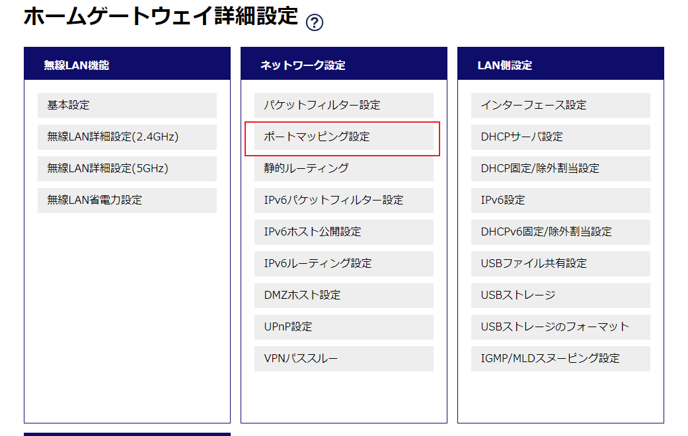
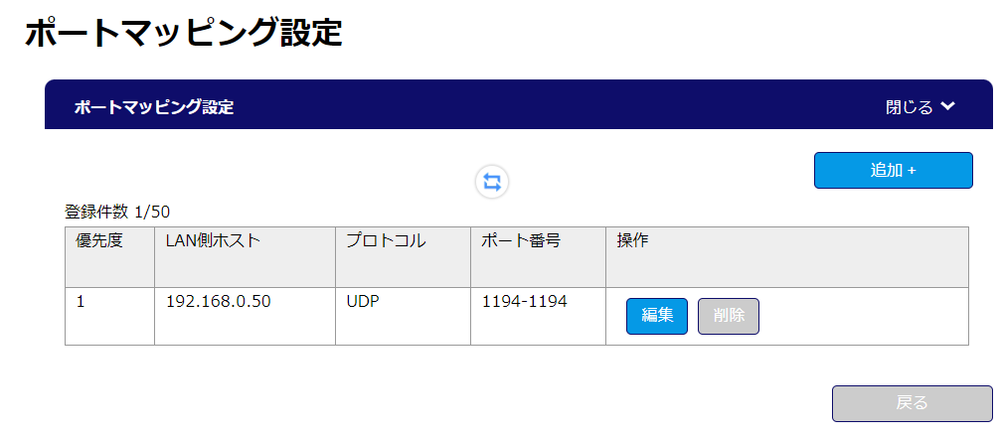

# Ubuntu OpenVPN 服务器配置手顺

## 一. 系统基础配置

### 1. 合盖不休眠

笔记本作为服务器需要保持运行，合盖不休眠。

**修改配置文件**：
```bash
sudo nano /etc/systemd/logind.conf
```

**修改以下三行**（取消注释并改为 ignore）：
```
HandleLidSwitch=ignore
HandleLidSwitchExternalPower=ignore
HandleLidSwitchDocked=ignore
```

**重启服务使配置生效**：
```bash
sudo systemctl restart systemd-logind
```

---

### 2. 配置静态 IP

#### 2.1 查看当前网络状态

```bash
# 查看网络接口和 IP
ip addr show

# 查看 netplan 配置文件
ls /etc/netplan/
```

#### 2.2 修改 netplan 配置

```bash
sudo nano /etc/netplan/50-cloud-init.yaml
```

**配置内容示例**（WiFi 静态 IP）：
```yaml
network:
  version: 2
  wifis:
    wlp4s0:
      dhcp4: false
      addresses:
        - 192.168.0.16/24
      routes:
        - to: default
          via: 192.168.0.1
      nameservers:
        addresses:
          - 8.8.8.8
      access-points:
        "WiFi名称":
          auth:
            key-management: "psk"
            password: "WiFi密码"
```

> 注意：根据实际情况修改接口名称（wlp4s0）、IP 地址、网关、WiFi 名称和密码

#### 2.3 应用配置

```bash
sudo netplan apply
```

#### 2.4 验证配置

```bash
ip addr show wlp4s0 | grep inet
```

---

## 二. 安装 OpenVPN

### 1. 确认公网 IP

```bash
curl -4 -s ifconfig.me
```

记录返回的 IPv4 地址，安装时需要使用。

### 2. 查看端口占用（可选）

如果同一网络有其他 OpenVPN 服务器，需要确认端口未被占用：

```bash
ss -tuln | grep 1194
ss -tuln | grep 1195
ss -tuln | grep 1196
```

### 3. 下载安装脚本

```bash
wget https://git.io/vpn -O openvpn-install.sh
```

### 4. 添加执行权限

```bash
chmod +x openvpn-install.sh
```

### 5. 执行安装脚本

```bash
sudo bash openvpn-install.sh
```

### 6. 安装选项说明

| 选项 | 说明 | 建议值 |
|------|------|--------|
| Public IPv4 | 公网 IP | 使用默认检测值 |
| Protocol | 协议 | 1 (UDP，推荐) |
| Port | 端口 | 1194（或未占用端口） |
| DNS | DNS 服务器 | 2 (Google) |
| Client name | 客户端名称 | 自定义，如 client1 |

**安装过程示例**：
```
This server is behind NAT. What is the public IPv4 address or hostname?
Public IPv4 address / hostname [106.155.137.28]: 回车

Which protocol should OpenVPN use?
   1) UDP (recommended)
   2) TCP
Protocol [1]: 1

What port should OpenVPN listen on?
Port [1194]: 1196

Select a DNS server for the clients:
   1) Default system resolvers
   2) Google
   ...
DNS server [1]: 2

Enter a name for the first client:
Name [client]: x1_openvpn

OpenVPN installation is ready to begin.
Press any key to continue...
```

### 7. 安装完成

安装完成后，客户端配置文件位置：
```
/home/用户名/客户端名称.ovpn
```

### 8. 验证服务状态

```bash
sudo systemctl status openvpn-server@server
```

---

## 三. 路由器端口转发

在路由器管理页面设置端口转发。

### 1. 进入路由器设置页面

访问路由器管理页面（通常是 `192.168.0.1`），找到「ポートマッピング設定」：



### 2. 添加端口映射规则

点击「追加+」添加新规则：



### 3. 设置参数

| 项目 | 值 |
|------|-----|
| LAN側ホスト | 192.168.0.16（服务器静态 IP） |
| プロトコル | UDP |
| ポート番号 | 1196-1196（与安装时选择的端口一致） |

---

## 四. 客户端使用

### 1. 获取配置文件

将服务器上的 `.ovpn` 文件传输到客户端设备。

### 2. 客户端软件

| 平台 | 软件 |
|------|------|
| Windows | OpenVPN GUI / OpenVPN Connect |
| macOS | Tunnelblick / OpenVPN Connect |
| iOS | OpenVPN Connect |
| Android | OpenVPN Connect |
| Linux | openvpn 命令行 |

### 3. 导入并连接

导入 `.ovpn` 文件，点击连接即可。

---

## 五. 添加新客户端

再次运行安装脚本：

```bash
sudo bash openvpn-install.sh
```

选择 `1) Add a new client`，输入新客户端名称即可生成新的 `.ovpn` 文件。

---

## 六. 常用命令

```bash
# 查看服务状态
sudo systemctl status openvpn-server@server

# 重启服务
sudo systemctl restart openvpn-server@server

# 停止服务
sudo systemctl stop openvpn-server@server

# 启动服务
sudo systemctl start openvpn-server@server

# 查看连接日志
sudo journalctl -u openvpn-server@server -f
```
