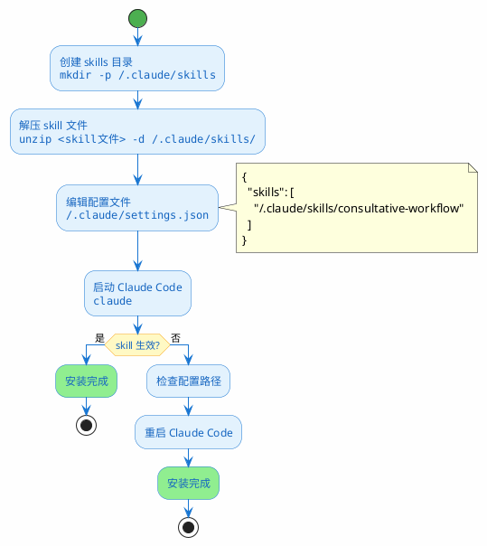

# Claude Code Skill 安装手顺

## 概要

本文档说明如何将自定义 skill (`consultative-workflow`) 安装到 WSL 环境的 Claude Code 中。

## 流程图



## 前提条件

- WSL2 环境已安装
- Claude Code 已安装并可正常使用
- 已下载 `.skill` 文件

## 安装步骤

### Step 1: 创建目录并解压

```bash
# 创建 skills 目录
mkdir -p ~/.claude/skills

# 解压 skill 文件（.skill 本质是 zip 格式）
unzip <skill文件路径> -d ~/.claude/skills/
```

### Step 2: 配置 Claude Code

编辑配置文件 `~/.claude/settings.json`，添加 skill 路径：

```json
{
  "skills": [
    "~/.claude/skills/consultative-workflow"
  ]
}
```

> **注意**：如果文件已存在且有其他配置，将 skill 路径添加到 `skills` 数组中即可。

### Step 3: 验证安装

启动 Claude Code 并测试：

```bash
claude
```

输入测试请求：

```
帮我修改 xxx 文件的 xxx 功能
```

**预期行为**：Claude 应该按照以下流程响应：

1. **阶段 1** - 主动探索项目结构和相关文件
2. **阶段 2** - 输出分析报告，询问方案是否正确
3. **阶段 3** - 等待你的确认或进行讨论迭代
4. **阶段 4** - 收到确认指令后才执行修改

## 一键安装脚本

将以下内容保存为 `install-skill.sh` 并执行：

```bash
#!/bin/bash

SKILL_FILE="$1"
SKILL_DIR="$HOME/.claude/skills"
CONFIG_FILE="$HOME/.claude/settings.json"

# 检查参数
if [ -z "$SKILL_FILE" ]; then
    echo "Usage: $0 <path-to-skill-file>"
    exit 1
fi

# 创建目录
mkdir -p "$SKILL_DIR"
mkdir -p "$(dirname "$CONFIG_FILE")"

# 解压 skill
unzip -o "$SKILL_FILE" -d "$SKILL_DIR/"

# 获取 skill 名称
SKILL_NAME=$(unzip -l "$SKILL_FILE" | grep "SKILL.md" | awk '{print $4}' | cut -d'/' -f1)

echo "Skill '$SKILL_NAME' installed to $SKILL_DIR/$SKILL_NAME"
echo ""
echo "请手动将以下路径添加到 $CONFIG_FILE 的 skills 数组中："
echo "   $SKILL_DIR/$SKILL_NAME"
```

使用方法：

```bash
chmod +x install-skill.sh
./install-skill.sh ~/consultative-workflow.skill
```

## 卸载方法

```bash
# 删除 skill 目录
rm -rf ~/.claude/skills/consultative-workflow

# 编辑 settings.json，移除对应的 skill 路径
nano ~/.claude/settings.json
```

## Troubleshooting

| 问题 | 解决方法 |
|------|----------|
| `unzip: command not found` | 执行 `sudo apt install unzip` |
| skill 未生效 | 检查 `settings.json` 路径是否正确，重启 Claude Code |
| 权限错误 | 执行 `chmod -R 755 ~/.claude/skills/` |

## 参考

- Skill 文件位置：`~/.claude/skills/consultative-workflow/SKILL.md`
- 配置文件位置：`~/.claude/settings.json`
