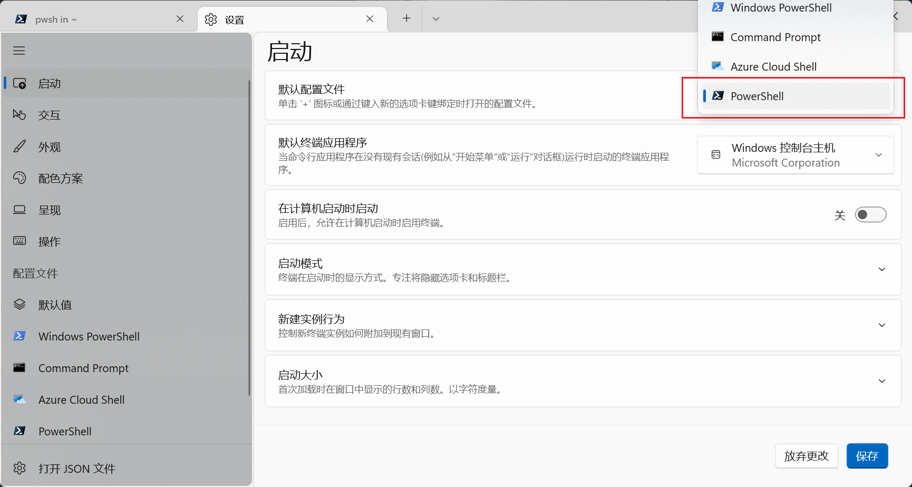
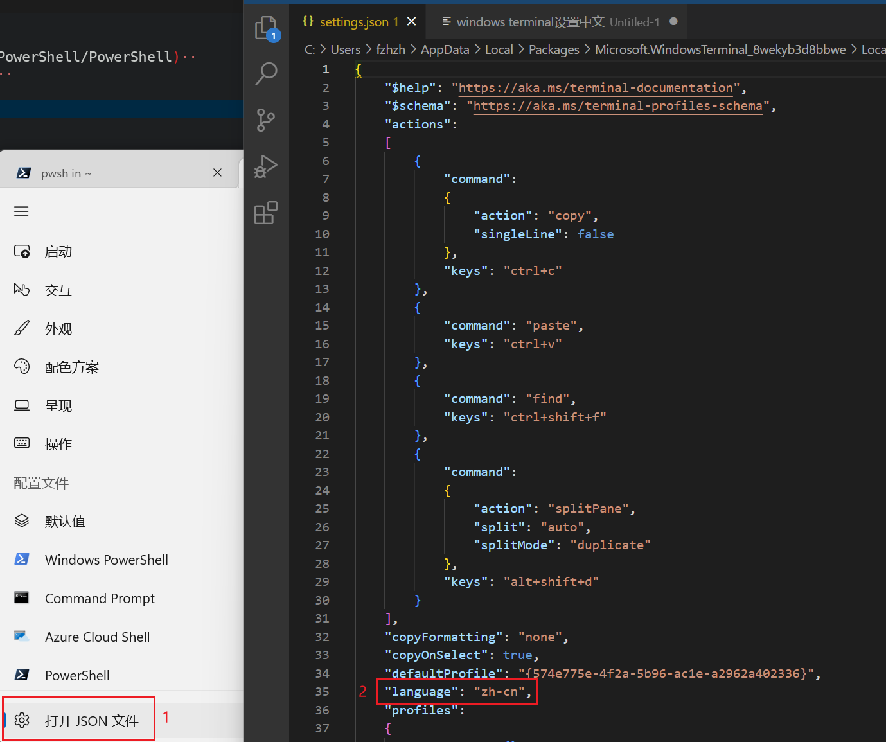
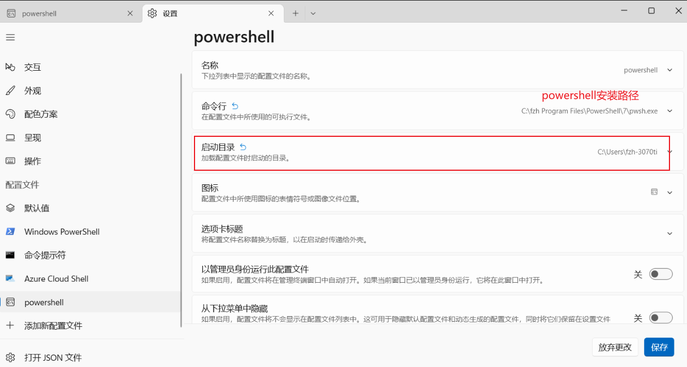
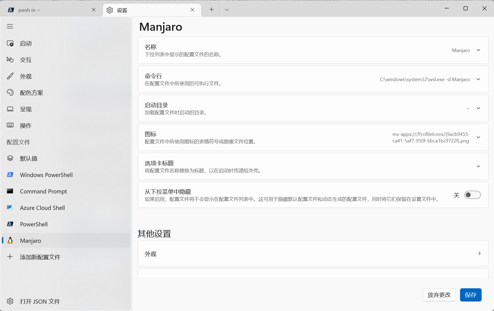

# powershell和nvim以及wsl2相关配置

- [1.下载powershell](#1)  
- [2.添加powershell配置文件](#2)  


<h4 id="1">[1.下载powershell]</h>  

> 下载最新**powershell-x.x.x-win-x64.msi**  
> 查看powershell版本  
> `$host`

- [powershell下载地址](https://github.com/PowerShell/PowerShell)  

<h4 id="2">[2.添加powershell配置文件]</h>  

> windows terminal 配置文件位置(按键映射以及外观设置)
> `C:\Users\fzh-3070ti\AppData\Local\Packages\Microsoft.WindowsTerminal_8wekyb3d8bbwe\LocalState\settings.json`
> 
>
> windows terminal设置为中文
> 
>
> 将powershell添加到windows terminal
> 

## 一.安装scoop

### 1.修改scoop安装的环境变量
```shell
$env:SCOOP='c:\Scoop'
[Environment]::SetEnvironmentVariable('SCOOP', $env:SCOOP, 'User')
```

### 2.安装scoop
```shell
iwr -useb get.scoop.sh | iex
```

### 3.安装一些命令
```shell
scoop install git
scoop bucket add versions
scoop update git
scoop bucket add extras
scoop bucket add main
scoop install posh-git
scoop install oh-my-posh
scoop install lazygit
scoop install graphviz
scoop bucket add java
scoop install openjdk
scoop install neovim-nightly
scoop install delta
scoop install mingw fd file lf fzf PSFzf ripgrep ouch ueberzugpp
scoop install global ctags
```

## 二.powershell安装emacs键位

### 在本terminal更改为emacs键位,在terminal输入
```shell
Install-Module -Name PowerShellGet -Force
Install-Module PSReadLine
Set-PSReadLineOption -EditMode Emacs

列出按键
Get-PSReadLineKeyHandler
```

### 生成配置文件,在terminal输入
```shell
if (!(Test-Path -Path $PROFILE )) { New-Item -Type File -Path $PROFILE -Force }

显示配置文件所在位置
echo $PROFILE

notepad C:\文档\PowerShell\Microsoft.PowerShell_profile.ps1
```

### Microsoft.PowerShell_profile.ps1文件内容
先设定环境变量(废弃)
```shell
POSH_THEMES_PATH
%SCOOP%\apps\oh-my-posh\current\themes
```
编辑Microsoft.PowerShell_profile.ps1
```shell
Import-Module PSReadLine
Import-Module posh-git
Set-PSReadLineOption -EditMode Emacs
Set-PSReadlineKeyHandler -Key Tab -Function MenuComplete
Set-Alias -Name lg -Value lazygit
setx POSH_THEMES_PATH "%LOCALAPPDATA%\Programs\oh-my-posh\themes"
oh-my-posh --init --shell pwsh --config "$env:POSH_THEMES_PATH\ys.omp.json" | Invoke-Expression

Set-PsFzfOption -PSReadlineChordProvider 'Ctrl+t' -PSReadlineChordReverseHistory 'Ctrl+r'
setx FZF_DEFAULT_OPTS "--no-mouse"

# ========== Yazi 配置（替换 lf） ==========
function ra {
    $tempFile = [System.IO.Path]::GetTempFileName()
    try {
        # Yazi を起動（終了時のディレクトリを記録）
        & yazi --cwd-file="$tempFile" $args

        # 終了後のディレクトリを読み取り
        if (Test-Path -LiteralPath $tempFile) {
            $lastDir = Get-Content -LiteralPath $tempFile -Raw
            if ($lastDir) {
                $lastDir = $lastDir.Trim()
            }

            # ディレクトリ変更
            if ($lastDir -and (Test-Path -LiteralPath $lastDir)) {
                $currentLocation = (Get-Location).Path
                if ($lastDir -ne $currentLocation) {
                    Set-Location -LiteralPath $lastDir
                }
            }
        }
    }
    finally {
        # 一時ファイルをクリーンアップ
        if (Test-Path -LiteralPath $tempFile) {
            Remove-Item -LiteralPath $tempFile -Force
        }
    }
}
```
### 实现右键菜单
```shell
git clone https://github.com/LittleNewton/Open_Windows_Terminal_Here.git
cd Open_Windows_Terminal_Here/src
.\install.ps1 mini
```

### yazi配置文件
```shell
# 创建配置目录
New-Item -ItemType Directory -Force -Path "$env:APPDATA\yazi\config"
New-Item -ItemType Directory -Force -Path "$env:APPDATA\yazi\config\plugins"
New-Item -ItemType Directory -Force -Path "$env:APPDATA\yazi\config\scripts"

# 查看配置目录
explorer "$env:APPDATA\yazi\config"

# 复制配置文件（假设文件在当前目录）
Copy-Item yazi.toml "$env:APPDATA\yazi\config\"
Copy-Item keymap.toml "$env:APPDATA\yazi\config\"
Copy-Item init.lua "$env:APPDATA\yazi\config\"
```

### lazygit配置文件位置
```shell
C:\Users\fzh-3070ti\AppData\Roaming\lazygit
```

### tig配置文件位置(%USERPROFILE%)
```shell
C:\Users\fzh-3070ti\
```

### lf配置文件位置
```shell
C:\Users\fzh-3070ti\AppData\Local\lf
```

### 查看环境变量
```shell
Get-ChildItem env:
```

### 查看命令位置,比如lf
```shell
Get-Command lf
Get-Command yazi
```

## 三.安装nerd字体

### 1.通过网址下载,打开以下网址
```shell
https://www.nerdfonts.com/font-downloads

选择喜欢的字体
Sauce Code Pro Semibold Nerd Font
Sauce Code Pro Semibold Nerd Font Complete Windows Compatible.ttf
```
## 四.nvim配置

### 1.nvim配置文件位置
```shell
C:\Users\fzh-3070ti\AppData\Local\nvim
```

### 2.其他必须操作
```shell
scoop install nvm
nvm list available
nvm install 16.13.1 注意安装LTS列的最新
nvm use 16.13.1

修改nvm环境变量(废弃)
NVM_SYMLINK
c:\Scoop\persist\nvm\nodejs\v16.15.0

Path(废弃)
C:\Scoop\apps\nvm\current\nodejs\v16.15.0


scoop search python
scoop install python

python3.exe -m pip install --upgrade pip
当以上命令报错时,使用以下命令
python -m pip install -U pip --user
并添加pip环境变量


pip3 install --user --upgrade pynvim
pip3 install --user --upgrade neovim
pip3 install --user --upgrade pygments
```

### 3.gtags配置文件位置
```shell
C:\Users\用户名\.gtags.conf
```

## 五.WSL2使用manjaro

### 1.安装WSL2:使用管理员身份打开terminal
```shell
dism.exe /online /enable-feature /featurename:Microsoft-Windows-Subsystem-Linux /all /norestart
dism.exe /online /enable-feature /featurename:VirtualMachinePlatform /all /norestart

以上两条命令执行后,需要重启电脑

下载Linux内核更新包:网址如下
https://wslstorestorage.blob.core.windows.net/wslblob/wsl_update_x64.msi

将WSL2设为默认版本
wsl --set-default-version 2
```

### 2.安装manjaro 或者Ubuntu22.04
```shell
scoop install manjarowsl

wsl --install -d Ubuntu-22.04
wsl --update

实体硬盘路径
C:\Scoop\persist\manjarowsl\data\ext4.vhdx

如果需要修改硬盘分配空间大小(不能小于256G,例子设为512G)
diskpart
DISKPART> Select vdisk file="C:\Scoop\persist\manjarowsl\data\ext4.vhdx"
DISKPART> detail vdisk
DISKPART> expand vdisk maximum=512000
DISKPART> exit

缩小WSL2 VHDX文件大小(没试过)
进入到WSL2中,运行zerofree将ext4文件系统内已经不用的块填零,
但zerofree不能运行在已经挂载为rw的文件系统上.
那就把文件系统挂载为readonly就行了.

wsl2> mount /dev/sda -o remount,ro
wsl2> zerofree /dev/sda

wsl --shutdown

diskpart
DISKPART> Select vdisk file="C:\Scoop\persist\manjarowsl\data\ext4.vhdx"
DISKPART> compact vdisk
DISKPART> exit
```

### 3.在terminal中新建manjaro配置文件.如图

```shell
配置文件头像设定
ms-appx:///ProfileIcons/{9acb9455-ca41-5af7-950f-6bca1bc9722f}.png
```

### 4.启动manjaro
```shell
首先确定是否在WSL2运行
wsl -l -v

新建用户
useradd -u 2018 -m -g fzh -G wheel -s /bin/bash fzh
passwd fzh
echo "%wheel ALL=(ALL) ALL" >/etc/sudoers.d/wheel
exit

WSL2 manjaro默认启动用户设定
Manjaro.exe config --default-user fzh
```

### 5.manjaro内部设定
```shell
sudo pacman-mirrors --country japan
sudo pacman -Syu
```

## 六.安装 wezterm 终端

### 1.使用 scoop 安装 wezterm
```shell
# 添加 extras bucket（如果还没添加）
scoop bucket add extras

# 安装 wezterm
scoop install wezterm
scoop install yazi@25.5.31

reg import "C:\Scoop\apps\wezterm\current\install-context.reg"
```

### 2.wezterm 配置文件位置
```shell

New-Item -ItemType File -Force -Path "$env:USERPROFILE\.wezterm.lua"
notepad "$env:USERPROFILE\.wezterm.lua"
```

### 3.基础配置示例（.wezterm.lua）
```lua
-- WezTerm 配置文件
local wezterm = require 'wezterm'
local config = {}

-- 使用更好的配置方式（如果 WezTerm 版本支持）
if wezterm.config_builder then
  config = wezterm.config_builder()
end

-- 窗口设置
config.window_background_opacity = 0.95                    -- 透明度
config.window_padding = {                                  -- 内边距
  left = 5,
  right = 5,
  top = 5,
  bottom = 5,
}
config.window_decorations = "TITLE | RESIZE"              -- 显示标题栏

-- 字体设置
config.font = wezterm.font('SauceCodePro Nerd Font')     -- 使用已安装的 Nerd Font
config.font_size = 10.0

-- 颜色主题（Campbell）
config.colors = {
  foreground = '#CCCCCC',    -- 浅灰色前景
  background = '#0C0C0C',    -- 黑色背景

  -- 普通颜色
  ansi = {
    '#0C0C0C',    -- black
    '#C50F1F',    -- red
    '#13A10E',    -- green
    '#C19C00',    -- yellow
    '#0037DA',    -- blue
    '#881798',    -- magenta
    '#3A96DD',    -- cyan
    '#CCCCCC',    -- white
  },

  -- 明亮颜色
  brights = {
    '#767676',    -- bright black（灰色）
    '#E74856',    -- bright red
    '#16C60C',    -- bright green
    '#F9F1A5',    -- bright yellow
    '#3B78FF',    -- bright blue
    '#B4009E',    -- bright magenta
    '#61D6D6',    -- bright cyan
    '#F2F2F2',    -- bright white
  },
}

-- ========================================
-- 默认启动程序
-- ========================================
-- WezTerm 打开时默认运行的程序
-- 这里设置为 PowerShell，也可以改为 'wsl.exe' 等
config.default_prog = { 'pwsh.exe' }

-- ========================================
-- WSL 域配置
-- ========================================
-- 定义 WSL 环境作为"域"，可以在域之间切换
-- 不常用，一般通过 launch_menu 启动 WSL 就够了
config.wsl_domains = {
  {
    name = 'WSL:Ubuntu',           -- 域名称（内部标识）
    distribution = 'Ubuntu',       -- WSL 发行版名称（通过 wsl -l 查看）
    default_cwd = '~',             -- 默认工作目录
  },
}

-- ========================================
-- 启动菜单
-- ========================================
-- 定义可以启动的 Shell 列表
-- 使用方法：右键标签栏 -> 选择要打开的 Shell
config.launch_menu = {
  {
    label = 'PowerShell',
    args = { 'pwsh.exe' },
  },
  {
    label = 'WSL (mav)',
    args = { 'wsl.exe', '-u', 'mav' },
  },
  {
    label = 'Windows PowerShell',
    args = { 'powershell.exe' },
  },
  {
    label = 'Command Prompt',
    args = { 'cmd.exe' },
  },
}

-- 光标设置
config.default_cursor_style = 'SteadyBlock'

-- 选择时自动复制到剪贴板
config.selection_word_boundary = ' \t\n{}[]()"\'`'

-- 鼠标绑定
config.mouse_bindings = {
  -- 右键粘贴
  {
    event = { Up = { streak = 1, button = 'Right' } },
    mods = 'NONE',
    action = wezterm.action.PasteFrom 'Clipboard',
  },
}

-- 按键绑定
config.keys = {
  -- Ctrl+Shift+V 粘贴
  {
    key = 'V',
    mods = 'CTRL|SHIFT',
    action = wezterm.action.PasteFrom 'Clipboard',
  },
  -- Ctrl+Shift+C 复制
  {
    key = 'C',
    mods = 'CTRL|SHIFT',
    action = wezterm.action.CopyTo 'Clipboard',
  },
  -- Ctrl+Shift+T 新窗口
  {
    key = 'T',
    mods = 'CTRL|SHIFT',
    action = wezterm.action.SpawnWindow,
  },
}

-- 启用扩展键支持
config.enable_csi_u_key_encoding = true

-- 其他设置
config.scrollback_lines = 10000              -- 回滚缓冲区行数
config.enable_tab_bar = true                 -- 启用标签栏
config.hide_tab_bar_if_only_one_tab = false  -- 即使只有一个标签也显示标签栏

-- 标签栏外观
config.use_fancy_tab_bar = true              -- 使用系统原生样式的标签栏
config.tab_max_width = 25                    -- 标签页最大宽度

-- 性能优化
config.front_end = "WebGpu"                  -- 使用 WebGPU 渲染（更快）
config.max_fps = 60                          -- 最大帧率

return config
```

### 4.将 wezterm 设为默认终端

#### Windows 11 设置默认终端
```shell
# 打开 Windows 设置
# 设置 -> 隐私和安全性 -> 开发者选项 -> 终端 -> 默认终端应用程序
# 选择 "Windows 终端" 或 "让 Windows 决定"

# 或者在 Windows Terminal 设置中
# 设置 -> 启动 -> 默认终端应用程序 -> 选择 WezTerm
```

#### 右键菜单集成
```shell
# WezTerm 安装时已经提供了注册表文件
# 导入注册表（已在第 1 节执行）
reg import "C:\Scoop\apps\wezterm\current\install-context.reg"

# 这会在右键菜单添加 "Open WezTerm here" 选项
# 可以在任意文件夹右键打开 WezTerm
```


### 5.与 WSL2 集成使用

#### 三个启动相关配置的区别

**1. default_prog（默认启动程序）**
```lua
config.default_prog = { 'pwsh.exe' }
```
- **作用**：WezTerm 启动时默认运行什么程序
- **使用场景**：设置你最常用的 Shell
- **示例**：
  - `{ 'pwsh.exe' }` - 启动 PowerShell
  - `{ 'wsl.exe' }` - 启动 WSL
  - `{ 'cmd.exe' }` - 启动 CMD

**2. wsl_domains（WSL 域）**
```lua
config.wsl_domains = {
  {
    name = 'WSL:Ubuntu',
    distribution = 'Ubuntu',
    default_cwd = '~',
  },
}
```
- **作用**：将 WSL 定义为一个"域"，可以在 WezTerm 的域管理器中切换
- **使用场景**：高级用户需要频繁在多个 WSL 发行版之间切换
- **不常用**：一般通过 launch_menu 启动 WSL 就够了
- **查看 WSL 发行版名称**：在 PowerShell 运行 `wsl -l`

**3. launch_menu（启动菜单）** ⭐ 最常用
```lua
config.launch_menu = {
  { label = 'PowerShell', args = { 'pwsh.exe' } },
  { label = 'WSL (mav)', args = { 'wsl.exe', '-u', 'mav' } },
}
```
- **作用**：定义可以快速启动的 Shell 列表
- **使用方法**：
  1. 右键点击标签栏
  2. 选择 "New Tab" 或直接看到 Shell 列表
  3. 点击想要打开的 Shell
- **最实用**：可以快速在 PowerShell、WSL、CMD 之间切换

---

#### 实际使用示例

**场景 1：我想 WezTerm 打开时默认进入 WSL**
```lua
config.default_prog = { 'wsl.exe' }  -- 改这里就行
```

**场景 2：我想快速在 PowerShell 和 WSL 之间切换**
```lua
-- 使用 launch_menu（最推荐）
config.launch_menu = {
  { label = 'PowerShell', args = { 'pwsh.exe' } },
  { label = 'WSL', args = { 'wsl.exe' } },
}
-- 然后右键标签栏选择
```

**场景 3：我有多个 WSL 发行版，需要切换**
```lua
config.launch_menu = {
  { label = 'Ubuntu', args = { 'wsl.exe', '-d', 'Ubuntu' } },
  { label = 'Debian', args = { 'wsl.exe', '-d', 'Debian' } },
}
```

---

#### 启动菜单详细配置
在配置文件中（第 410-427 行）定义了多个启动选项：
```lua
config.launch_menu = {
  {
    label = 'PowerShell',          -- 菜单显示名称
    args = { 'pwsh.exe' },        -- 启动命令
  },
  {
    label = 'WSL (mav)',
    args = { 'wsl.exe', '-u', 'mav' },  -- 指定 WSL 用户
  },
  {
    label = 'Windows PowerShell',
    args = { 'powershell.exe' },
  },
  {
    label = 'Command Prompt',
    args = { 'cmd.exe' },
  },
}
```

**使用方法**：
1. **右键标签栏** → 看到 Shell 列表 → 点击选择
2. **点击标签栏右侧 "+" 按钮** → 选择 Shell
3. 选中的 Shell 会在新标签页打开

**自定义启动选项**：
- 修改 `label`：显示的名称
- 修改 `args`：启动命令
  - `{ 'pwsh.exe' }` - PowerShell
  - `{ 'wsl.exe', '-u', 'mav' }` - WSL 指定用户
  - `{ 'wsl.exe', '-d', 'Ubuntu-22.04' }` - 指定 WSL 发行版
  - `{ 'cmd.exe', '/k', 'cd', 'C:\\projects' }` - CMD 并切换目录

#### WSL 与 Windows 互操作
```shell
# 在 WezTerm 中启动 WSL
wezterm start -- wsl.exe

# 在 WSL 中访问 Windows 文件
cd /mnt/c/Users/用户名/Documents

# 在 WSL 中运行 Windows 程序
explorer.exe .                    # 在文件资源管理器打开当前目录
notepad.exe file.txt             # 用记事本打开文件
pwsh.exe -c "Get-Process"        # 运行 PowerShell 命令

# 在 Windows 中访问 WSL 文件
# 在文件资源管理器地址栏输入：\\wsl$\Ubuntu\home\mav
```

#### 在 WSL 中使用 WezTerm 配置
WezTerm 会自动在 WSL 中使用 Windows 的配置文件：
```shell
# Windows 配置文件位置
C:\Users\用户名\.wezterm.lua

# WSL 中 WezTerm 会读取
/mnt/c/Users/用户名/.wezterm.lua

# 也可以在 WSL 中创建符号链接
ln -s /mnt/c/Users/用户名/.wezterm.lua ~/.wezterm.lua
```

### 6.常用快捷键

#### 自定义快捷键（已在配置文件中定义）
```shell
Ctrl+Shift+V       # 粘贴
Ctrl+Shift+C       # 复制选中文本
Ctrl+Shift+T       # 打开新窗口
```

#### WezTerm 默认快捷键
```shell
# 标签页管理
Ctrl+Shift+Tab     # 切换到上一个标签页
Ctrl+Tab           # 切换到下一个标签页
Alt+数字           # 切换到第 N 个标签页
Ctrl+Shift+W       # 关闭当前标签页

# 窗格分割（需要在配置中启用）
Ctrl+Shift+Alt+-   # 水平分割窗格
Ctrl+Shift+Alt+\   # 垂直分割窗格
Ctrl+Shift+Arrow   # 在窗格间切换焦点
Ctrl+Shift+X       # 关闭当前窗格

# 字体大小调整
Ctrl+Plus(+)       # 增大字体
Ctrl+Minus(-)      # 减小字体
Ctrl+0             # 重置字体大小

# 搜索和滚动
Ctrl+Shift+F       # 在终端输出中搜索
Shift+PageUp       # 向上滚动一页
Shift+PageDown     # 向下滚动一页

# 快速命令面板
Ctrl+Shift+P       # 打开命令面板（显示所有可用命令）

# 调试
Ctrl+Shift+L       # 打开调试覆盖层
```

#### 鼠标操作（已在配置中定义）
```shell
右键单击           # 粘贴剪贴板内容（第 435-442 行配置）
选中文本           # 自动复制到剪贴板
Ctrl+左键单击      # 打开 URL
中键单击           # 粘贴选中内容（Linux 风格）
```

#### 自定义更多快捷键
在 `.wezterm.lua` 的 `config.keys` 部分添加：
```lua
-- 示例：添加窗格分割快捷键
{
  key = '|',
  mods = 'CTRL|SHIFT',
  action = wezterm.action.SplitHorizontal { domain = 'CurrentPaneDomain' },
},
{
  key = '_',
  mods = 'CTRL|SHIFT',
  action = wezterm.action.SplitVertical { domain = 'CurrentPaneDomain' },
},
-- 关闭窗格
{
  key = 'W',
  mods = 'CTRL|SHIFT|ALT',
  action = wezterm.action.CloseCurrentPane { confirm = true },
},
```

## 七. Windows Terminal 快捷键配置

### 1.配置文件位置
```shell
C:\Users\用户名\AppData\Local\Packages\Microsoft.WindowsTerminal_8wekyb3d8bbwe\LocalState\settings.json

# 或者直接在 Windows Terminal 中按 Ctrl+, 打开设置
# 然后点击左下角的"打开 JSON 文件"图标
```

### 2.完整快捷键配置

在 `settings.json` 中的 `"actions"` 数组里添加以下配置：

```json
{
  "actions": [
    // ========================================
    // 标签页导航
    // ========================================
    {
      "command": "prevTab",
      "keys": "ctrl+shift+p"
    },
    {
      "command": "nextTab",
      "keys": "ctrl+shift+n"
    },

    // ========================================
    // 窗格管理
    // ========================================
    {
      "command": "closePane",
      "keys": "ctrl+shift+q"
    },
    {
      "command": {
        "action": "splitPane",
        "split": "down"
      },
      "keys": "ctrl+shift+o"
    },
    {
      "command": {
        "action": "splitPane",
        "split": "right"
      },
      "keys": "ctrl+shift+e"
    },
    {
      "command": {
        "action": "moveFocus",
        "direction": "down"
      },
      "keys": "ctrl+tab"
    },
    {
      "command": {
        "action": "resizePane",
        "direction": "up"
      },
      "keys": "ctrl+shift+i"
    },
    {
      "command": {
        "action": "resizePane",
        "direction": "down"
      },
      "keys": "ctrl+shift+k"
    },
    {
      "command": {
        "action": "resizePane",
        "direction": "right"
      },
      "keys": "ctrl+shift+l"
    },
    {
      "command": {
        "action": "resizePane",
        "direction": "left"
      },
      "keys": "ctrl+shift+j"
    },

    // ========================================
    // 标签页管理
    // ========================================
    {
      "command": "newTab",
      "keys": "ctrl+shift+t"
    },

    // ========================================
    // 复制粘贴
    // ========================================
    {
      "command": "paste",
      "keys": "ctrl+shift+v"
    },

    // ========================================
    // 字体大小调整
    // ========================================
    {
      "command": {
        "action": "adjustFontSize",
        "delta": -1
      },
      "keys": "ctrl+minus"
    },
    {
      "command": {
        "action": "adjustFontSize",
        "delta": 1
      },
      "keys": "ctrl+plus"
    },
    {
      "command": "resetFontSize",
      "keys": "ctrl+0"
    },

    // ========================================
    // 全屏切换
    // ========================================
    {
      "command": "toggleFullscreen",
      "keys": "f10"
    },
    {
      "command": "toggleFullscreen",
      "keys": "alt+enter"
    },
    {
      "command": "toggleFocusMode",
      "keys": "ctrl+shift+z"
    }
  ]
}
```

### 3.快捷键速查表

| 功能 | 快捷键 |
|------|--------|
| **标签页导航** | |
| 上一个选项卡 | `Ctrl+Shift+P` |
| 下一个选项卡 | `Ctrl+Shift+N` |
| 新建标签页 | `Ctrl+Shift+T` |
| | |
| **窗格管理** | |
| 关闭窗格 | `Ctrl+Shift+Q` |
| 拆分窗格（下） | `Ctrl+Shift+O` |
| 拆分窗格（右） | `Ctrl+Shift+E` |
| 按顺序将焦点移动到下一个窗格 | `Ctrl+Tab` |
| | |
| **窗格大小调整** | |
| 调整窗格大小 上 | `Ctrl+Shift+I` |
| 调整窗格大小 下 | `Ctrl+Shift+K` |
| 调整窗格大小 右 | `Ctrl+Shift+L` |
| 调整窗格大小 左 | `Ctrl+Shift+J` |
| | |
| **复制粘贴** | |
| 粘贴 | `Ctrl+Shift+V` |
| | |
| **字体调整** | |
| 减小字号 | `Ctrl+-` |
| 增大字号 | `Ctrl++` |
| 重置字号 | `Ctrl+0` |
| | |
| **全屏模式** | |
| 切换全屏 | `F10` |
| 切换全屏 | `Alt+Enter` |
| 切换窗格缩放 | `Ctrl+Shift+Z` |

### 4.如何应用配置

#### 方法 1：通过图形界面
```shell
1. 打开 Windows Terminal
2. 按 Ctrl+, 打开设置
3. 点击左侧的"操作"（Actions）
4. 点击"添加新操作"按钮手动添加
```

#### 方法 2：直接编辑 JSON（推荐）
```shell
1. 打开 Windows Terminal
2. 按 Ctrl+, 打开设置
3. 点击左下角的"打开 JSON 文件"图标
4. 找到 "actions" 数组
5. 将上面的配置复制粘贴进去
6. 保存文件（Ctrl+S）
7. Windows Terminal 会自动重新加载配置
```

### 5.注意事项

```shell
1. 不要重复定义：如果 settings.json 中已经有某些快捷键，删除旧的或修改成你想要的
2. JSON 格式要正确：注意逗号、括号要匹配
3. 快捷键冲突：避免与系统或其他软件的快捷键冲突
4. 立即生效：保存后 Windows Terminal 会立即应用新配置
```

### 6.自定义快捷键示例

如果你想自定义其他快捷键，格式如下：

```json
// 简单命令
{
  "command": "命令名称",
  "keys": "快捷键组合"
}

// 带参数的命令
{
  "command": {
    "action": "命令名称",
    "参数名": "参数值"
  },
  "keys": "快捷键组合"
}
```

**常用命令名称**：
- `newTab` - 新建标签页
- `closeTab` - 关闭标签页
- `nextTab` - 下一个标签页
- `prevTab` - 上一个标签页
- `splitPane` - 拆分窗格
- `closePane` - 关闭窗格
- `moveFocus` - 移动焦点
- `resizePane` - 调整窗格大小
- `toggleFullscreen` - 切换全屏
- `copy` - 复制
- `paste` - 粘贴
- `find` - 查找

**方向参数**：`up`, `down`, `left`, `right`
**拆分方向**：`horizontal`, `vertical`, `auto`

## 八.为拯救者安装工具箱

```shell
scoop install extras/lenovolegiontoolkit
```

