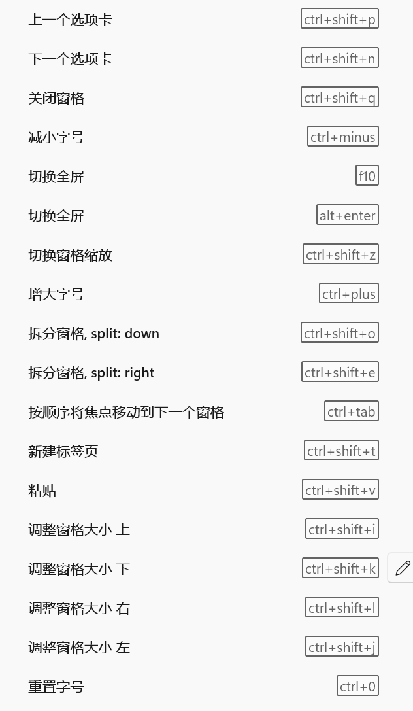
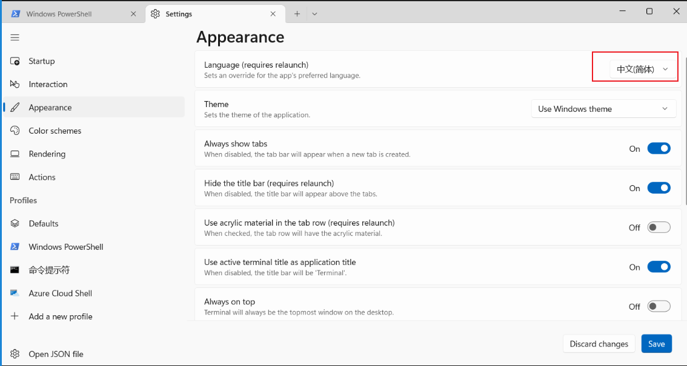

# powershell和nvim以及wsl2相关配置

- [1.下载powershell](#1)  
- [2.添加powershell配置文件](#2)  


<h4 id="1">[1.下载powershell]</h>  

> 下载最新**powershell-x.x.x-win-x64.msi**  
> 查看powershell版本  
> `$host`

- [powershell下载地址](https://github.com/PowerShell/PowerShell)  

<h4 id="2">[2.添加powershell配置文件]</h>  

> windows terminal 配置文件位置(按键映射以及外观设置)
> `C:\Users\fzh-3070ti\AppData\Local\Packages\Microsoft.WindowsTerminal_8wekyb3d8bbwe\LocalState\settings.json`
> 
>
> windows terminal设置为中文
> 
>
> 将powershell添加到windows terminal
> 

## 一.安装scoop

### 1.设置 PowerShell 执行策略（必须先执行）
```powershell
Set-ExecutionPolicy -ExecutionPolicy RemoteSigned -Scope CurrentUser
```

### 2.修改scoop安装的环境变量
```powershell
$env:SCOOP='C:\Scoop'
[Environment]::SetEnvironmentVariable('SCOOP', $env:SCOOP, 'User')
```

### 3.安装scoop
```powershell
iwr -useb get.scoop.sh | iex
```

### 4.添加 bucket 仓库
```powershell
scoop install git
scoop bucket add main
scoop bucket add extras
scoop bucket add versions
scoop bucket add java

[Environment]::SetEnvironmentVariable("PATH", $env:PATH + ";C:\Scoop\apps\git\current\usr\bin", "User")
```

### 5.安装软件（按分类）

**终端美化**
```powershell
scoop install posh-git oh-my-posh
```

**开发工具**
```powershell
scoop install lazygit delta ctags
```

**搜索和文件管理**
```powershell
scoop install fd fzf PSFzf ripgrep
scoop install lf yazi file ouch
```

**编程语言 - Java**
```powershell
scoop install openjdk prince
```

**编程语言 - Node.js**
```powershell
scoop install nvm
nvm list available
nvm install 22.12.0      # 安装 LTS 最新版本
nvm use 22.12.0
```

**Claude Code**
```powershell
# 1. 设置 Git Bash 环境变量（Claude Code 需要 bash）
$gitBashPath = "C:\Scoop\apps\git\current\usr\bin\bash.exe"
Test-Path $gitBashPath

# 如果返回 False，查找正确路径
if (-not (Test-Path $gitBashPath)) {
    $scoop = if ($env:SCOOP) { $env:SCOOP } else { "$env:USERPROFILE\scoop" }

    Write-Host "Searching for bash.exe in Scoop directory..."
    $bashLocations = Get-ChildItem "$scoop\apps\git" -Recurse -Filter "bash.exe" -ErrorAction SilentlyContinue | Select-Object -ExpandProperty FullName

    if ($bashLocations) {
        Write-Host "Found bash.exe at:"
        $bashLocations | ForEach-Object { Write-Host "  $_" }

        $gitBashPath = $bashLocations | Where-Object { $_ -like "*\usr\bin\bash.exe" } | Select-Object -First 1
        Write-Host "Selected: $gitBashPath"
    } else {
        Write-Host "Git Bash not found. Please install Git first: scoop install git"
        exit
    }
}

# 验证并设置环境变量
if (Test-Path $gitBashPath) {
    Write-Host "Git Bash found at: $gitBashPath" -ForegroundColor Green

    [Environment]::SetEnvironmentVariable("CLAUDE_CODE_GIT_BASH_PATH", $gitBashPath, "User")
    $env:CLAUDE_CODE_GIT_BASH_PATH = $gitBashPath

    Write-Host "Environment variable set:"
    Write-Host "  CLAUDE_CODE_GIT_BASH_PATH = $env:CLAUDE_CODE_GIT_BASH_PATH" -ForegroundColor Cyan
} else {
    Write-Host "Error: Git Bash path not valid!" -ForegroundColor Red
}

# 2. 安装 Claude Code
npm install -g @anthropic-ai/claude-code@latest
```

**编程语言 - Python**
```powershell
scoop install python

# 升级 pip
python -m pip install --upgrade pip

# 安装 neovim 相关包
pip install pynvim neovim pygments
```

**其他工具**
```powershell
scoop install mingw graphviz
```

### 6.安装 PowerShell 模块
```powershell
Install-Module -Name PowerShellGet -Force
Install-Module PSReadLine
```

### 7.生成 PowerShell 配置文件
```powershell
# 如果配置文件不存在则创建
if (!(Test-Path -Path $PROFILE)) { New-Item -Type File -Path $PROFILE -Force }

# 查看配置文件位置
echo $PROFILE

# 编辑配置文件
notepad $PROFILE
```

### 8.Microsoft.PowerShell_profile.ps1 文件内容
```powershell
# ========== 模块导入 ==========
Import-Module PSReadLine
Import-Module posh-git

# ========== 编辑模式和按键 ==========
Set-PSReadLineOption -EditMode Emacs
Set-PSReadlineKeyHandler -Key Tab -Function MenuComplete

# ========== 别名 ==========
Set-Alias -Name lg -Value lazygit

# ========== Oh My Posh 主题 ==========
oh-my-posh init pwsh --config "$env:POSH_THEMES_PATH\ys.omp.json" | Invoke-Expression

# ========== FZF 配置 ==========
Set-PsFzfOption -PSReadlineChordProvider 'Ctrl+t' -PSReadlineChordReverseHistory 'Ctrl+r'
$env:FZF_DEFAULT_OPTS = "--no-mouse"

# ========== Yazi 文件管理器 ==========
function ra {
    $tempFile = [System.IO.Path]::GetTempFileName()
    try {
        & yazi --cwd-file="$tempFile" $args
        if (Test-Path -LiteralPath $tempFile) {
            $lastDir = Get-Content -LiteralPath $tempFile -Raw
            if ($lastDir) {
                $lastDir = $lastDir.Trim()
            }
            if ($lastDir -and (Test-Path -LiteralPath $lastDir)) {
                $currentLocation = (Get-Location).Path
                if ($lastDir -ne $currentLocation) {
                    Set-Location -LiteralPath $lastDir
                }
            }
        }
    }
    finally {
        if (Test-Path -LiteralPath $tempFile) {
            Remove-Item -LiteralPath $tempFile -Force
        }
    }
}
```

### 9.常用命令
```powershell
# 列出所有按键绑定
Get-PSReadLineKeyHandler

# 查看环境变量
Get-ChildItem env:

# 查看命令位置
Get-Command yazi
Get-Command lazygit
```

### 10.实现右键菜单
```powershell
git clone https://github.com/LittleNewton/Open_Windows_Terminal_Here.git
cd Open_Windows_Terminal_Here/src
.\install.ps1 mini
```

### 11.Windows Terminal 快捷键配置

**配置文件位置**
```
notepad C:\Users\用户名\AppData\Local\Packages\Microsoft.WindowsTerminal_8wekyb3d8bbwe\LocalState\settings.json
```

**打开配置文件**
```powershell
# 在 Windows Terminal 中按 Ctrl+, 打开设置，点击左下角"打开 JSON 文件"图标
```

**配置结构说明**

快捷键配置分为两部分：
- `actions`：定义命令，每个命令有唯一的 `id`
- `keybindings`：通过 `id` 绑定快捷键
- `"id": null`：禁用该快捷键的默认行为

**actions 数组**（命令定义）
```json
        { "command": "prevTab", "id": "User.prevTab" },
        { "command": "nextTab", "id": "User.nextTab" },
        { "command": "closePane", "id": "User.closePane" },
        { "command": "paste", "id": "User.paste" },
        { "command": "find", "id": "User.find" },
        { "command": "toggleFullscreen", "id": "User.toggleFullscreen" },
        { "command": "togglePaneZoom", "id": "User.togglePaneZoom" },
        { "command": { "action": "splitPane", "split": "down" }, "id": "User.splitDown" },
        { "command": { "action": "splitPane", "split": "right" }, "id": "User.splitRight" },
        { "command": { "action": "moveFocus", "direction": "nextInOrder" }, "id": "User.moveFocus" },
        { "command": { "action": "resizePane", "direction": "up" }, "id": "User.resizeUp" },
        { "command": { "action": "resizePane", "direction": "down" }, "id": "User.resizeDown" },
        { "command": { "action": "resizePane", "direction": "left" }, "id": "User.resizeLeft" },
        { "command": { "action": "resizePane", "direction": "right" }, "id": "User.resizeRight" },
        { "command": { "action": "copy", "singleLine": false }, "id": "User.copy" }
```

**keybindings 数组**（快捷键绑定）
```json
        { "id": "User.prevTab", "keys": "ctrl+shift+p" },
        { "id": "User.nextTab", "keys": "ctrl+shift+n" },
        { "id": "User.closePane", "keys": "ctrl+shift+q" },
        { "id": "User.paste", "keys": "ctrl+shift+v" },
        { "id": "User.find", "keys": "ctrl+shift+f" },
        { "id": "User.toggleFullscreen", "keys": "f10" },
        { "id": "User.togglePaneZoom", "keys": "ctrl+shift+z" },
        { "id": "User.splitDown", "keys": "ctrl+shift+o" },
        { "id": "User.splitRight", "keys": "ctrl+shift+e" },
        { "id": "User.moveFocus", "keys": "ctrl+tab" },
        { "id": "User.resizeUp", "keys": "ctrl+shift+i" },
        { "id": "User.resizeDown", "keys": "ctrl+shift+k" },
        { "id": "User.resizeLeft", "keys": "ctrl+shift+j" },
        { "id": "User.resizeRight", "keys": "ctrl+shift+l" },

        { "id": null, "keys": "ctrl+v" },
        { "id": null, "keys": "ctrl+c" },
        { "id": null, "keys": "ctrl+shift+c" },
        { "id": null, "keys": "ctrl+0" },
        { "id": null, "keys": "ctrl+comma" },
        { "id": null, "keys": "ctrl+shift+comma" },
        { "id": null, "keys": "ctrl+insert" },
        { "id": null, "keys": "shift+insert" },
        { "id": null, "keys": "ctrl+numpad_minus" },
        { "id": null, "keys": "ctrl+numpad_plus" },
        { "id": null, "keys": "ctrl+numpad0" },
        { "id": null, "keys": "ctrl+shift+1" },
        { "id": null, "keys": "ctrl+shift+2" },
        { "id": null, "keys": "ctrl+shift+3" },
        { "id": null, "keys": "ctrl+shift+4" },
        { "id": null, "keys": "ctrl+shift+5" },
        { "id": null, "keys": "ctrl+shift+6" },
        { "id": null, "keys": "ctrl+shift+7" },
        { "id": null, "keys": "ctrl+shift+8" },
        { "id": null, "keys": "ctrl+shift+9" },
        { "id": null, "keys": "ctrl+alt+1" },
        { "id": null, "keys": "ctrl+alt+2" },
        { "id": null, "keys": "ctrl+alt+3" },
        { "id": null, "keys": "ctrl+alt+4" },
        { "id": null, "keys": "ctrl+alt+5" },
        { "id": null, "keys": "ctrl+alt+6" },
        { "id": null, "keys": "ctrl+alt+7" },
        { "id": null, "keys": "ctrl+alt+8" },
        { "id": null, "keys": "ctrl+alt+9" },
        { "id": null, "keys": "ctrl+shift+a" },
        { "id": null, "keys": "ctrl+shift+d" },
        { "id": null, "keys": "ctrl+shift+m" },
        { "id": null, "keys": "ctrl+shift+w" },
        { "id": null, "keys": "ctrl+shift+tab" },
        { "id": null, "keys": "ctrl+shift+space" },
        { "id": null, "keys": "ctrl+shift+home" },
        { "id": null, "keys": "ctrl+shift+end" },
        { "id": null, "keys": "ctrl+shift+pgup" },
        { "id": null, "keys": "ctrl+shift+pgdn" },
        { "id": null, "keys": "ctrl+shift+up" },
        { "id": null, "keys": "ctrl+shift+down" },
        { "id": null, "keys": "ctrl+alt+left" },
        { "id": null, "keys": "ctrl+alt+comma" },
        { "id": null, "keys": "alt+up" },
        { "id": null, "keys": "alt+down" },
        { "id": null, "keys": "alt+left" },
        { "id": null, "keys": "alt+right" },
        { "id": null, "keys": "alt+enter" },
        { "id": null, "keys": "alt+f4" },
        { "id": null, "keys": "alt+space" },
        { "id": null, "keys": "alt+shift+d" },
        { "id": null, "keys": "alt+shift+up" },
        { "id": null, "keys": "alt+shift+down" },
        { "id": null, "keys": "alt+shift+left" },
        { "id": null, "keys": "alt+shift+right" },
        { "id": null, "keys": "alt+shift+minus" },
        { "id": null, "keys": "alt+shift+plus" },
        { "id": null, "keys": "f11" },
        { "id": null, "keys": "enter" },
        { "id": null, "keys": "menu" },
        { "id": null, "keys": "win+sc(41)" }
```

**快捷键速查表**

| 功能 | 快捷键 |
|------|--------|
| 上一个标签页 | `Ctrl+Shift+P` |
| 下一个标签页 | `Ctrl+Shift+N` |
| 关闭窗格 | `Ctrl+Shift+Q` |
| 拆分窗格（下） | `Ctrl+Shift+O` |
| 拆分窗格（右） | `Ctrl+Shift+E` |
| 切换窗格焦点 | `Ctrl+Tab` |
| 调整窗格大小 | `Ctrl+Shift+I/K/J/L` |
| 粘贴 | `Ctrl+Shift+V` |
| 查找 | `Ctrl+Shift+F` |
| 全屏 | `F10` |
| 窗格缩放 | `Ctrl+Shift+Z` |

### 12.配置文件位置

**yazi配置文件**
```powershell
# 创建配置目录
New-Item -ItemType Directory -Force -Path "$env:APPDATA\yazi\config"
New-Item -ItemType Directory -Force -Path "$env:APPDATA\yazi\config\plugins"
New-Item -ItemType Directory -Force -Path "$env:APPDATA\yazi\config\scripts"

# 查看配置目录
explorer "$env:APPDATA\yazi\config"

# 复制配置文件（假设文件在当前目录）
Copy-Item yazi.toml "$env:APPDATA\yazi\config\"
Copy-Item keymap.toml "$env:APPDATA\yazi\config\"
Copy-Item init.lua "$env:APPDATA\yazi\config\"
```

**lazygit配置文件位置**
```
C:\Users\用户名\AppData\Roaming\lazygit
```

**tig配置文件位置（%USERPROFILE%）**
```
C:\Users\用户名\
```

**lf配置文件位置**
```
C:\Users\用户名\AppData\Local\lf
```

## 三.安装nerd字体

### 1.通过网址下载,打开以下网址
```shell
https://www.nerdfonts.com/font-downloads

选择喜欢的字体
SauceCodeProNerdFont-Regular.ttf
```
## 四.nvim配置

### 1.nvim配置文件位置
```shell
C:\Users\fzh-3070ti\AppData\Local\nvim
```

### 2.其他必须操作
```shell
scoop install nvm
nvm list available
nvm install 16.13.1 注意安装LTS列的最新
nvm use 16.13.1

修改nvm环境变量(废弃)
NVM_SYMLINK
c:\Scoop\persist\nvm\nodejs\v16.15.0

Path(废弃)
C:\Scoop\apps\nvm\current\nodejs\v16.15.0


scoop search python
scoop install python

python3.exe -m pip install --upgrade pip
当以上命令报错时,使用以下命令
python -m pip install -U pip --user
并添加pip环境变量


pip3 install --user --upgrade pynvim
pip3 install --user --upgrade neovim
pip3 install --user --upgrade pygments
```

### 3.gtags配置文件位置
```shell
C:\Users\用户名\.gtags.conf
```

## 五.WSL2 安装与配置

### 1.安装 WSL2（管理员身份运行）
```powershell
dism.exe /online /enable-feature /featurename:Microsoft-Windows-Subsystem-Linux /all /norestart
dism.exe /online /enable-feature /featurename:VirtualMachinePlatform /all /norestart

# 重启电脑后，下载并安装内核更新包
# https://wslstorestorage.blob.core.windows.net/wslblob/wsl_update_x64.msi

wsl --set-default-version 2
```

### 2.磁盘管理（扩容/缩小）
```powershell
# 扩容（例：512G）
diskpart
DISKPART> Select vdisk file="C:\路径\ext4.vhdx"
DISKPART> expand vdisk maximum=512000
DISKPART> exit

# 缩小（需先在 WSL 内执行 zerofree）
wsl --shutdown
diskpart
DISKPART> Select vdisk file="C:\路径\ext4.vhdx"
DISKPART> compact vdisk
DISKPART> exit
```

## 六.WSL2 Ubuntu（22.04/24.04）

### 1.安装
```powershell
wsl --install -d Ubuntu-22.04
# 或
wsl --install -d Ubuntu-24.04
wsl --update
```

### 2.初始用户配置（以 root 执行）
```shell
wsl -u root

# 设置 root 密码
passwd root

apt update
apt install -y git zsh sudo

groupadd -g 1008 mav
useradd -u 2018 -M -g mav -s /bin/zsh mav
rm -rf /home/mav

cd /home
git clone https://github.com/fzhzhen1987/feng_LG.git mav

chown -R mav:mav /home/mav
chmod 755 /home/mav

usermod -aG sudo mav
echo 'mav:2' | chpasswd
echo 'mav ALL=(ALL) NOPASSWD: ALL' >> /etc/sudoers

# 设置默认用户
if [ -f /etc/wsl.conf ]; then
    if grep -q "^\[user\]" /etc/wsl.conf; then
        sed -i '/^\[user\]/,/^\[/{s/^default=.*/default=mav/}' /etc/wsl.conf
    else
        echo -e "\n[user]\ndefault=mav" >> /etc/wsl.conf
    fi
else
    echo -e "[user]\ndefault=mav" > /etc/wsl.conf
fi

# 删除用户（可选）
# sudo killall -u test
# sudo deluser --remove-home test

exit
```

```powershell
wsl --shutdown
```

### 3.系统更新和基础依赖
```shell
sudo apt update && sudo apt upgrade -y

# 添加 i386 架构支持
sudo dpkg --add-architecture i386
sudo apt update
```

### 4.安装开发工具
```shell
# 编译工具链
sudo apt install -y build-essential gcc g++ make cmake
sudo apt install -y git tig bc flex bison openssh-server
sudo apt install -y libssl-dev libncurses-dev

# 文件处理工具
sudo apt install -y file rsync kmod cpio unzip bzip2 zip
sudo apt install -y wget curl tofrodos clangd

# 设备树和补丁工具
sudo apt install -y device-tree-compiler patch

# Python 环境
sudo apt install -y python3 python3-pip python3-full python3-venv

# 32 位库（交叉编译用）
sudo apt install -y libc6:i386 libncurses6:i386 libstdc++6:i386 zlib1g:i386
```

### 5.配置 locale
```shell
sudo apt install -y locales
sudo sed -i 's/^# en_US.UTF-8/en_US.UTF-8/' /etc/locale.gen
sudo sed -i 's/^# zh_CN.UTF-8/zh_CN.UTF-8/' /etc/locale.gen
sudo sed -i 's/^# ja_JP.UTF-8/ja_JP.UTF-8/' /etc/locale.gen
sudo locale-gen
```

### 6.安装 Oh My Zsh
```shell
su - mav
cd /home/mav/memo
chmod +x install.sh
./install.sh
cd ~
git checkout .zshrc
```

### 7.安装 Zsh 插件
```shell
git clone https://github.com/zsh-users/zsh-syntax-highlighting.git \
  ${ZSH_CUSTOM:-~/.oh-my-zsh/custom}/plugins/zsh-syntax-highlighting

git clone https://github.com/zsh-users/zsh-autosuggestions.git \
  ${ZSH_CUSTOM:-~/.oh-my-zsh/custom}/plugins/zsh-autosuggestions

git clone --depth=1 https://github.com/romkatv/powerlevel10k.git \
  ${ZSH_CUSTOM:-~/.oh-my-zsh/custom}/themes/powerlevel10k
```

### 8.安装 fzf
```shell
git clone --depth 1 https://github.com/junegunn/fzf.git ~/.fzf
~/.fzf/install
# Enable fuzzy auto-completion? Yes
# Enable key bindings? Yes
# Update shell configuration? No

git checkout .zshrc
```

### 9.安装命令行工具
```shell
cd ~/memo

# ripgrep
wget https://github.com/BurntSushi/ripgrep/releases/download/13.0.0/ripgrep_13.0.0_amd64.deb
sudo dpkg -i ripgrep_13.0.0_amd64.deb

# git-delta
wget https://github.com/dandavison/delta/releases/download/0.17.0/git-delta_0.17.0_amd64.deb
sudo dpkg -i git-delta_0.17.0_amd64.deb

# bat
wget https://github.com/sharkdp/bat/releases/download/v0.24.0/bat_0.24.0_amd64.deb
sudo dpkg -i bat_0.24.0_amd64.deb

# fd
wget https://github.com/sharkdp/fd/releases/download/v10.2.0/fd_10.2.0_amd64.deb
sudo dpkg -i fd_10.2.0_amd64.deb
```

### 10.安装文件管理器和工具
```shell
cd ~/memo
mkdir -p ~/.local/bin

# yazi
sudo apt install -y nkf xclip
wget https://github.com/sxyazi/yazi/releases/download/v25.5.31/yazi-x86_64-unknown-linux-musl.zip
unzip -o yazi-x86_64-unknown-linux-musl.zip
mv yazi-x86_64-unknown-linux-musl/yazi ~/.local/bin/
mv yazi-x86_64-unknown-linux-musl/ya ~/.local/bin/

# lazygit
wget https://github.com/jesseduffield/lazygit/releases/download/v0.55.1/lazygit_0.55.1_Linux_x86_64.tar.gz
tar xzvf lazygit_0.55.1_Linux_x86_64.tar.gz
mv lazygit ~/.local/bin/

# ouch
wget https://github.com/ouch-org/ouch/releases/latest/download/ouch-x86_64-unknown-linux-musl.tar.gz
tar xzf ouch-x86_64-unknown-linux-musl.tar.gz
mv ouch-x86_64-unknown-linux-musl/ouch ~/.local/bin/
chmod +x ~/.local/bin/ouch

# claude code
curl -fsSL https://claude.ai/install.sh | bash -s latest
```

### 11.安装 rainbarf（tmux 状态栏）
```shell
cd ~/memo
git clone https://github.com/creaktive/rainbarf.git
cd rainbarf
sudo apt install -y libmodule-build-perl
perl Build.PL
./Build test
sudo ./Build install
```

### 12.安装 GNU Global
```shell
cd ~/memo
wget https://ftp.gnu.org/pub/gnu/global/global-6.6.4.tar.gz
tar xzvf global-6.6.4.tar.gz
cp global-6.6.4/gtags.conf ~/.gtags.conf
```

### 13.安装 Neovim（固定版本 v0.9.4）
```shell
cd ~/memo
wget https://github.com/neovim/neovim/releases/download/v0.9.4/nvim.appimage
chmod +x nvim.appimage
mv nvim.appimage ~/.local/bin/nvim
sudo apt install -y fuse libfuse2

mkdir -p ~/.config
git clone https://github.com/fzhzhen1987/nvim.git ~/.config/nvim
```

### 14.配置 yazi
```shell
mkdir -p ~/.config
git clone https://github.com/fzhzhen1987/yazi.git ~/.config/yazi
```

### 15.安装 Python 包

**Ubuntu 22.04**
```shell
python3 -m pip install --user --upgrade pip
pip3 install --user --upgrade pynvim neovim pygments
```

**Ubuntu 24.04**
```shell
sudo apt install -y pipx python3-full
pipx ensurepath
pipx install pynvim
pipx install pygments
```

### 16.完成配置
```shell
cd ~
git checkout .zshrc
source ~/.zshrc
```

### 17.安装字体（PowerShell）
```powershell
Invoke-WebRequest -Uri "https://github.com/ryanoasis/nerd-fonts/releases/download/v3.3.0/SourceCodePro.zip" -OutFile "$env:USERPROFILE\Downloads\SourceCodePro.zip"
Expand-Archive -Path "$env:USERPROFILE\Downloads\SourceCodePro.zip" -DestinationPath "$env:USERPROFILE\Downloads\SourceCodePro" -Force
explorer "$env:USERPROFILE\Downloads\SourceCodePro"

# 右键 SauceCodeProNerdFont-Regular.ttf → 为所有用户安装
```

## 七.WSL2 Manjaro

### 1.安装
```powershell
scoop install manjarowsl

# 硬盘路径
C:\Scoop\persist\manjarowsl\data\ext4.vhdx
```

### 2.用户配置
```shell
useradd -u 2018 -m -g fzh -G wheel -s /bin/bash fzh
passwd fzh
echo "%wheel ALL=(ALL) ALL" >/etc/sudoers.d/wheel
exit

# 设置默认用户
Manjaro.exe config --default-user fzh
```

### 3.系统设定
```shell
sudo pacman-mirrors --country japan
sudo pacman -Syu
```

## 八.安装 wezterm 终端

### 1.使用 scoop 安装 wezterm
```shell
# 添加 extras bucket（如果还没添加）
scoop bucket add extras

# 安装 wezterm
scoop install wezterm
scoop install yazi@25.5.31

reg import "C:\Scoop\apps\wezterm\current\install-context.reg"
```

### 2.wezterm 配置文件位置
```shell

New-Item -ItemType File -Force -Path "$env:USERPROFILE\.wezterm.lua"
notepad "$env:USERPROFILE\.wezterm.lua"
```

### 3.基础配置示例（.wezterm.lua）
```lua
-- WezTerm 配置文件
local wezterm = require 'wezterm'
local config = {}

-- 使用更好的配置方式（如果 WezTerm 版本支持）
if wezterm.config_builder then
  config = wezterm.config_builder()
end

-- 窗口设置
config.window_background_opacity = 0.95                    -- 透明度
config.window_padding = {                                  -- 内边距
  left = 5,
  right = 5,
  top = 5,
  bottom = 5,
}
config.window_decorations = "TITLE | RESIZE"              -- 显示标题栏

-- 字体设置
config.font = wezterm.font('SauceCodePro Nerd Font')     -- 使用已安装的 Nerd Font
config.font_size = 10.0

-- 颜色主题（Campbell）
config.colors = {
  foreground = '#CCCCCC',    -- 浅灰色前景
  background = '#0C0C0C',    -- 黑色背景

  -- 普通颜色
  ansi = {
    '#0C0C0C',    -- black
    '#C50F1F',    -- red
    '#13A10E',    -- green
    '#C19C00',    -- yellow
    '#0037DA',    -- blue
    '#881798',    -- magenta
    '#3A96DD',    -- cyan
    '#CCCCCC',    -- white
  },

  -- 明亮颜色
  brights = {
    '#767676',    -- bright black（灰色）
    '#E74856',    -- bright red
    '#16C60C',    -- bright green
    '#F9F1A5',    -- bright yellow
    '#3B78FF',    -- bright blue
    '#B4009E',    -- bright magenta
    '#61D6D6',    -- bright cyan
    '#F2F2F2',    -- bright white
  },
}

-- ========================================
-- 默认启动程序
-- ========================================
-- WezTerm 打开时默认运行的程序
-- 这里设置为 PowerShell，也可以改为 'wsl.exe' 等
config.default_prog = { 'pwsh.exe' }

-- ========================================
-- WSL 域配置
-- ========================================
-- 定义 WSL 环境作为"域"，可以在域之间切换
-- 不常用，一般通过 launch_menu 启动 WSL 就够了
config.wsl_domains = {
  {
    name = 'WSL:Ubuntu',           -- 域名称（内部标识）
    distribution = 'Ubuntu',       -- WSL 发行版名称（通过 wsl -l 查看）
    default_cwd = '~',             -- 默认工作目录
  },
}

-- ========================================
-- 启动菜单
-- ========================================
-- 定义可以启动的 Shell 列表
-- 使用方法：右键标签栏 -> 选择要打开的 Shell
config.launch_menu = {
  {
    label = 'PowerShell',
    args = { 'pwsh.exe' },
  },
  {
    label = 'WSL (mav)',
    args = { 'wsl.exe', '-u', 'mav' },
  },
  {
    label = 'Windows PowerShell',
    args = { 'powershell.exe' },
  },
  {
    label = 'Command Prompt',
    args = { 'cmd.exe' },
  },
}

-- 光标设置
config.default_cursor_style = 'SteadyBlock'

-- 选择时自动复制到剪贴板
config.selection_word_boundary = ' \t\n{}[]()"\'`'

-- 鼠标绑定
config.mouse_bindings = {
  -- 右键粘贴
  {
    event = { Up = { streak = 1, button = 'Right' } },
    mods = 'NONE',
    action = wezterm.action.PasteFrom 'Clipboard',
  },
}

-- 按键绑定
config.keys = {
  -- Ctrl+Shift+V 粘贴
  {
    key = 'V',
    mods = 'CTRL|SHIFT',
    action = wezterm.action.PasteFrom 'Clipboard',
  },
  -- Ctrl+Shift+C 复制
  {
    key = 'C',
    mods = 'CTRL|SHIFT',
    action = wezterm.action.CopyTo 'Clipboard',
  },
  -- Ctrl+Shift+T 新窗口
  {
    key = 'T',
    mods = 'CTRL|SHIFT',
    action = wezterm.action.SpawnWindow,
  },
}

-- 启用扩展键支持
config.enable_csi_u_key_encoding = true

-- 其他设置
config.scrollback_lines = 10000              -- 回滚缓冲区行数
config.enable_tab_bar = true                 -- 启用标签栏
config.hide_tab_bar_if_only_one_tab = false  -- 即使只有一个标签也显示标签栏

-- 标签栏外观
config.use_fancy_tab_bar = true              -- 使用系统原生样式的标签栏
config.tab_max_width = 25                    -- 标签页最大宽度

-- 性能优化
config.front_end = "WebGpu"                  -- 使用 WebGPU 渲染（更快）
config.max_fps = 60                          -- 最大帧率

return config
```

### 4.将 wezterm 设为默认终端

#### Windows 11 设置默认终端
```shell
# 打开 Windows 设置
# 设置 -> 隐私和安全性 -> 开发者选项 -> 终端 -> 默认终端应用程序
# 选择 "Windows 终端" 或 "让 Windows 决定"

# 或者在 Windows Terminal 设置中
# 设置 -> 启动 -> 默认终端应用程序 -> 选择 WezTerm
```

#### 右键菜单集成
```shell
# WezTerm 安装时已经提供了注册表文件
# 导入注册表（已在第 1 节执行）
reg import "C:\Scoop\apps\wezterm\current\install-context.reg"

# 这会在右键菜单添加 "Open WezTerm here" 选项
# 可以在任意文件夹右键打开 WezTerm
```


### 5.与 WSL2 集成使用

#### 三个启动相关配置的区别

**1. default_prog（默认启动程序）**
```lua
config.default_prog = { 'pwsh.exe' }
```
- **作用**：WezTerm 启动时默认运行什么程序
- **使用场景**：设置你最常用的 Shell
- **示例**：
  - `{ 'pwsh.exe' }` - 启动 PowerShell
  - `{ 'wsl.exe' }` - 启动 WSL
  - `{ 'cmd.exe' }` - 启动 CMD

**2. wsl_domains（WSL 域）**
```lua
config.wsl_domains = {
  {
    name = 'WSL:Ubuntu',
    distribution = 'Ubuntu',
    default_cwd = '~',
  },
}
```
- **作用**：将 WSL 定义为一个"域"，可以在 WezTerm 的域管理器中切换
- **使用场景**：高级用户需要频繁在多个 WSL 发行版之间切换
- **不常用**：一般通过 launch_menu 启动 WSL 就够了
- **查看 WSL 发行版名称**：在 PowerShell 运行 `wsl -l`

**3. launch_menu（启动菜单）** ⭐ 最常用
```lua
config.launch_menu = {
  { label = 'PowerShell', args = { 'pwsh.exe' } },
  { label = 'WSL (mav)', args = { 'wsl.exe', '-u', 'mav' } },
}
```
- **作用**：定义可以快速启动的 Shell 列表
- **使用方法**：
  1. 右键点击标签栏
  2. 选择 "New Tab" 或直接看到 Shell 列表
  3. 点击想要打开的 Shell
- **最实用**：可以快速在 PowerShell、WSL、CMD 之间切换

---

#### 实际使用示例

**场景 1：我想 WezTerm 打开时默认进入 WSL**
```lua
config.default_prog = { 'wsl.exe' }  -- 改这里就行
```

**场景 2：我想快速在 PowerShell 和 WSL 之间切换**
```lua
-- 使用 launch_menu（最推荐）
config.launch_menu = {
  { label = 'PowerShell', args = { 'pwsh.exe' } },
  { label = 'WSL', args = { 'wsl.exe' } },
}
-- 然后右键标签栏选择
```

**场景 3：我有多个 WSL 发行版，需要切换**
```lua
config.launch_menu = {
  { label = 'Ubuntu', args = { 'wsl.exe', '-d', 'Ubuntu' } },
  { label = 'Debian', args = { 'wsl.exe', '-d', 'Debian' } },
}
```

---

#### 启动菜单详细配置
在配置文件中（第 410-427 行）定义了多个启动选项：
```lua
config.launch_menu = {
  {
    label = 'PowerShell',          -- 菜单显示名称
    args = { 'pwsh.exe' },        -- 启动命令
  },
  {
    label = 'WSL (mav)',
    args = { 'wsl.exe', '-u', 'mav' },  -- 指定 WSL 用户
  },
  {
    label = 'Windows PowerShell',
    args = { 'powershell.exe' },
  },
  {
    label = 'Command Prompt',
    args = { 'cmd.exe' },
  },
}
```

**使用方法**：
1. **右键标签栏** → 看到 Shell 列表 → 点击选择
2. **点击标签栏右侧 "+" 按钮** → 选择 Shell
3. 选中的 Shell 会在新标签页打开

**自定义启动选项**：
- 修改 `label`：显示的名称
- 修改 `args`：启动命令
  - `{ 'pwsh.exe' }` - PowerShell
  - `{ 'wsl.exe', '-u', 'mav' }` - WSL 指定用户
  - `{ 'wsl.exe', '-d', 'Ubuntu-22.04' }` - 指定 WSL 发行版
  - `{ 'cmd.exe', '/k', 'cd', 'C:\\projects' }` - CMD 并切换目录

#### WSL 与 Windows 互操作
```shell
# 在 WezTerm 中启动 WSL
wezterm start -- wsl.exe

# 在 WSL 中访问 Windows 文件
cd /mnt/c/Users/用户名/Documents

# 在 WSL 中运行 Windows 程序
explorer.exe .                    # 在文件资源管理器打开当前目录
notepad.exe file.txt             # 用记事本打开文件
pwsh.exe -c "Get-Process"        # 运行 PowerShell 命令

# 在 Windows 中访问 WSL 文件
# 在文件资源管理器地址栏输入：\\wsl$\Ubuntu\home\mav
```

#### 在 WSL 中使用 WezTerm 配置
WezTerm 会自动在 WSL 中使用 Windows 的配置文件：
```shell
# Windows 配置文件位置
C:\Users\用户名\.wezterm.lua

# WSL 中 WezTerm 会读取
/mnt/c/Users/用户名/.wezterm.lua

# 也可以在 WSL 中创建符号链接
ln -s /mnt/c/Users/用户名/.wezterm.lua ~/.wezterm.lua
```

### 6.常用快捷键

#### 自定义快捷键（已在配置文件中定义）
```shell
Ctrl+Shift+V       # 粘贴
Ctrl+Shift+C       # 复制选中文本
Ctrl+Shift+T       # 打开新窗口
```

#### WezTerm 默认快捷键
```shell
# 标签页管理
Ctrl+Shift+Tab     # 切换到上一个标签页
Ctrl+Tab           # 切换到下一个标签页
Alt+数字           # 切换到第 N 个标签页
Ctrl+Shift+W       # 关闭当前标签页

# 窗格分割（需要在配置中启用）
Ctrl+Shift+Alt+-   # 水平分割窗格
Ctrl+Shift+Alt+\   # 垂直分割窗格
Ctrl+Shift+Arrow   # 在窗格间切换焦点
Ctrl+Shift+X       # 关闭当前窗格

# 字体大小调整
Ctrl+Plus(+)       # 增大字体
Ctrl+Minus(-)      # 减小字体
Ctrl+0             # 重置字体大小

# 搜索和滚动
Ctrl+Shift+F       # 在终端输出中搜索
Shift+PageUp       # 向上滚动一页
Shift+PageDown     # 向下滚动一页

# 快速命令面板
Ctrl+Shift+P       # 打开命令面板（显示所有可用命令）

# 调试
Ctrl+Shift+L       # 打开调试覆盖层
```

#### 鼠标操作（已在配置中定义）
```shell
右键单击           # 粘贴剪贴板内容（第 435-442 行配置）
选中文本           # 自动复制到剪贴板
Ctrl+左键单击      # 打开 URL
中键单击           # 粘贴选中内容（Linux 风格）
```

#### 自定义更多快捷键
在 `.wezterm.lua` 的 `config.keys` 部分添加：
```lua
-- 示例：添加窗格分割快捷键
{
  key = '|',
  mods = 'CTRL|SHIFT',
  action = wezterm.action.SplitHorizontal { domain = 'CurrentPaneDomain' },
},
{
  key = '_',
  mods = 'CTRL|SHIFT',
  action = wezterm.action.SplitVertical { domain = 'CurrentPaneDomain' },
},
-- 关闭窗格
{
  key = 'W',
  mods = 'CTRL|SHIFT|ALT',
  action = wezterm.action.CloseCurrentPane { confirm = true },
},
```

## 九.为拯救者安装工具箱

```shell
scoop install extras/lenovolegiontoolkit
```

## 十.VSCode Markdown + PlantUML 环境配置

### 1.前提条件
确保已通过 scoop 安装以下软件（见第一章）：
- openjdk（PlantUML 运行需要）
- graphviz（PlantUML 绘图需要）

```powershell
# 验证安装
java -version
dot -V
```

### 2.安装 VSCode 插件

| 插件名 | 插件 ID | 用途 |
|--------|---------|------|
| PlantUML | `jebbs.plantuml` | 提供 plantuml.jar 和语法高亮 |
| Markdown Preview Enhanced | `shd101wyy.markdown-preview-enhanced` | 增强预览，支持内嵌 PlantUML |

### 3.获取 plantuml.jar 路径

```powershell
Get-ChildItem "$env:USERPROFILE\.vscode\extensions\jebbs.plantuml-*\plantuml.jar"
```

### 4.配置 settings.json

按 `Ctrl+Shift+P` → `Preferences: Open User Settings (JSON)`

```json
{
    "markdown-preview-enhanced.plantumlJarPath": "C:\\Users\\用户名\\.vscode\\extensions\\jebbs.plantuml-2.18.1\\plantuml.jar",
    "markdown-preview-enhanced.previewMode": "Multiple Previews",
    "markdown-preview-enhanced.automaticallyShowPreviewOfMarkdownBeingEdited": false
}
```

### 5.配置快捷键 keybindings.json（可选）

按 `Ctrl+Shift+P` → `Preferences: Open Keyboard Shortcuts (JSON)`

```json
[
    {
        "key": "ctrl+shift+v",
        "command": "markdown-preview-enhanced.openPreviewToTheSide",
        "when": "editorLangId == markdown"
    }
]
```

### 6.使用方法

**打开预览**：`Ctrl+Shift+V` 或右键 → `Markdown Preview Enhanced: Open Preview to the Side`

**编写 PlantUML**：
````markdown

````

### 7.故障排除

**plantuml.jar 找不到**：确认 `plantumlJarPath` 路径正确，插件更新后版本号会变化

**图表渲染失败**：运行 `java -version` 和 `dot -V` 确认依赖已安装

## 十一.Windows 语言与输入法配置

### 1. 语言管理

#### 1.1 查看当前语言列表

```powershell
Get-WinUserLanguageList | Format-List LanguageTag, LocalizedName, InputMethodTips
```

#### 1.2 删除所有语言（重置为干净状态）

```powershell
# 创建只包含英语的新列表，清除所有其他语言
$newList = New-WinUserLanguageList en-US
Set-WinUserLanguageList $newList -Force

# 确认清理结果
Get-WinUserLanguageList | Format-List LanguageTag, LocalizedName, InputMethodTips
```

#### 1.3 添加语言

**添加简体中文（微软拼音）**
```powershell
$langList = Get-WinUserLanguageList
$langList.Add("zh-Hans-CN")
Set-WinUserLanguageList $langList -Force
```

**添加日语**
```powershell
$langList = Get-WinUserLanguageList
$langList.Add("ja")
Set-WinUserLanguageList $langList -Force
```

#### 1.4 修改显示语言

Windows 显示语言由语言列表的**第一个语言**决定。

**设置中文为显示语言**
```powershell
$langList = New-WinUserLanguageList zh-Hans-CN
$langList.Add("en-US")
$langList.Add("ja")  # 可选
Set-WinUserLanguageList $langList -Force
```

**设置英语为显示语言**
```powershell
$langList = New-WinUserLanguageList en-US
$langList.Add("zh-Hans-CN")
$langList.Add("ja")  # 可选
Set-WinUserLanguageList $langList -Force
```

**设置日语为显示语言**
```powershell
$langList = New-WinUserLanguageList ja
$langList.Add("zh-Hans-CN")
$langList.Add("en-US")
Set-WinUserLanguageList $langList -Force
```

> **注意**: 修改显示语言后需要**注销或重启**才能生效。

#### 1.5 删除特定语言

**步骤 1：查看当前语言列表和索引**
```powershell
$langList = Get-WinUserLanguageList
$langList | ForEach-Object { $i = 0 } { Write-Host "[$i] $($_.LanguageTag) - $($_.LocalizedName)"; $i++ }
```

输出示例：
```
[0] zh-Hans-CN - 简体中文(中国大陆)
[1] en-US - 英语(美国)
[2] ja - 日语
```

**步骤 2：删除指定索引的语言**
```powershell
$langList = Get-WinUserLanguageList
$langList.RemoveAt(1)  # 索引号从 0 开始
Set-WinUserLanguageList $langList -Force
```

**步骤 3：确认删除结果**
```powershell
Get-WinUserLanguageList | Format-List LanguageTag, LocalizedName
```

> **注意**：索引号每次可能不同，删除前务必先确认。删除索引 0 的语言会改变 Windows 显示语言。

#### 1.6 一键配置示例

**中文 + 英语 + 日语（中文显示）**
```powershell
$langList = New-WinUserLanguageList zh-Hans-CN
$langList.Add("en-US")
$langList.Add("ja")
Set-WinUserLanguageList $langList -Force
```

**英语 + 中文（英语显示）**
```powershell
$langList = New-WinUserLanguageList en-US
$langList.Add("zh-Hans-CN")
Set-WinUserLanguageList $langList -Force
```

---

### 2. 键盘布局配置

> 适用于：日语配列笔记本，让中文/英文输入法也使用日语键盘布局（标点位置）

| 功能 | 说明 |
|------|------|
| 中文输入法 → 日语键盘布局 | 中文输入时标点位置与日语一致 |
| 英文输入法 → 日语键盘布局 | 英文输入时标点位置与日语一致 |
| CapsLock → Ctrl | 将 CapsLock 键改为 Ctrl 键 |

#### 2.1 创建 Substitutes 注册表键

```powershell
if (!(Test-Path "HKCU:\Keyboard Layout\Substitutes")) {
    New-Item -Path "HKCU:\Keyboard Layout" -Name "Substitutes" -Force
}

# 确认
Test-Path "HKCU:\Keyboard Layout\Substitutes"  # 返回 True 表示成功

# 回退
# Remove-Item -Path "HKCU:\Keyboard Layout\Substitutes" -Force
```

#### 2.2 添加中文键盘映射

让中文输入法 (00000804) 使用日语键盘布局 (00000411)

```powershell
Set-ItemProperty -Path "HKCU:\Keyboard Layout\Substitutes" -Name "00000804" -Value "00000411" -Force

# 确认
Get-ItemProperty "HKCU:\Keyboard Layout\Substitutes"  # 应显示 00000804 : 00000411

# 回退
# Remove-ItemProperty -Path "HKCU:\Keyboard Layout\Substitutes" -Name "00000804" -Force
```

#### 2.3 添加英文键盘映射

让英文输入法 (00000409) 使用日语键盘布局 (00000411)

```powershell
Set-ItemProperty -Path "HKCU:\Keyboard Layout\Substitutes" -Name "00000409" -Value "00000411" -Force

# 确认
Get-ItemProperty "HKCU:\Keyboard Layout\Substitutes"
# 应显示：00000804 : 00000411 和 00000409 : 00000411

# 回退
# Remove-ItemProperty -Path "HKCU:\Keyboard Layout\Substitutes" -Name "00000409" -Force
```

#### 2.4 CapsLock 改为 Ctrl（需要管理员权限）

```powershell
$hexValue = "00,00,00,00,00,00,00,00,02,00,00,00,1d,00,3a,00,00,00,00,00"
$binaryValue = $hexValue.Split(',') | ForEach-Object { [byte]('0x' + $_) }
Set-ItemProperty -Path "HKLM:\SYSTEM\CurrentControlSet\Control\Keyboard Layout" -Name "Scancode Map" -Value $binaryValue -Type Binary -Force

# 确认
Get-ItemProperty -Path "HKLM:\SYSTEM\CurrentControlSet\Control\Keyboard Layout" -Name "Scancode Map"
# 应显示 Scancode Map : {0, 0, 0, 0…}

# 回退
# Remove-ItemProperty -Path "HKLM:\SYSTEM\CurrentControlSet\Control\Keyboard Layout" -Name "Scancode Map" -Force
```

#### 2.5 重启 ctfmon 进程

```powershell
Stop-Process -Name "ctfmon" -Force -ErrorAction SilentlyContinue
Start-Process "ctfmon.exe"

# 确认
Get-Process -Name "ctfmon" -ErrorAction SilentlyContinue | Select-Object Name, Id, StartTime
```

#### 2.6 重启电脑

键盘布局映射在重启 ctfmon 后即可生效，但 **CapsLock 改 Ctrl 必须重启电脑**才能生效。

#### 2.7 完全回退（恢复原状）

```powershell
# 1. 删除键盘布局映射（不需要管理员权限）
Remove-Item -Path "HKCU:\Keyboard Layout\Substitutes" -Force

# 2. 删除 CapsLock 映射（需要管理员权限）
Remove-ItemProperty -Path "HKLM:\SYSTEM\CurrentControlSet\Control\Keyboard Layout" -Name "Scancode Map" -Force

# 3. 重启电脑使更改生效
```

---

### 3. 参考信息

**常用语言代码**

| 语言 | LanguageTag | 键盘布局代码 |
|------|-------------|--------------|
| 简体中文 | `zh-Hans-CN` | 00000804 |
| 繁体中文(台湾) | `zh-Hant-TW` | - |
| 繁体中文(香港) | `zh-Hant-HK` | - |
| 英语(美国) | `en-US` | 00000409 |
| 英语(英国) | `en-GB` | - |
| 日语 | `ja` | 00000411 |
| 韩语 | `ko` | - |
| 法语 | `fr-FR` | - |
| 德语 | `de-DE` | - |

**注册表位置**

| 路径 | 作用 | 权限 |
|------|------|------|
| `HKCU:\Keyboard Layout\Substitutes` | 键盘布局替换规则 | 用户级别 |
| `HKCU:\Keyboard Layout\Preload` | 已安装的输入法列表 | 用户级别 |
| `HKLM:\SYSTEM\CurrentControlSet\Control\Keyboard Layout` | 按键扫描码映射 | 管理员 |


