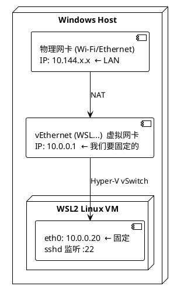
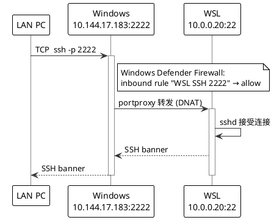

# WSL2 局域网 SSH 接入完整操作手册

> 目标:让局域网内任意一台机器通过 `ssh -p 2222 <用户>@<这台 Windows 的 LAN IP>` 直接登录 WSL。
> 适用:Windows 11 22H2+(教育版 / 专业版),WSL 2.0.9+(默认带 Hyper-V firewall 模式)。

---

## 0. 文档结构速览

| 章节 | 你会看到什么 |
|---|---|
| §1 概念背景 | WSL 网络怎么走、firewall 模式是什么、NAT/portproxy 区别 |
| §2 前置清单 | 动手前必须确认的事 |
| §3 操作步骤 | 阶段 0 → 阶段 7,顺序执行(含 firewall 模式遗留清理 §3 阶段 2b、可选 DNS 锁 §3 阶段 4b) |
| §4 故障排查 | 常见症状对照表 + 快速恢复命令 |
| §5 回滚 | 想还原时跑这里 |
| §附录 | 在新机器上的最短复刻路径 |

---

## 1. 概念背景

### 1.1 WSL2 默认网络拓扑

WSL2 实质是一个轻量级 Hyper-V VM。Windows 通过虚拟交换机和它通信:



**默认问题**:WSL 给两端分配的 IP(`172.x.x.x` 段)每次重启都变,任何"写死目标 IP"的转发都会失效。所以核心思路是 —— **两端都给一个稳定的 10.0.0.0/24 段地址**。

### 1.2 Hyper-V Firewall 模式是什么

Windows 11 22H2 之后随 WSL 2.0.9 引入,**默认开启**。

**它做的事**:把 WSL 流量纳入 Windows Defender Firewall 管控,让 WSL 看起来像一台被防火墙保护的虚拟机。

**它带来的副作用**:
1. 网卡名变成 `vEthernet (WSL (Hyper-V firewall))`,带括号嵌套 —— 所有硬编码 alias 的脚本失效
2. 它内部维护一套自己的 NAT,**和我们要手动建的 `New-NetNat` 冲突**
3. portproxy 在某些路径下被这层吞掉,流量到不了 WSL

**为什么我们要关掉**:
我们的目标是手动管控 NAT + portproxy + 静态 IP。firewall 模式抢走了这部分控制权,所以必须关。

**代价**:失去 Defender Firewall / 公司 EDR 对 WSL 出入流量的统一审计。
- 个人机:一般可接受
- **公司机**:先和 IT 政策对齐,可能被合规要求强制开启

### 1.3 NAT vs portproxy

实现"LAN → WSL"靠两层:

| 层 | 角色 | 配置命令 |
|---|---|---|
| **NAT** | Windows 帮 WSL 上网(SNAT 出站) | `New-NetNat` |
| **portproxy** | Windows 监听 LAN 端口,转给 WSL IP:port(DNAT 入站) | `netsh interface portproxy add` |

**入站数据流**(局域网另一台机 SSH 进来):



每一环都通才能登上去。任何一环挂了就要按 §4 排查。

### 1.4 为什么硬编码 alias 是反模式

旧笔记里常见 `Get-NetIPAddress -InterfaceAlias 'vEthernet (WSL)'`,在新 WSL 上查空,**不是 cmdlet 出问题**,而是名字真的不对(变成 `vEthernet (WSL (Hyper-V firewall))`)。

而且 PowerShell 里嵌套括号当字符串字面量传是合法的,但当 wildcard / 正则用就会爆炸。所以:

- ❌ 不要 `-InterfaceAlias 'vEthernet (WSL)'`
- ✅ 用变量取网卡对象,然后传 `-InterfaceIndex $wsl.ifIndex`(完全绕开名字)

`Get-NetIPAddress` 本身**没有 `-IncludeHidden` 参数**;隐藏属性是网卡级的,IP 只要 ifIndex 对得上就查得到。

---

## 2. 操作前提清单

执行前确认:

- [ ] Windows 11 教育版 / 专业版 / 企业版(**家庭版不能装 Hyper-V**)
- [ ] 个人机,或公司机已和 IT 确认允许关 firewall
- [ ] 没有 VMware Workstation 旧版本在跑(Hyper-V 可能冲突 — 新版 VMware 16.2+ 已支持共存)
- [ ] 没有 Docker Desktop 在跑(`New-NetNat` 一台机只能一个,会冲突)
- [ ] 接受**重启一次**(装 Hyper-V 必须重启)
- [ ] 知道 WSL 里的 Linux 用户名

---

## 3. 操作步骤

> 所有命令默认在**管理员 PowerShell**;WSL 内命令用 `# (WSL)` 标注。

### 阶段 0:诊断与备份

```powershell
# 系统版本
winver

# WSL 版本
wsl -l -v
wsl --version

# 当前 WSL 网卡
Get-NetAdapter -IncludeHidden | Where-Object Name -like '*WSL*' | Select Name, ifIndex, Status

# 当前 VMSwitch + HNS 网络(检查是否有旧 firewall 模式遗留)
Get-VMSwitch -ErrorAction SilentlyContinue | Format-Table Name, SwitchType -Auto
Get-HnsNetwork -ErrorAction SilentlyContinue | Format-Table Name, Type, Id
# 期望:除 Default Switch + WSL 外不应有 "WSL (Hyper-V firewall)" 行
# 若有,阶段 2 之后跑阶段 2b 清理

# 当前 NAT(检查是否被 Docker 等占用)
Get-NetNat

# 当前 portproxy
netsh interface portproxy show all

# 当前 LAN IP(后面登录用)
Get-NetIPAddress -AddressFamily IPv4 |
  Where-Object { $_.InterfaceAlias -notlike '*WSL*' -and $_.InterfaceAlias -notlike 'Loopback*' -and $_.IPAddress -notlike '169.254*' } |
  Select InterfaceAlias, IPAddress
```

输出建议留档,失败回看用。

### 阶段 1:启用 Hyper-V Windows 功能

⚠️ **会要求重启**

```powershell
Enable-WindowsOptionalFeature -Online -FeatureName Microsoft-Hyper-V -All
# 提示重启 → 重启
```

重启后验证两个 cmdlet 可用:

```powershell
Get-Command New-NetNat
Get-Command Get-VMSwitch
```

### 阶段 2:关闭 WSL Hyper-V firewall 模式

WSL2 配置文件位置:`%USERPROFILE%\.wslconfig`(即 `C:\Users\<你的用户名>\.wslconfig`)。

```powershell
# 已有 .wslconfig 时建议先备份再合并;新建的话直接写:
@"
[wsl2]
firewall=false
"@ | Set-Content -Path "$env:USERPROFILE\.wslconfig" -Encoding utf8

wsl --shutdown
wsl -- echo wsl-up    # 启动一下让网卡冒出来
```

验证:

```powershell
Get-NetAdapter -IncludeHidden | ? Name -like '*WSL*' | Select Name, ifIndex, Status
# 期望:Name 不再带 "(Hyper-V firewall)" 后缀
```

> 如果还带后缀,通常是 `.wslconfig` 写错位置(必须在 `%USERPROFILE%` 下)、或编码不对(需 UTF-8)。

### 阶段 2b:清理旧 firewall 模式遗留(仅切换过模式的机器需要)

**症状一**:阶段 2 跑 `wsl -- echo wsl-up` 时看到:

```
wsl: 无法创建地址范围为"172.26.112.0/20"的虚拟网络,已创建具有以下范围的新网络:"172.17.32.0/20",对象已存在。
wsl: 无法创建地址为"172.26.116.108"的网络终结点,已分配新地址:"172.17.40.68"
```

**症状二**:`Get-VMSwitch` 多出一个名字带 `(Hyper-V firewall)` 的孤儿交换机,即使你已切到 `firewall=false`。

**原因**:旧 firewall 模式的 Hyper-V VMSwitch + HNS 网络在切模式时**没被自动清理**,占着 WSL 惯用的 `172.26.x.x` 段。WSL 撞名,被迫退到备用段(常见 `172.17.x.x`)。

**为什么必须清**:阶段 3 的网卡选择器
```powershell
... | Where-Object { $_.Name -like 'vEthernet (WSL*' -and $_.Status -eq 'Up' } | Select-Object -First 1
```
对 `vEthernet (WSL)` 和 `vEthernet (WSL (Hyper-V firewall))` **都成立**。`-First 1` 选哪张不确定;两张同时 Up 时静态 IP 可能落到错的网卡上,自检那行 `firewall ON ⚠ / OFF ✓` 也会误判。

**清理步骤**(管理员 PowerShell):

```powershell
# 0) 先确认你是真正管理员;某些命令在 Hyper-V Administrators 组就能跑,但 Remove-* 必须 True
[bool]([Security.Principal.WindowsPrincipal][Security.Principal.WindowsIdentity]::GetCurrent()).IsInRole([Security.Principal.WindowsBuiltInRole]::Administrator)

# 1) 检查是否有遗留
Get-VMSwitch | Format-Table Name, SwitchType -Auto
# 看到 "WSL (Hyper-V firewall)" 行才需要继续

# 2) 关 WSL,从 HNS 层删(连带清掉底层 VMSwitch)
wsl --shutdown
Get-HnsNetwork | Where-Object Name -eq 'WSL (Hyper-V firewall)' | Remove-HnsNetwork

# 3) 验证两层都干净
Get-VMSwitch | Format-Table Name, SwitchType -Auto
Get-HnsNetwork | Format-Table Name, Type, Id
# 期望:都不再出现 (Hyper-V firewall)

# 4) 偶发 — VMSwitch 没自动消失,补一刀
Remove-VMSwitch -Name 'WSL (Hyper-V firewall)' -Force -ErrorAction SilentlyContinue

# 5) 重新拉起 WSL
wsl -- echo wsl-up

# 6) 最终确认 — 只剩一张 WSL 网卡
Get-NetAdapter -IncludeHidden | Where-Object Name -like '*WSL*' |
  Select Name, ifIndex, Status | Format-Table -Auto
```

**踩过的坑**:

- 直接 `Remove-VMSwitch` 即使管理员身份也会报 `删除交换机失败 ... 拒绝访问 (0x80070005)`。原因是 **HNS 还持有交换机的句柄** — 必须先 `Remove-HnsNetwork`,HNS 删除会一并带走 VMSwitch。
- 失败的 `Remove-VMSwitch` 可能产生过渡态:SwitchType 从 `Internal` 变成 `Private`(host vNIC `vEthernet (...)` 已脱离,但 switch 本体还在)。这种状态下 IP 冲突已经解除,但 `Get-VMSwitch` 输出还会带这行;最好走完上面的 HNS 清理流程彻底干掉。
- Windows 重启**不会**自动回收孤儿 VMSwitch — `vmms` 服务每次启动按配置重建。
- 通过 `Get-VMSwitch -Name '...' | Format-List Id` 拿到的 GUID 和 `Get-HnsNetwork` 的 ID **完全相同**,可以用 ID 精确匹配;但同名匹配(`Where-Object Name -eq ...`)更直观。

### 阶段 3:Windows 侧固定 IP + 建 NAT

```powershell
# 通用前置:取网卡对象,后面所有命令用 $wsl 不写 alias 字面量
$wsl = Get-NetAdapter -IncludeHidden |
       Where-Object { $_.Name -like 'vEthernet (WSL*' -and $_.Status -eq 'Up' } |
       Select-Object -First 1
if (-not $wsl) { throw "WSL 网卡未找到 — WSL 是否启动?" }

# 显示当前模式自检
$mode = if ($wsl.Name -match 'Hyper-V firewall') { 'firewall ON ⚠' } else { 'firewall OFF ✓' }
"WSL adapter: $($wsl.Name)  [$mode]"

# 清掉自动分配的 IP
Get-NetIPAddress -InterfaceIndex $wsl.ifIndex -AddressFamily IPv4 -ErrorAction SilentlyContinue |
  Remove-NetIPAddress -Confirm:$false

# 设静态 10.0.0.1/24
New-NetIPAddress -InterfaceIndex $wsl.ifIndex -IPAddress 10.0.0.1 -PrefixLength 24

# 建 NAT(已存在则跳过)
if (-not (Get-NetNat -Name WSLNat -ErrorAction SilentlyContinue)) {
    New-NetNat -Name WSLNat -InternalIPInterfaceAddressPrefix 10.0.0.0/24
}
```

> 10.0.0.0/24 是任意挑的私网。**只要不和你的 LAN 段(如 10.144.x.x)冲突**就行。冲突的话改成 `192.168.99.0/24` 之类,后面所有 10.0.0.x 同步替换。

### 阶段 4:WSL 内静态 IP + sshd

进 WSL:

```bash
# (WSL) 安装 sshd
sudo apt update && sudo apt install -y openssh-server

# (WSL) 临时设静态 IP(测试用,持久化在阶段 6b)
sudo ip addr flush dev eth0
sudo ip addr add 10.0.0.20/24 dev eth0
sudo ip route add default via 10.0.0.1 2>/dev/null || true

# (WSL) sshd 配置:确认监听 0.0.0.0:22
sudo sed -i 's/^#\?Port .*/Port 22/' /etc/ssh/sshd_config
sudo sed -i 's/^#\?ListenAddress .*/ListenAddress 0.0.0.0/' /etc/ssh/sshd_config

# (WSL) 启动 sshd
sudo systemctl enable ssh
sudo systemctl restart ssh
sudo systemctl status ssh --no-pager

# (WSL) 本地自测
ssh -p 22 $USER@10.0.0.20    # 输密码能登就 OK
```

> 如果 `systemctl` 提示 systemd 没起来,见阶段 6b 的 `/etc/wsl.conf` 里 `systemd=true`。

### 阶段 4b:WSL DNS 兜底(可选,出网卡不通时再用)

如果 WSL 内 `apt update` / `ping 8.8.8.8` 不通,但 `ping 10.0.0.1` 通(说明本地链路 OK,只是 DNS / 上游路由有问题),先看 `/etc/resolv.conf`:

```bash
cat /etc/resolv.conf
```

WSL 默认让 systemd-resolved 自动写这个文件,但**有些场景下被写空 / 写错(尤其切到 firewall=false + NAT 自管的拓扑后)**。这时锁死一份静态 DNS 最简单:

```bash
# (WSL) 解锁 -> 删 -> 重写 -> 锁死
sudo chattr -i /etc/resolv.conf 2>/dev/null || true
sudo rm -f /etc/resolv.conf
sudo tee /etc/resolv.conf > /dev/null <<'EOF'
nameserver 223.5.5.5
nameserver 114.114.114.114
nameserver 8.8.8.8
EOF
sudo chattr +i /etc/resolv.conf      # immutable,WSL 重启后也不会被覆盖
```

`chattr +i` 把文件标记为 immutable,内核层面禁止任何进程写它(包括 root 自己),WSL 的自动 DNS 写入也写不进去。**唯一代价**:以后想改 DNS 必须先 `sudo chattr -i`。

要让 WSL 不再尝试自动管理 resolv.conf,在阶段 6b 的 `/etc/wsl.conf` 里加一段 `[network]` 区块:

```ini
[network]
generateResolvConf=false
```

> 这段不是必装的。**只在你确认 DNS 出问题后再上**;装得越多,越多的隐性配置点。

### 阶段 5:portproxy + Windows 防火墙

```powershell
# 端口 2222 (LAN) → 22 (WSL)
netsh interface portproxy add v4tov4 `
  listenport=2222 listenaddress=0.0.0.0 `
  connectport=22 connectaddress=10.0.0.20

# Windows 防火墙放行 2222
New-NetFirewallRule -DisplayName "WSL SSH 2222" `
  -Direction Inbound -Protocol TCP -LocalPort 2222 -Action Allow

# 验证规则就绪
netsh interface portproxy show all
Test-NetConnection 127.0.0.1 -Port 2222   # TcpTestSucceeded 应为 True
```

本机自测:

```powershell
ssh -p 2222 <wsl用户名>@127.0.0.1
```

### 阶段 6:持久化(关键)

哪些状态会丢、哪些会留:

| 项 | 重启后 | 处理 |
|---|---|---|
| Windows 侧 `10.0.0.1/24` | ❌ Windows 重启 / HNS 重置时丢(`wsl --shutdown` 不丢,网卡持久) | 阶段 6a 计划任务(AtLogOn)+ 手动兜底 |
| WSL 侧 `10.0.0.20` | ❌ 丢 | 阶段 6b `/etc/wsl.conf` |
| `New-NetNat` | ✅ 保留 | — |
| portproxy 规则 | ✅ 保留 | — |
| Windows 防火墙规则 | ✅ 保留 | — |
| `.wslconfig` 配置 | ✅ 保留 | — |

#### 6a. Windows 侧:登录时自启 WSL + 一键修复脚本

**设计取舍**:不用 2 分钟轮询。计划任务**只在登录时触发一次**,脚本本身**双用途**:

- **AtLogon 计划任务自动跑**:开机登录后自启 WSL + 检查全部资源(IP / NAT / portproxy / 防火墙规则)
- **手动一键修复**:任何时候 SSH 不通,管理员 PowerShell 里 `& C:\Tools\wsl-net-fix.ps1` 一回车修好

每一步都先 idempotent 检查,**已对就跳过**(日志里看到一连串 `skipping` 是正常运行)。任一项被破坏时它都能修。

> 为什么不只 AtLogOn 不带自启 WSL:登录时 WSL 还没启动,`vEthernet (WSL)` 不存在,脚本无事可做就退出。所以脚本必须主动 `wsl.exe -- echo wsl-up` 唤醒 WSL,等网卡出来再修配置。
>
> 为什么计划任务必须用"用户账户"而不是 SYSTEM:**SYSTEM 账户调 wsl.exe 会失败**(报 `WSL_E_LOCAL_SYSTEM_NOT_SUPPORTED`),WSL 起不来就什么都做不了。

脚本文件:[wsl-net-fix.ps1](./wsl-net-fix.ps1)(同目录),部署到 `C:\Tools\wsl-net-fix.ps1`。Win10 / Win11 通用。

完整内容(也可直接 `Copy-Item` 文件):

```powershell
# C:\Tools\wsl-net-fix.ps1
$ErrorActionPreference = 'Stop'

# === 配置参数 ===
$LogFile           = 'C:\Tools\wsl-net-fix.log'
$StaticIP          = '10.0.0.1'
$PrefixLength      = 24
$NatName           = 'WSLNat'
$NatPrefix         = '10.0.0.0/24'
$WslIP             = '10.0.0.20'
$WslPort           = 22
$ListenPort        = 2222
$FwRuleName        = "WSL SSH $ListenPort"
$MaxAdapterWaitSec = 60

function Write-Log {
    param([string]$Msg)
    $ts = Get-Date -Format 'yyyy-MM-dd HH:mm:ss'
    "$ts $Msg" | Out-File -FilePath $LogFile -Append -Encoding UTF8
    Write-Host "$ts $Msg"
}

'' | Out-File -FilePath $LogFile -Encoding UTF8
Write-Log '=== wsl-net-fix start ==='

# 1) 唤醒 WSL
Write-Log 'Starting WSL via wsl.exe -- echo wsl-up'
try {
    wsl.exe -- echo wsl-up | Out-Null
    Write-Log 'WSL startup command returned'
} catch {
    Write-Log "WSL start failed: $_"
}

# 2) 等 vEthernet (WSL) 网卡(最多 60s)
$wsl = $null
$waited = 0
while ($waited -lt $MaxAdapterWaitSec) {
    $wsl = Get-NetAdapter -IncludeHidden |
           Where-Object { $_.Name -like 'vEthernet (WSL*' -and $_.Status -eq 'Up' } |
           Select-Object -First 1
    if ($wsl) { break }
    Start-Sleep -Seconds 2
    $waited += 2
}
if (-not $wsl) {
    Write-Log "ERROR: WSL adapter not found after $MaxAdapterWaitSec s — exit"
    exit 1
}
Write-Log "Adapter: $($wsl.Name) ifIndex=$($wsl.ifIndex) (waited ${waited}s)"

# 3) 修 IP
$has = Get-NetIPAddress -InterfaceIndex $wsl.ifIndex -AddressFamily IPv4 -ErrorAction SilentlyContinue |
       Where-Object IPAddress -eq $StaticIP
if ($has) {
    Write-Log "IP $StaticIP already set, skipping"
} else {
    Write-Log "IP $StaticIP missing, resetting all IPv4 on adapter"
    try {
        Get-NetIPAddress -InterfaceIndex $wsl.ifIndex -AddressFamily IPv4 -ErrorAction SilentlyContinue |
          Remove-NetIPAddress -Confirm:$false
        New-NetIPAddress -InterfaceIndex $wsl.ifIndex -IPAddress $StaticIP -PrefixLength $PrefixLength | Out-Null
        Write-Log "IP $StaticIP/$PrefixLength set"
    } catch {
        Write-Log "ERROR setting IP: $_"
    }
}

# 4) 修 NAT
if (Get-NetNat -Name $NatName -ErrorAction SilentlyContinue) {
    Write-Log "NAT '$NatName' exists, skipping"
} else {
    Write-Log "NAT '$NatName' missing, creating"
    try {
        New-NetNat -Name $NatName -InternalIPInterfaceAddressPrefix $NatPrefix | Out-Null
        Write-Log "NAT created: $NatPrefix"
    } catch {
        Write-Log "ERROR creating NAT: $_"
    }
}

# 5) 修 portproxy
$existing = (netsh interface portproxy show v4tov4) | Out-String
$pattern  = "0\.0\.0\.0\s+$ListenPort\s+$([regex]::Escape($WslIP))\s+$WslPort"
if ($existing -match $pattern) {
    Write-Log "portproxy 0.0.0.0:$ListenPort -> ${WslIP}:$WslPort already correct, skipping"
} else {
    Write-Log "portproxy missing or wrong, recreating"
    netsh interface portproxy delete v4tov4 listenport=$ListenPort listenaddress=0.0.0.0 2>&1 | Out-Null
    $r = netsh interface portproxy add v4tov4 listenport=$ListenPort listenaddress=0.0.0.0 connectport=$WslPort connectaddress=$WslIP 2>&1
    Write-Log "portproxy add result: $r"
}

# 6) 修防火墙规则
if (Get-NetFirewallRule -DisplayName $FwRuleName -ErrorAction SilentlyContinue) {
    Write-Log "Firewall rule '$FwRuleName' exists, skipping"
} else {
    Write-Log "Firewall rule '$FwRuleName' missing, creating"
    try {
        New-NetFirewallRule -DisplayName $FwRuleName `
          -Direction Inbound -Protocol TCP -LocalPort $ListenPort -Action Allow | Out-Null
        Write-Log "Firewall rule created: TCP $ListenPort allow inbound"
    } catch {
        Write-Log "ERROR creating firewall rule: $_"
    }
}

Write-Log '=== wsl-net-fix done ==='
```

注册计划任务(只在登录时触发一次,管理员 PowerShell):

```powershell
New-Item -ItemType Directory -Force -Path C:\Tools | Out-Null
# 把上面的脚本内容写入 C:\Tools\wsl-net-fix.ps1 后:

$action = New-ScheduledTaskAction -Execute 'powershell.exe' `
  -Argument '-NoProfile -ExecutionPolicy Bypass -File C:\Tools\wsl-net-fix.ps1'
$trigger = New-ScheduledTaskTrigger -AtLogOn
$principal = New-ScheduledTaskPrincipal -UserId "$env:USERNAME" -RunLevel Highest
Register-ScheduledTask -TaskName 'WSL-Net-Fix' `
  -Action $action -Trigger $trigger -Principal $principal -Force
# 之前注册过带 2 分钟轮询的旧版?-Force 直接覆盖,无需先 Unregister。
```

**手动兜底**(任何时候 SSH 不通时,管理员 PowerShell):

```powershell
& C:\Tools\wsl-net-fix.ps1
```

这一句和计划任务行为完全一致 —— 没起 WSL 就帮你起,IP 丢了就补上。

可选:`$PROFILE` 里加个函数,以后 `Fix-WSLNet` 一回车搞定:

```powershell
function Fix-WSLNet { & C:\Tools\wsl-net-fix.ps1 }
```

**自检**:

```powershell
# 模拟 IP 丢失
wsl --shutdown

# 跑脚本(管理员 PowerShell)
& C:\Tools\wsl-net-fix.ps1

# 看日志:每步是 skipping(已对)还是 created/set(新修),错误也在里面
Get-Content C:\Tools\wsl-net-fix.log

# 应能看到 10.0.0.1 重新设上
Get-NetIPAddress -AddressFamily IPv4 | Where-Object IPAddress -eq '10.0.0.1'
```

#### 6b. WSL 侧:启动时设 IP

WSL 内执行:

```bash
# (WSL) boot 脚本
sudo tee /usr/local/bin/wsl-net-init.sh > /dev/null <<'EOF'
#!/bin/bash
ip addr flush dev eth0
ip addr add 10.0.0.20/24 dev eth0
ip route add default via 10.0.0.1 2>/dev/null || true
EOF
sudo chmod +x /usr/local/bin/wsl-net-init.sh

# (WSL) /etc/wsl.conf 启动钩子
sudo tee /etc/wsl.conf > /dev/null <<'EOF'
[boot]
systemd=true
command="/usr/local/bin/wsl-net-init.sh"
EOF
```

回 Windows 重启 WSL:

```powershell
wsl --shutdown
wsl -- echo wsl-up
```

### 阶段 7:全链路验证

```powershell
# 1) 本机:经 portproxy
ssh -p 2222 <wsl用户名>@127.0.0.1

# 2) 局域网另一台机(替换为这台 Windows 的 LAN IP)
#    LAN IP 用阶段 0 那条 Get-NetIPAddress 命令查
ssh -p 2222 <wsl用户名>@10.144.17.183
```

两个都通才算配置成功。

---

## 4. 故障排查

| 现象 | 排查方向 |
|---|---|
| `Get-NetIPAddress -InterfaceAlias 'vEthernet (WSL)'` 查空 | alias 不匹配(可能仍在 firewall 模式)— 改用 `-InterfaceIndex $wsl.ifIndex` |
| `Get-NetAdapter` 看不到 WSL 网卡 | WSL 没启动 — `wsl -- echo ok` 先唤醒 |
| `New-NetNat` 报已存在 / 冲突 | `Get-NetNat` 看是否 Docker / 别的 NAT 占用;一台机只能一个 |
| portproxy 规则在,但 `Test-NetConnection` 失败 | WSL 侧 IP 漂了 — 跑 `C:\Tools\wsl-net-fix.ps1`;或 sshd 没起来 |
| 本机 127.0.0.1:2222 通,LAN 不通 | Windows Defender Firewall 没放行;或 LAN 有 client isolation(公共 Wi-Fi、企业 Guest 网常见) |
| WSL 内 `ip addr` 没 10.0.0.20 | `/etc/wsl.conf` 没生效 — 检查 `systemd=true` 是否冲突,`wsl --shutdown` 后重进 |
| `.wslconfig` 改了 firewall 后没效果 | 文件路径错了(必须 `%USERPROFILE%\.wslconfig`)、编码错(必须 UTF-8)、或没 `wsl --shutdown` |
| `wsl -- echo wsl-up` 报"无法创建地址范围为...对象已存在",或 `Get-VMSwitch` 还有 `WSL (Hyper-V firewall)` 行 | 旧 firewall 模式 VMSwitch + HNS 网络遗留 — 见阶段 2b |
| `Remove-VMSwitch` 即使管理员身份也报 `0x80070005 拒绝访问` | HNS 还持有交换机句柄 — 必须先 `Remove-HnsNetwork`,见阶段 2b |
| `vEthernet (WSL)` 和 `vEthernet (WSL (Hyper-V firewall))` 同时存在且都 Up | 切 firewall 模式留下的双网卡状态;阶段 3 选错网卡概率高 — 立刻按阶段 2b 清理 |
| 一段时间后 SSH 突然连不上 | WSL idle shutdown 后被唤醒,网卡重建 IP 丢了 — 在管理员 PowerShell 里跑 `& C:\Tools\wsl-net-fix.ps1` 修复(本方案不做轮询) |
| 重启后计划任务失败,SSH 不通,日志显示错误代码 `-2147023829` 或 `WSL_E_LOCAL_SYSTEM_NOT_SUPPORTED` | 计划任务被错配为 SYSTEM 账户 / AtStartup 触发 — **SYSTEM 起不了 WSL**。改为用户账户 + AtLogOn(阶段 6a 的 `New-ScheduledTaskPrincipal -UserId "$env:USERNAME"`),`-Force` 直接覆盖旧任务 |
| `& C:\Tools\wsl-net-fix.ps1` 跑了但 SSH 还是不通 | 看 `C:\Tools\wsl-net-fix.log` —— 找含 `ERROR` / `WARNING` 的行,定位是 IP / NAT / portproxy / 防火墙哪一步挂了 |
| WSL 能上 LAN 但 `apt update` 不通 | DNS 问题 — 见阶段 4b 锁 `/etc/resolv.conf` |

诊断命令汇总:

```powershell
# Windows 侧
$wsl = Get-NetAdapter -IncludeHidden | ? { $_.Name -like 'vEthernet (WSL*' -and $_.Status -eq 'Up' } | Select -First 1
$wsl
Get-NetIPAddress -InterfaceIndex $wsl.ifIndex
Get-NetNat
netsh interface portproxy show all
Get-NetFirewallRule -DisplayName "WSL SSH 2222"

# WSL 侧
ip addr show eth0
ip route
systemctl status ssh
ss -tlnp | grep :22
```

### 快速恢复(SSH 不通、不知道哪挂了)

按顺序两条命令,绝大多数场景可恢复:

**Windows 侧**(管理员 PowerShell):

```powershell
& C:\Tools\wsl-net-fix.ps1
# 看日志确认每步状态
Get-Content C:\Tools\wsl-net-fix.log
```

**WSL 侧**:

```bash
# 重新设 IP / 路由(如果 wsl.conf 的 boot 命令没生效)
sudo /usr/local/bin/wsl-net-init.sh

# 重启 sshd
sudo systemctl restart ssh

# 自测
ssh -p 22 $USER@10.0.0.20
```

跑完两边后,从局域网另一台机:`ssh -p 2222 <wsl用户名>@<这台 Windows 的 LAN IP>`。

---

## 5. 回滚 / 卸载

按需选择执行:

```powershell
# 移除 portproxy
netsh interface portproxy delete v4tov4 listenport=2222 listenaddress=0.0.0.0

# 移除防火墙规则
Remove-NetFirewallRule -DisplayName "WSL SSH 2222"

# 移除 NAT
Remove-NetNat -Name WSLNat -Confirm:$false

# 移除计划任务
Unregister-ScheduledTask -TaskName 'WSL-Net-Fix' -Confirm:$false

# 删 .wslconfig 中 firewall=false 一行,恢复默认 firewall 模式
# 然后 wsl --shutdown
```

如果要彻底卸载 Hyper-V(不推荐,除非装其他虚拟化软件冲突):

```powershell
Disable-WindowsOptionalFeature -Online -FeatureName Microsoft-Hyper-V -All
# 重启
```

---

## 附录:在新机器上的最短复刻路径

把这个目录(`fzh_markdown/windows/`,含 `wsl_ssh.md` + `wsl-net-fix.ps1`)随身带,新机上:

1. §2 清单逐项确认
2. §3 阶段 0 → 阶段 7 顺序跑一遍
3. IP 段 `10.0.0.0/24` 一般可保留,**前提是新机 LAN 不在这段**
4. portproxy 端口 `2222` 可改成自己习惯的(改后 §3 阶段 5 / §4 / §5 + `wsl-net-fix.ps1` 顶部 `$ListenPort` 同步替换)
5. WSL 用户名、Windows 用户名按当地填
6. 部署脚本:
   ```powershell
   New-Item -ItemType Directory -Force -Path C:\Tools | Out-Null
   Copy-Item "$PSScriptRoot\wsl-net-fix.ps1" C:\Tools\wsl-net-fix.ps1 -Force
   # 或者从你保存的目录手动复制
   ```

跑完所有阶段大约 15–25 分钟(不含 Hyper-V 重启)。
